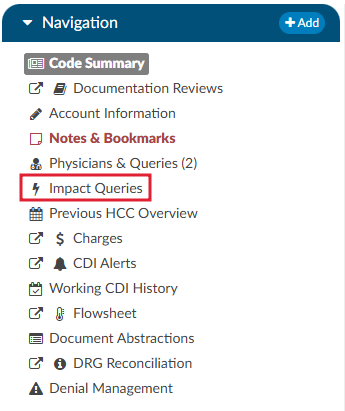
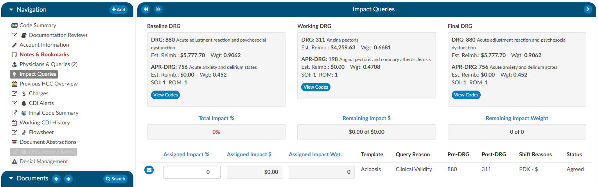

+++
title = 'Impact Queries'
weight = 19
aliases = [
  '/general-user-guide/account-screen/navigation-tree/impact-queries-viewer/',
  '/general-user-guide/account-screen/account-viewers/impact-queries-viewer/',
]
+++

{}

The Impact Queries Viewer is designed exclusively for CDI teams. This tool may not be necessary for all customers, but it serves a specific purpose for those who use it. CDI teams often issue multiple queries per account and require a way to track the impact of each query distinctly. This viewer allows teams to determine whether the impact of a query accounts for the total change in the account or if it shares this impact with other queries.

## Purpose and Use

* **Impact Tracking:** Allows CDI specialists to clearly see the account impact of each query, from the initial baseline to the final assessment after all queries.
* **Impact Assignment:** Within each query, CDI specialists can assign a percentage to quantify the impact of the query on the account. This percentage is then translated into a dollar value attributed to the query.

This feature helps prevent double-counting and overestimating the impact that CDI claims on an account. After coding is completed, CDI specialists must revisit and reassess the account to determine and specify the precise impact each query had.

By using the Impact Queries Viewer, CDI teams can ensure more accurate and accountable query impact assessments, contributing to more precise documentation and reimbursement processes.

To access the Impact Queries Viewer, the user must have a CDI role **AND** there must be at least one (1) query sent by a CDI user.

Displayed at the top of the viewer is the Baseline, Working and Final DRG. The account impact equals Final DRG – Baseline DRG. 

Clicking on the {}View Codes{} button in either the Baseline or Working DRG boxes will take the user to the [Working CDI History](https://dolbeysystems.github.io/fusion-cac-web-docs/account-navigation/navigation-tree/working-cdi-history/) viewer to allow the user to view how the CDS developed their DRG at different stages. Clicking on the {}View Codes{} button in the Final DRG box will take the user to the [Final Code Summary](https://dolbeysystems.github.io/fusion-cac-web-docs/account-navigation/navigation-tree/code-summary/#final-code-summary) viewer to show the user how the account was final coded by the Coder.

To review the query that was assigned, click on the **BLUE ENVELOPE**. This will open the query in a dialog box.

To assign the impact of the query, the user will enter a percentage in the "Assigned Impact %" field. This will autocalculate the following fields:
* Total Impact %
* Remaining Impact $
* Remaining Impact Weight
* Assigned Impact $
* Assigned Impact Wgt.

|Field|Definition|
|-----|----------|
|Total Impact %|This is the % of the impact assigned to queries it can never exceed 100% but, it is allowed to be less than 100%. The impact % must be assigned in the assigned impact % field per each query.|
|Remaining Impact $|This is the account impact dollars left to divvy out. Think about this like a bank account if the account impact between the baseline and final DRG is $10,000 it should start off with $10,000 then if we assign 50% of the account impact to the first query then it would reduce to $5k and so on.|
|Remaining Impact Weight|This is the same concept as Remaining Impact $ we have a field for Remaining impact weight since some sites do not have reimbursement dollars in the system.|
|Assigned Impact %|This is the % of the account impact you are assigning per query.|
|Assigned Impact $|This is the $ of the account impact you are assigning per query based upon the % you placed in the assigned impact % field that pulls from the remaining impact $.|
|Assigned Impact Wgt.|This is the weight of the account impact you are assigning per query based upon the % you placed in the assigned impact % field that pulls from the remaining impact weight.|
|Template|This is the query template you are assigning impact to. Only queries issued by CDI will display here.|
|Query Reason|This is the query reason assigned to the query template.|
|Pre-DRG|This is the pre-DRG assigned to the query. To change this, click on the blue envelope icon to the right of assigned impact. On accounts with a Billing Grouper of APR, this column is labeled **Pre-APR** and shows the APR-DRG.|
|Post-DRG|This is the post-DRG assigned to the query. To change this, click on the blue envelope icon to the right of assigned impact. On accounts with a Billing Grouper of APR, this column is labeled **Post-APR** and shows the APR-DRG.|
|Shift Reasons|This is the shift reasons assigned to the query, to change this click on the blue envelope icon to the right of assigned impact.|
|Status|This is the status of the query, to change this click on the blue envelope icon to the right of assigned impact.|

>[!Note]Impact Assignment
For guidelines on how to quantify the impact of a query, or queries, contact your {} supervisor for any internal policies and procedures.