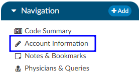

+++
title = 'Account Information'
weight = 21
+++

{}

The Account Information pane summarizes patient demographic information (based on custom system configuration) with data captured for purposes of state and/or registry reporting. To update data fields in the Account information pane, click on the blue button and select the appropriate selection from the drop-down menu.

Users can expand the width of the Code Summary pane by clicking on the arrow in the top right corner of the pane. 

### Unspecified Code Edit Flag

On April 1, 2022 CMS made the Unspecified Code Edit effective. This new edit is triggered when a code from the unspecified code list is assigned by a coder. It is the provider’s responsibility to determine if a more specific code from that subcategory is available in the medical record documentation by a clinical provider. 

If additional information to identify the laterality from the available medical record documentation by any other clinical provider is unable to be obtained, or there is documentation in the record indicating that the physician is clinically unable to determine the laterality because of the nature of the disease/condition, then the provider must enter that information into the remarks section. 
Specifically, the provider may enter “UNABLE TO DET LAT 1” to identify that they are unable to obtain additional information to specify laterality or they may enter “UNABLE TO DET LAT 2” to identify that the physician is clinically unable to determine laterality. If not entered, the claim will be returned.

Fusion CAC/CDI can support the addition of this field to your account information viewer and send the necessary information, known as the billing note, downstream if required. If this is something that you need, please reach out to the Dolbey SME Team at smeteam@dolbey.com. 