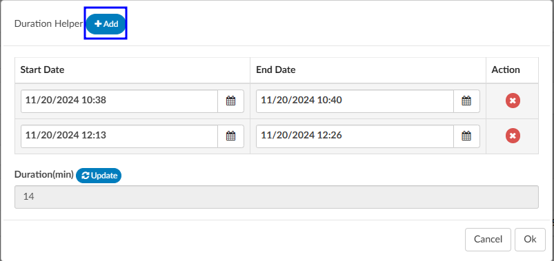

+++
title = 'Add-On Modules and Viewers'
weight = 35
+++

> [!note] Optional Viewers
> The following viewers are part of optional
> [add-on modules](https://dolbeysystems.github.io/fusion-cac-web-docs/general-user-guide/add-on-modules/)
> and may not be used at all organizations. If you are unsure if a module is relevant to your
> organization, please contact your  supervisor. Organizations looking for more information on
> these modules should reach out to the Dolbey SME team via email (smeteam@dolbey.com).
{}

## Audit Module

The audit viewer displays when the account is opened by a user in the role of Auditor. The audit viewer can be popped out onto a separate screen, allowing the auditor to have a screen for reviewing the chart. By selecting “Show All” codes in the unassigned code tree, the auditor is taken to the documents/documentation supporting that code.  This will help streamline the audit process. 

An account can have one or more audits added to it. By clicking {}+Add Audit{} a new, blank audit worksheet will be created. These worksheets are numbered and displayed at the top of the audit viewer, along with a date stamp indicating when each worksheet was opened. The worksheet currently being viewed will be highlighted with a green background.

Data in the audit viewer is only intended for coder education and administrative staff to score how the coder is doing in a report card. The auditor will need to add the coder of record so that the coder of record, any auditor, or other user role that has been given access can view the audit worksheets. 

The audit module allows for the role of an auditor within the application. The role of an "Auditor" has the same privileges as a "Coder" when it comes to account editing. More details on audit functionality can be found in the [Audit User Guide](https://dolbeysystems.github.io/fusion-cac-web-docs/auditor-user-guide/). 

## Discrete Values (Viewer)

**This feature may not be supported by your organization's EHR vendor.** The Discrete Values viewer show trending data or data that has values.  The most common examples of discrete values are lab values and vital signs. The viewer can be popped out into another window by clicking on a little square with an arrow pointing to the right in the navigation tree next to the viewer name.

An older style of discrete data can be displayed in a Discrete Values viewer. Tabs across the top of the screen display the categories of data. This displays each of the types of discrete data elements, which may vary by organization. 

The Discrete Values viewer has a Filter by Month box, listing the months that contain values. Selecting a month will highlight all the corresponding dates in the Filter by Date box. The resulting values will show in the viewer. The Normal and Abnormal tabs both have this functionality and are filtered separately. 

Discrete Values with a grey header are within normal limits. Each organization sends what is the reference point to determine what is normal and what is abnormal. If a header is display in red, it is considered abnormal by the organization. In addition to the header color, users can tell if the value is out of normal limits as there is a flag that indicates if the value is low vs. high. 

## Flowsheet (Viewer)

**This feature may not be supported by your organization's EHR vendor.** The Flowsheet viewer shows information found in nursing documentation such as nursing or respiratory assessments, skin assessments, intake and outake data, etc. The viewer can be popped out into another window by clicking on a little square with an arrow pointing to the right in the navigation tree next to the viewer name.

The Flowsheet viewer is the most recent style of discrete data viewer. This viewer is organized much like a spreadsheet. Depending on configuration, users may see major categories on the left-hand side of the spreadsheet (there are many different options as each site is a little different.). Upon clicking on one of these items users will be presented with a grid to the right. That grid will have multiple columns, the first column being name. Hovering over the column name will display three little lines. Clicking on them, will allow the user to filter in order to narrow down the data. If any of those names appear in red that means that at least one of the data elements are outside of the normal limits if there is a range. 

To the right of the name, if applicable, is a reference column. This reference column will indicate if the value is within normal limits. This is data that the EHR system has sent to Fusion CAC. If the reference column is available, then to the right of that is a flag column. A checkmark in that field  also means the value is out of the normal range. This column can also be filtered if the user wants to look at everything outside of the normal limits. Next to that field is a date and time column. The user may see multiple dates and times depending on how the data is organized and how frequently it is documented. If a discrete value on the Flowsheet viewer has a specimen, it will show as a beaker symbol in the Results column. Hovering over the symbol will provide the name and site of the specimen. 

Right clicking in the Major Category column will show a menu allowing the user to expand or collapse all categories. That configuration will be saved for all accounts that have the Flowsheet Viewer, per user role.  Note that if a user collapses/uncollapses a major category in the pop-out, it will not be seen on the main page until the user moves to a different viewer and back.

## ER E/M Module 

The ER E/M viewer is part of an add-on module for any chart with a “Is Emergency” flag within the account properties.
If this module is turned on, any “Is Emergency” chart will have the “E/M Coding Worksheet” in the [Navigation](https://dolbeysystems.github.io/fusion-cac-web-docs/general-user-guide/account-screen/#navigation-pane) menu. 
There are several sections to the E/M Coding worksheet including:  E/M No Charge, E/M Level, Trauma, Critical Care, Medications, and Additional Charging. More details on ER E/M functionality can be found in the [Administrative User Guide](https://dolbeysystems.github.io/fusion-cac-web-docs/administrative-user-guide/tools/er-em-configuration-page/).

### Completing the ER E/M Worksheet

#### ER Date and Provider

The first step in completing this worksheet is filling in the ER Date and the ER Physician fields.  Once these are completed, the rest of the worksheet will populate.

#### No Charge

If a patient fits the criteria for “no charges” (for example, a registration error), all other fields in the worksheet go away because there is nothing else to be done from an ER charging perspective.  However, other selections from the list will populate the fields accordingly.  

 

##### Critical Care

Select appropriate answers to “Is Criteria Met” and “Is Time Determined.”  To enter the duration, click on the clock icon. 

 
Enter start date/time and click on the {}Update{} button for the minutes to display. 

 
If there were multiple spans of time for critical care, click on {}+Add{} and enter any additional durations of time.  The system will add up on the minutes and display once “Update” has been selected.

##### E/M Levels Matrix

The E/M Levels martix is configured per organization. This matirx will allow the user to check what interventions were completed during the ER visit. Once an intervention is selected from one of the columns, that becomes the minimal level and all columns before that will gray out. As the remaining sections are completed, users may see the level advance.  

##### Trauma
If the case was a trauma, make the appropriate selection from the dropdown menu (pre-hospital notification, post-hospital notification, consult).

 
##### Medication Administration Qty
Based on the selection, additional fields or boxes will populate. Complete the quantities, add modifiers, and any notes.  Modifier fields are available in the appropriate sections of the worksheet. The user can add up to four (4) modifiers unless they are using the 3M CRS encoder, then they will be able to add up to five (5) modifiers. The “Notes” field is available for the coder to track things such as medications.  

 
##### Medication Administration Time/Modifier
Update this section with the duration of each medication as needed, any modifier(s), and notes. The user can add up to four (4) modifiers unless they are using the 3M CRS encoder, then they will be able to add up to five (5) modifiers.

 
If there are multiple infusions (for example, one infusion started in left arm and one infusion stated in the right arm), click on the {}Action{} button to create another row to be completed including appropriate modifiers for each infusion.

##### Additional Charges

Add any additional charges. Much like the matrix, the additional charges section will be configured per each organization to include the necessary charges each organization captures.   

 
##### Charges for Assigned CPT Codes

If the Coder adds a CPT code (otherwise referred to as “soft code”), the codes will appear in this section of the E/M Coding worksheet.  It must then be determined by the Coder, or Charger, if the procedure added by the Coder occurred in the ER and should be charged.  If so, the fields should be completed.  If the procedure is determined to have occurred elsewhere, leave the 0 in the field.  

>[!Note] 
When there is a CPT coded added that has no CDM charge, it won’t appear in this section; only those that have a CDM.
 
##### E/M Summary
Once the Additional Charges section is complete, users will see the Summary which details the E/M level and other charges with the corresponding CDM Code.
 

When all charging is complete and the charges are ready to be submitted, check the “Send Charges Outbound” checkbox and click on the {}Save{} button in the banner bar. This action sends charges out and the account will automatically route to a coder worklist so the rest of the coding that is not charge-related can be completed.  

If the charges cannot be completed for some reason (missing trauma documentation), the box should **NOT** be checked, and instead, a pending reason should be assigned on the Code Summary. Once a pending reason has been added, click on the {}Save{} button in the banner bar.  

 If the “Send Charges Outbound” checkbox is **NOT** checked, the Coder will get a warning that ER charges are missing and will not be able to submit the account upon completion of coding. The Coder, in this case, would attach a pending reason to send the account back to the user applying charges to check the box. The account then goes back to the Coder to submit the account for final billing. This workflow ensures that the Coder does not submit an account unless all ER charges have been completed.  

##### E/M History

This section displays the history of charges submitted. 
Click to expand for details.
 

## Physician Coding/Single Path

Physician Coders differ from hospital coders in that they will usually work for a doctor who specializes in a specific type of medicine. As a result, they typically code for just that specialty. These coders will only deal with a subset of the ICD10 code set. Within the CAC system, functionality is built to allow a Physician Coder to code charts just like hospital coding staff. The Single Path coding role allows the user to code an account as a final coder *and* a physician coder simultaneously. When a Single Path user opens up the detail on a CPT code, they will see two separate fields for modifiers, and they can enter modifiers for both.

A Single Path role can also be modified from the Profile drop-down menu under the user name at the top of the Account Detail screen, provided that another changeable profile role, such as CDI, Coder, or Physician Coder, is available on the User Profile.  When adding or editing modifiers in the Charges viewer, the Single Path user sees the Coder’s version of the viewer, so what is added will be viewable to both a Coder and a Single Path user. The Physician Coder charges viewers are different and viewable only to them. 

