+++
title = 'ER E/M Module'
weight = 40
+++

> [!note] Add-On Module
> This is an add-on module and may not be available at every organization. If you are unsure whether it is available, please contact your {} supervisor.

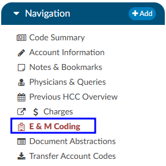

The ER E/M viewer is part of an add-on module for any chart with a “Is Emergency” flag within the account properties.
If this module is turned on, any “Is Emergency” chart will have the “E/M Coding Worksheet” in the [Navigation](https://dolbeysystems.github.io/fusion-cac-web-docs/account-navigation/#navigation-tree) menu. 
There are several sections to the E/M Coding worksheet including:  E/M No Charge, E/M Level, Trauma, Critical Care, Medications, and Additional Charging. More details on ER E/M functionality can be found in the [Administrative User Guide](https://dolbeysystems.github.io/fusion-cac-web-docs/administrative-user-guide/tools/er-em-configuration-page/).

## Completing the ER E/M Worksheet

### ER Date and Provider

The first step in completing this worksheet is filling in the ER Date and the ER Physician fields.  Once these are completed, the rest of the worksheet will populate.

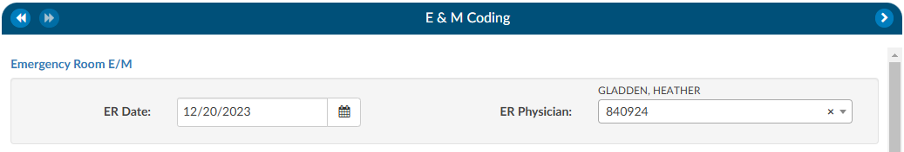

### No Charge

If a patient fits the criteria for “no charges” (for example, a registration error), all other fields in the worksheet go away because there is nothing else to be done from an ER charging perspective.  However, other selections from the list will populate the fields accordingly.  

 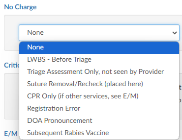

#### Critical Care

Select appropriate answers to “Is Criteria Met” and “Is Time Determined.”  To enter the duration, click on the clock icon. 

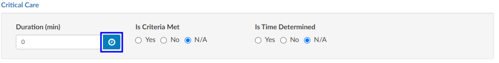
 
Enter start date/time and click on the {}Update{} button for the minutes to display. 

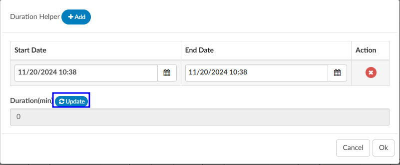
 
If there were multiple spans of time for critical care, click on {}+Add{} and enter any additional durations of time.  The system will add up the minutes and display once “Update” has been selected.

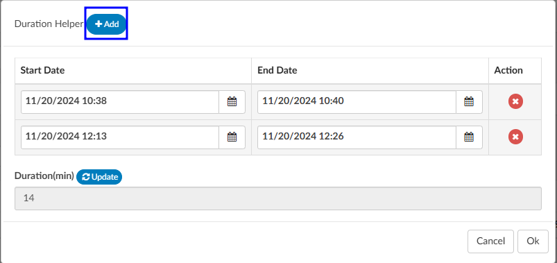

#### E/M Levels Matrix

The E/M Levels matrix is configured per organization. This matrix will allow the user to check what interventions were completed during the ER visit. Once an intervention is selected from one of the columns, that becomes the minimal level and all columns before that will gray out. As the remaining sections are completed, users may see the level advance.  

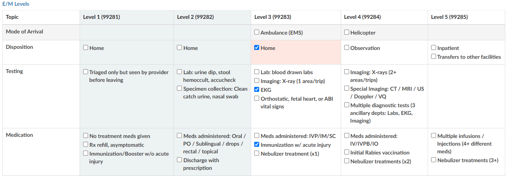

#### Trauma
If the case was a trauma, make the appropriate selection from the dropdown menu (pre-hospital notification, post-hospital notification, consult).

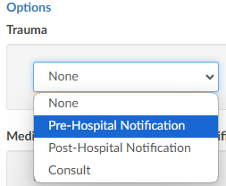

 
#### Medication Administration Qty
Based on the selection, additional fields or boxes will populate. Complete the quantities, add modifiers, and any notes.  Modifier fields are available in the appropriate sections of the worksheet. The user can add up to four (4) modifiers unless they are using the Solventum CRS encoder, then they will be able to add up to five (5) modifiers. The “Notes” field is available for the coder to track things such as medications.  

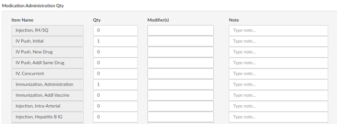
 
#### Medication Administration Time/Modifier
Update this section with the duration of each medication as needed, any modifier(s), and notes. The user can add up to four (4) modifiers unless they are using the Solventum CRS encoder, then they will be able to add up to five (5) modifiers.

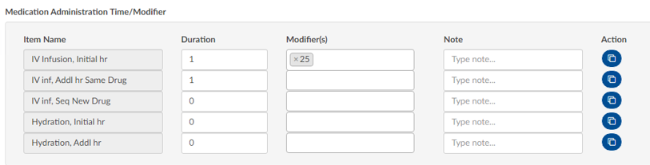
 
If there are multiple infusions (for example, one infusion started in left arm and one infusion started in the right arm), click on the {}Action{} button to create another row to be completed including appropriate modifiers for each infusion.

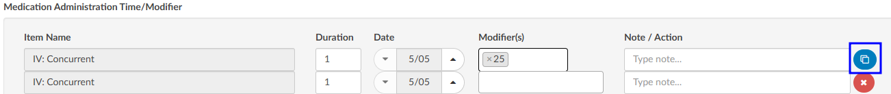

#### Additional Charges

Add any additional charges. Much like the matrix, the additional charges section will be configured per each organization to include the necessary charges each organization captures.   

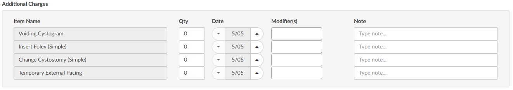
 
#### Charges for Assigned CPT Codes

If the Coder adds a CPT code (otherwise referred to as “soft code”), the codes will appear in this section of the E/M Coding worksheet.  It must then be determined by the Coder, or Charger, if the procedure added by the Coder occurred in the ER and should be charged.  If so, the fields should be completed.  If the procedure is determined to have occurred elsewhere, leave the 0 in the field.  

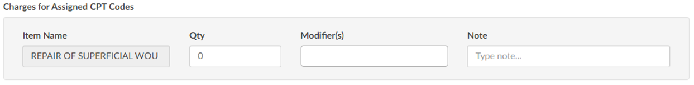

>[!Note] 
When there is a CPT code added that has no CDM charge, it won’t appear in this section; only those that have a CDM.
 
#### E/M Summary
Once the Additional Charges section is complete, users will see the Summary which details the E/M level and other charges with the corresponding CDM Code.
 
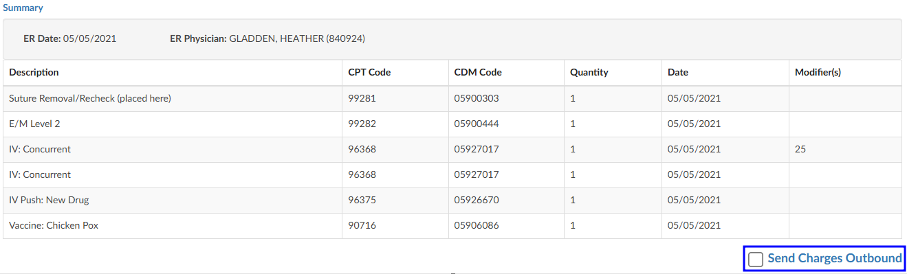

When all charging is complete and the charges are ready to be submitted, check the “Send Charges Outbound” checkbox and click on the {}Save{} button in the banner bar. This action sends charges out and the account will automatically route to a coder worklist so the rest of the coding that is not charge-related can be completed.  

If the charges cannot be completed for some reason (missing trauma documentation), the box should **NOT** be checked, and instead, a pending reason should be assigned on the Code Summary. Once a pending reason has been added, click on the {}Save{} button in the banner bar.  

 If the “Send Charges Outbound” checkbox is **NOT** checked, the Coder will get a warning that ER charges are missing and will not be able to submit the account upon completion of coding. The Coder, in this case, would attach a pending reason to send the account back to the user applying charges to check the box. The account then goes back to the Coder to submit the account for final billing. This workflow ensures that the Coder does not submit an account unless all ER charges have been completed.  

#### E/M History

This section displays the history of charges submitted. 
Click to expand for details.
 
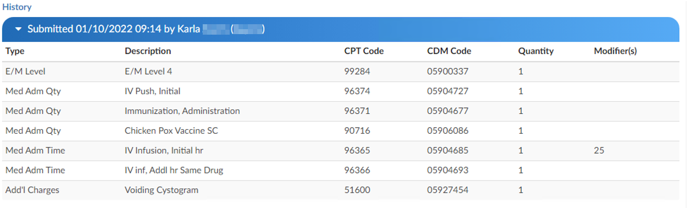
