+++
title = 'Audit Worksheet'
weight = 13
+++

## Starting an Audit

The pre-audit codes and DRG are displayed for easy reference by the Auditor. The Auditor conducts the review (see steps 1-9) and makes changes to the codes in the Assigned code tree.

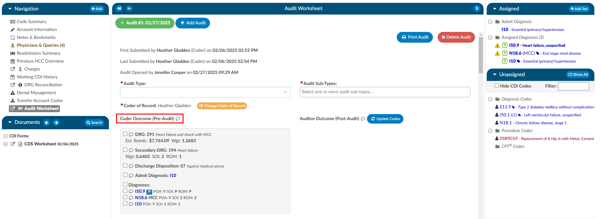

### Step 1

Ensure the current user role is set to have the Auditor role as well as Chart Access of Auditor.
   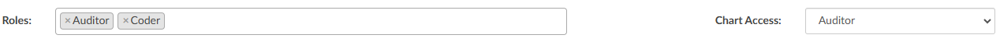

### Step 2

Open a chart that has been submitted by a Coder. This may come from a worklist or by manually typing in an account number.

### Step 3

On the Navigation tree select the viewer called “Audit Worksheet”, then click the {}+Add Audit{} button to begin.

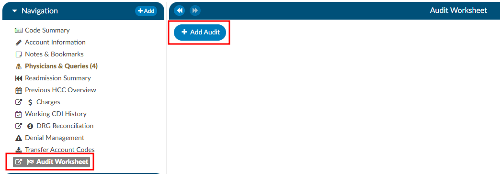

>[!info]DRG Required
> A DRG must be computed by a user before an audit can be started.

### Step 4

Select the appropriate audit type from the dropdown. This will be used for reporting on the types of audit performed and can also be used for workflow purposes. 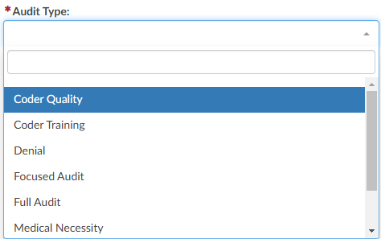
   
### Step 5

The codes in the Assigned code tree are the same codes initially submitted by the
Coder, allowing the Auditor to start the audit with the codes from the Coder. The Audit
viewer can be popped out onto a separate screen, allowing the Auditor to have a screen
for reviewing the chart. Selecting “Show All” codes in the Unassigned code tree and then clicking on the codes assigned, the
Auditor will load the documentation supporting that code. This will help streamline the audit process. 

### Step 6

Once the Auditor has made changes and is completed with the audit, they can click “Update Codes”
  which automatically calculates and populates the audit statistics section. There is a comment bubble
  next to each code as well as the DRG for the Auditor to enter any comment(s). A symbol may display next to the codes.
    - A green ‘plus’ sign will show if the code was added. 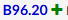
    - A red ‘minus’ sign will show if a code was deleted. 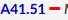
    - A orange up or down ‘arrow’ sign will appear if the code location has been changed, as
    in a primary and secondary are swapped. 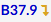

### Step 7

Although audit statistics have been automatically calculated and populated, the Auditor must 
manually enter in the “Total Errors” which then automatically calculates the “Error Rate”.

>[!note]
>Because of its importance, and to include principal diagnosis changes in the error rate, changing the principal diagnosis counts as **two errors intentionally**. 
>- One error for changing a diagnosis code.
>- A second error if the principal diagnosis is incorrect.
>
>For an account with only two diagnosis codes, the error rate when the principal code is changed is 2 out of 3.
>If on the same account the Auditor says the principal is correct and only changes the secondary code, the error rate is 1 out of 3.

### Step 8

Complete additional sections as needed.

#### Abstracting

The Audit viewer also allows Auditors to review the abstraction performed by the Coder. Abstraction is managed on the [Account Information](https://dolbeysystems.github.io/fusion-cac-web-docs/account-navigation/navigation-tree/account-information/) page, and the specific fields audited can be customized. By default, the system audits the discharge disposition, but additional fields—such as point of origin, admit type, admit source, or others can be included upon request. To enable auditing for additional fields, contact the CAC Support Team (CACsupport@dolbey.com).

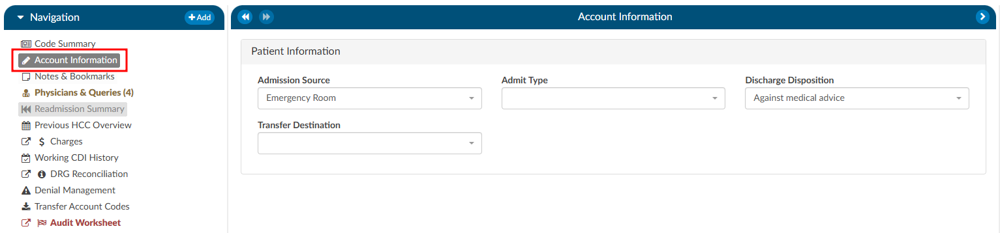

Once the desired fields are configured, the Auditor can make any necessary corrections directly in the Account Information viewer. Click on the {}Update Codes{} buttong next to the Auditor Outcome. This will cause the system to compare the updated information against the Coder's original entries and include the selected Account Information fields for auditing.

**Before:**
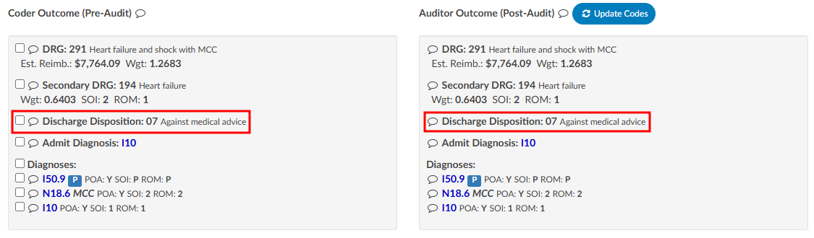
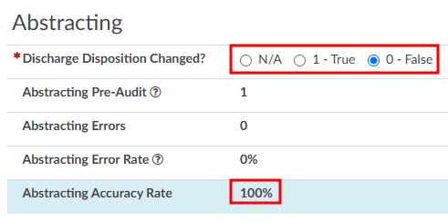

**After:**
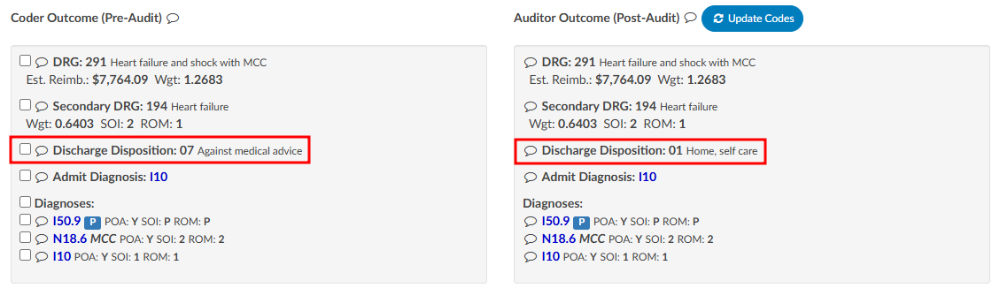
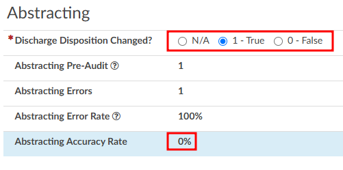

#### Charges

The Audit viewer also enables users to audit hard charges, but this functionality requires a configuration change by the CAC Support Team. To enable this capability, provide the CAC Support Team with the specific revenue codes to audit, as not all charges in the [Charges or Transaction](https://dolbeysystems.github.io/fusion-cac-web-docs/account-navigation/navigation-tree/charges-or-transactions/) viewer will require auditing. Commonly audited revenue codes include 450 and 762, but others may apply depending on organizational needs.

Once the specified revenue codes are provided and configured, the Audit viewer will flag accounts containing charges that match the selected codes. When an audit is initiated, the user will see sections for "Charge Codes" listed under both the Coder Outcome and Auditor Outcome. Below these outcomes there will be a section for "Audited Charges," where changes amde to the charges can be recorded.

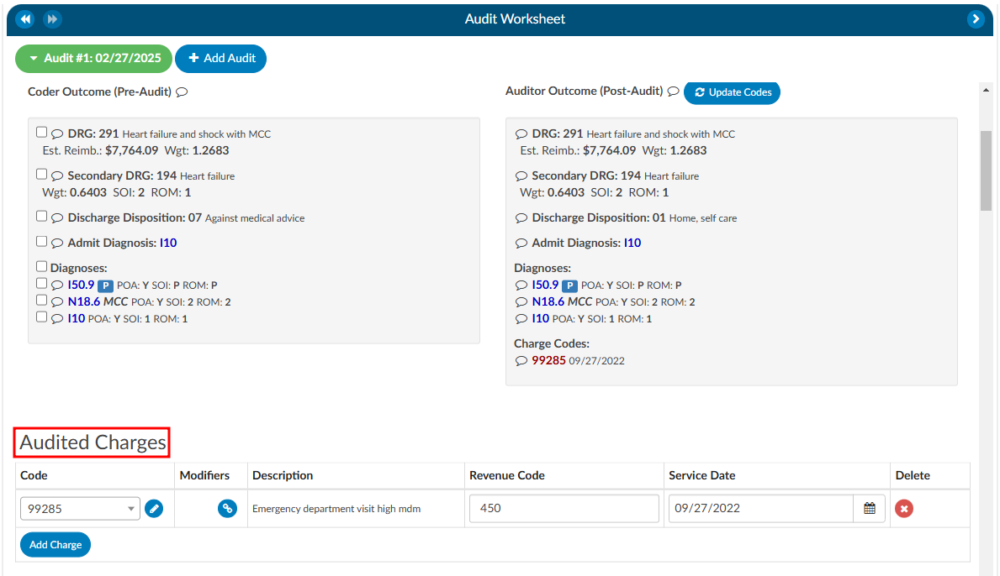

>[!Note]Updated Charges
It is important to note that most interfaces do not allow updated charges to be sent outbound. Therefore, the Auditor must manually record any changes on the audit worksheet. Changes can be made by directly editing the field or clicking the pencil icon, which launches the encoder, allowing the Auditor to look up CPT codes. The Auditor can also add modifiers, change the revenue code, or adjust the service date as needed.

#### Training Recommendations

At the conclusion of the audit, the Auditor can list any recommended training topics. If no recommendations are necessary, "None" should be indicated. These topics can be modified using the mapping table. Additionally, the Auditor has space to provide any additional details as needed.

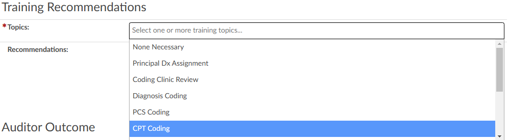

#### Auditor Outcome

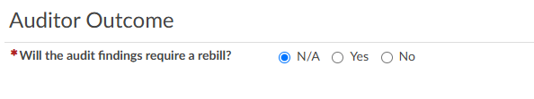

### Step 9

The Auditor can then re-submit the chart or route it back to the Coder of Record by using the
{}Route to Coder{} button in the top right corner of the audit worksheet. This will route the chart to
the Coder’s **You** worklist for the Coder to complete the [Coder Acknowledgement](https://dolbeysystems.github.io/fusion-cac-web-docs/auditor-user-guide/starting-an-audit/#coder-acknowledgement) section. 

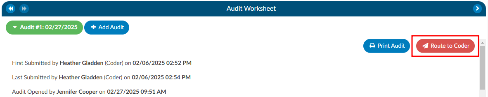

## Missed Queries

This section will only be available if queries were initiated *after* the audit began. The query does not have to be initiated by the Auditor to be attributed to the audit as a missed opportunity.

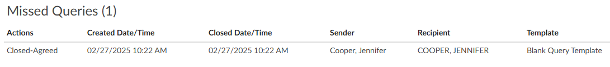

## Multiple Audits per Account

An account can have one or more audits added to it. Clicking the {}+Add Audit{} button will create a new, blank audit worksheet. These worksheets are numbered and displayed at the top of the Audit viewer, along with a date stamp indicating when each worksheet was opened. The worksheet currently being viewed will be highlighted with a green background.

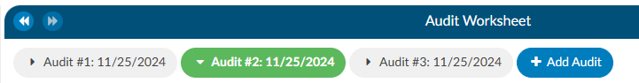

## Coder Acknowledgement

If there are changes for the Coder to address post-audit, the Auditor will route the chart back to the Coder by clicking on the {}Route to Coder{} button. 

When the Coder opens the chart to review, there will be a "Coder Acknowledgement" section. This section gives the Coder the opportunity to either agree with the audit or to provide a rebuttal. If the Coder selects the outcome to be a rebuttal the Coder must provide a comment for the Auditor. Once the Coder has added their comments they will route the chart back to the Auditor by clicking on the {}Return to Auditor{} button.

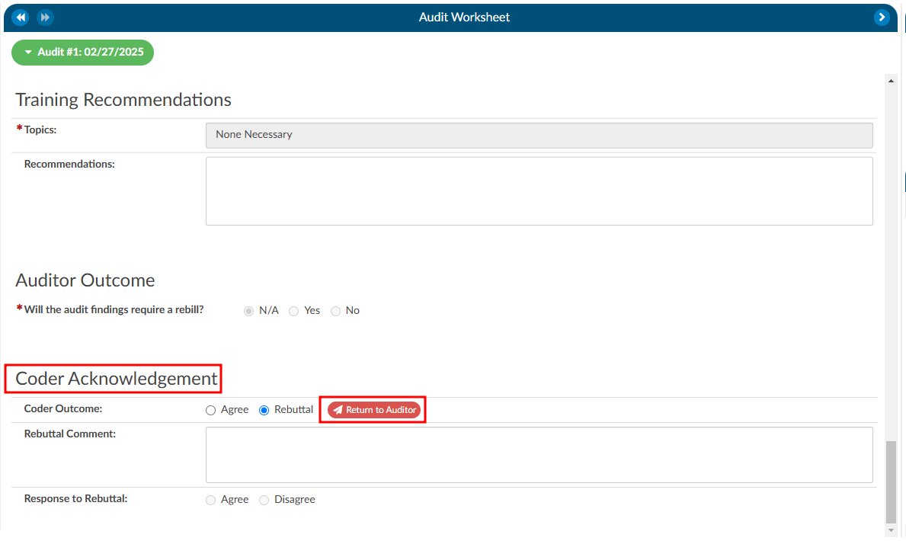

Once the chart is returned to the Auditor, there are a few actions the Auditor can take based on the Coder Acknowledgement response: 

1. Review the rebuttal, select agree, and finish the audit.
2. Review the rebuttal, select disagree, and finish the audit **OR** initiate the [Audit Escalation](https://dolbeysystems.github.io/fusion-cac-web-docs/auditor-user-guide/starting-an-audit/#audit-escalation) process. 

## Audit Escalation

The Audit Escalation feature is triggered when the Coder's outcome results in a rebuttal, and the Auditor disagrees with the rebuttal and further action may need to be taken. In this case, a section labeled "Escalation Requested" becomes available. The Auditor can activate this section to indicate that an escalation is necessary. Once this is set, an additional section called Audit Escalation will appear. This section allows the user to document the outcome of the escalation and provides a designated space for comments related to the escalation.

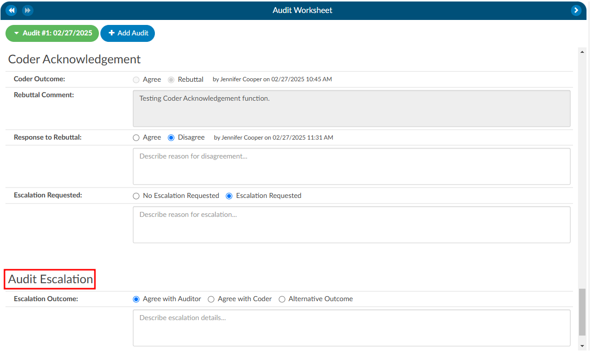

This feature is governed by role-based permissions in the [Role Management](https://dolbeysystems.github.io/fusion-cac-web-docs/administrative-user-guide/tools/role-management/) settings. Within Role Management, there is an option to specify who has the ability to edit the Audit Escalation section.

If a coding manager or another designated individual is responsible for responding to escalations, they must meet the following requirements:
1.	**Audit View Access**: The user’s role must include permissions to view audits.
2.	**Audit Role Setting**: The role assigned to the user must have the Audit option enabled in the top-right corner of Role Management.
3.	**Edit Escalation Access**: The user must also have explicit permission to edit escalations, as defined within the Role Management settings.

These permissions ensure that only authorized individuals can manage and resolve the escalation process effectively.s

## Finishing an Audit

To finish an audit, whether it goes through a rebuttal process or not, the Auditor would simiply click on the {}Finish Audit{} button. This closes the audit, but the Auditor has the option to re-open the audit as needed.

## Audit Statistics

- **Diagnosis Added:** Codes added to the assigned codes list by quantity. 

  *ex.* If the coder has 5 total diagnosis codes and the auditor has 6 total diagnosis codes, the number of added codes is 1 (because the auditor added an additional code).
- **Diagnosis Codes Unassigned:** Codes removed from the assigned codes list by quantity. 
 
  *ex.* If the coder has 5 total diagnosis codes and the auditor has 3 total diagnosis codes, the number of unassigned codes is 2 (because the auditor removed two codes).
- **Diagnosis Codes Edited:** Codes that are different between the assigned code lists by comparing the auditor's codes to the coder's code, but not counting the number of codes added or unassigned. 
  
   *ex.* If a coder has 5 total diagnosis codes, and the auditor changed 2 of them without adding or unassigning codes, the number of edited codes is 2 (because the auditor "swapped out" two of the codes from the coder with different ones).

