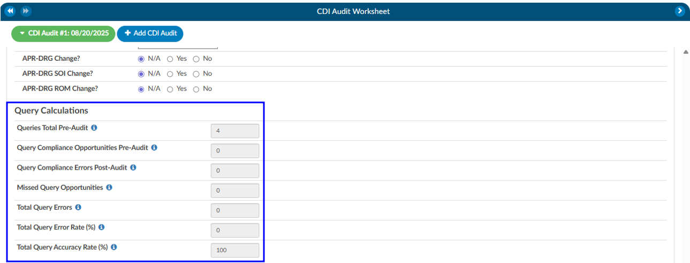

+++
title = 'CDI Audit Worksheet'
weight = 14
+++

## Starting a CDI Audit

Once prerequisites are met, you can begin the audit process:

1.  **Select a Patient Chart:** Open a patient chart that includes a baseline DRG.
2.	**Locate the CDI Audit Worksheet:** Within the chart’s navigation tree, click on the CDI Audit Worksheet.
3.	**Start the Audit:** Select Start Audit to launch the audit session.

At this point, the audit is only visible to a limited group of users. These include:

- The CDI of record, who is the primary subject of the audit.
- Other CDI auditors, who have authority to perform or review audits.
- System administrators, who maintain oversight.

The audit displays the **CDI Specialist of Record**, showing which CDI user is being evaluated. If you need to audit a different CDI user, you may select their name from the drop-down menu. This is especially important in cases where more than one CDI professional has worked on the same chart.

#### Selecting Audit Types and Subtypes

When beginning an audit, you are required to choose an **audit type**. This classification is used for reporting and allows leadership to track and analyze the kinds of audits being performed. 

Audit types can be customized within the system by navigating to **Tools → Mapping → CDI Audit Types**. In addition to the audit type, you can also assign one or more **audit subtypes**. Subtypes allow you to specify the focus of the audit. For instance, if the purpose is to evaluate a trainee’s performance, you might choose “CDI User in Training” as a subtype. If the goal is to validate whether the **baseline DRG** was appropriately assigned, you could select “Baseline DRG Review.” Subtypes may be tied to specific audit types and can be customized by your organization. This classification ensures that reporting can reflect both the general purpose of the audit and its specific focus.

#### Reviewing the Baseline DRG

The first major step in the audit is evaluating the **baseline DRG** assigned by the CDI of record.
1.	**Expand the Baseline DRG Section:** By default, this section is collapsed. Expanding it reveals the baseline DRG chosen by the CDI.

2.	**CDI Specialist Outcome:** This is the Baseline DRG and the codes that went into the Basline.
3.  **CDI Specialist Outcome:** This is the Baseline DRG and the codes that went into the Basline.
4.  **Adding Missing Codes:** 
    - If the necessary code does not appear on the right-hand side, you can minimize the editor by clicking the red button in the top-right corner.
    - From there, you can find the appropriate documentation or unassigned codes. Right-click to either Add Code or Add Code from Encoder.
    - After adding the code, reopen the editor, move the code into the baseline DRG list, and save.
5. **Update Codes:** If the CDI wants to change the existing CDI DRG they will need to add codes if not already in assigned code tree. Then click on Update Codes to open the coding editor. 

6. **Editor Presents two Panels:** 
   - Left side: Displays the codes used to calculate the current baseline DRG.
   - Right side: Displays the system’s assigned code tree, showing all available codes. Move any codes from the right to the left if you want the audited Baseline to use these codes.

#### Reviewing the Working DRG

After validating the baseline DRG, the next step is to review the **working DRG**. This process is nearly identical to the baseline review. By expanding the working DRG section and selecting **Update Codes**, you can access the editor, compare codes, and make adjustments as necessary. The working DRG reflects the CDI’s evolving assessment of the case and is often compared against the baseline DRG for consistency and accuracy.

#### Query Compliance Review

The third key component of the audit involves **query compliance**. If queries were issued by the CDI of record, you will see them listed under the **Query Statistics** section. If no queries were created, this section will not appear.
It is important to note that the module only displays queries created by the CDI user listed as the **owner of the audit**. If another CDI professional also issued queries on the chart, you must start a separate audit under that individual’s name to review their work.
Each query is marked with a red envelope icon. Clicking this icon allows you to open the query and review its contents. Within the query review window, you may adjust the **pre-DRG** and **post-DRG** to reflect impact and then proceed to compliance evaluation.

#### Query Pre/Post DRG

If either of the pre-DRG and/or post-DRG you can click to open either section. If you click on update codes. The editor presents two panels:

- **Left side**: Displays the codes used to calculate the current baseline DRG.
- **Right side**: Displays the system’s assigned code tree, showing all available codes. Move any codes from the right to the left if you want the audited Baseline to use these codes. 

#### Query Compliance Questions

For each query, the system provides ten compliance questions. These are customizable through the mapping table but generally focus on ensuring that the query was appropriate, compliant, and educational.

Response options include:
- **Not Applicable** – The question does not apply to this query.
- **Criteria Met** – The query meets compliance standards.
- **Training Opportunity** – The query does not meet expectations and is counted as a negative finding.
  
Each query therefore has up to ten possible compliance opportunities. The number of “Training Opportunity” responses provides a measure of compliance performance. If an auditor identifies that a CDI missed sending a query that should have been issued, the auditor can document this as a **Missed Query Opportunity**. This requires opening the physician query section as you would normally and recording the oversight within the audit.

## CDI Audit Statistics

#### Baseline/Working DRG Changes

If there are changes to the Baseline or the Working DRG this section will automatically move the radio buttons automatically to line up with the differences between the CDI Outcome compared to the Auditor Outcome.

#### Query Calculations

The below calculations are the outcome of each query that was audited.

|Fields|Description|
|------|-----------|
|Queries Total Pre-Audit|This is the total queries pre-audit that was created by the CDI being audited that were not canceled.|
|Query Compliance Opportunities Pre-Audit|Query Compliance Opportunities that are labelled as criteria-met or educational-opportunity.|
|Query Compliance Errors Post-Audit|Query Compliance Opportunities that are labelled as educational-opportunity.|
|Missed Query Opportunities|Queries created by the CDI Auditor after this audit was started|
|Total Query Errors|Total Query Errors = Query Compliance Errors Post Audit - Missed Query Opportunities|
|Total Query Error Rate (%)|Total Query Error Rate (%) = (Query Compliance Errors Post-Audit + Missed Query Opportunities)/(Query Compliance Opportunities Pre-Audit + Missed Query Opportunities)|
|Total Query Accuracy Rate (%)|Total Query Accuracy Rate (%) = 100 - Total Query Error Rate (%)|

#### Training Recommendations

At the conclusion of the audit, the Auditor can list any recommended training topics. If no recommendations are necessary, "None" should be indicated. These topics can be modified using the mapping table. Additionally, the Auditor has space to provide any additional details as needed.

#### Best Practices

To maximize the effectiveness of CDI audits, auditors should follow several best practices. Always verify that you are auditing the correct CDI of record before starting, as this ensures you are reviewing the intended queries and DRGs. Use audit subtypes to capture specific learning opportunities, such as audits performed for new CDI staff or targeted reviews of certain DRG assignments. Ensure compliance questions are kept current, reflecting not only internal policies but also industry guidelines and payer expectations. Finally, conduct audits consistently and document findings clearly. Overtime, this creates a feedback loop that improves documentation quality, strengthens DRG accuracy, and reinforces compliance across the CDI program.