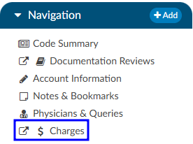
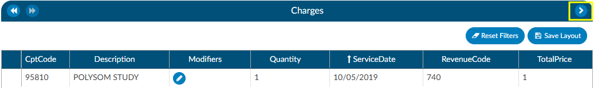
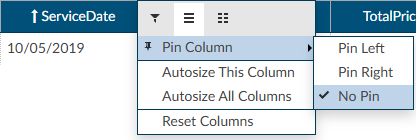
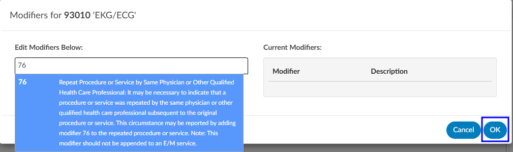
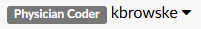
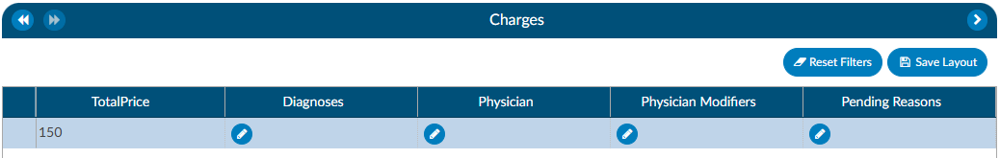
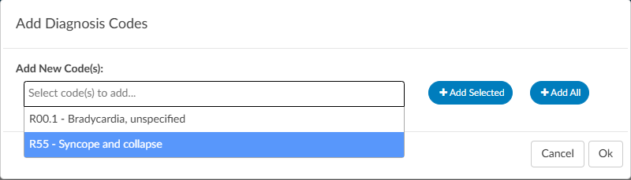
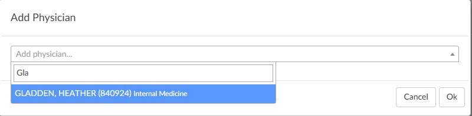
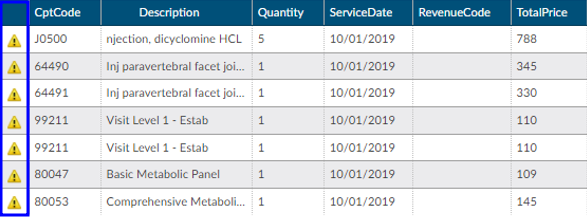

+++
title = 'Charge or Transaction'
weight = 14
+++

{}

If an interface for account charges or transactions is set up during configuration, the Charges screen shows a listing of charges on the account.

There are activity buttons to "Save Layout" or expand the Charges viewer. Users can expand the width of the Charges viewer to view more available columns by clicking on the arrow in the top right corner of the viewer. This viewer also provides information on CPT Codes, Descriptions, Modifiers, Quantity, Service Date, Revenue Code, and Total Price.

### Column Settings

Each column within the Charges grid has menu options to Pin Column, Autosize, and Reset Columns. Click on the Menu icon to view the drop-down listing. After making column setting selections, click on the button to retain column settings for future coding sessions.

|Column Setting      |Definition|
|--------------------|----------|
|Pin Column          |Allows users to select the column and then pin it to the RIGHT or LEFT side of the assigned accounts grid. This function works similarly to freezing columns in Excel.|
|Autosize This Column|Select this option to change the column width to automatically size the width of the column for contents of the cells in this column.|
|Autosize All Columns|To quickly autosize all columns in the assigned accounts grid, click the Autosize All Columns button.|
|Reset Columns|Click on this option to Reset Columns to their default column width.|

### Adding Modifiers to Charges

Click on the **BLUE PENCIL** button to open the Modifiers window.  Start entering the digits for the modifier to bring up the drop-down listing of available modifiers and their descriptions to select the appropriate modifier.  After the modifier is in the window, click on the {}OK{} button to save the selected modifier. Continue this process to add all applicable modifiers to charges in the Charges viewer. The user can add up to four (4) modifiers unless they are using the 3M CRS encoder, then they will be able to add up to five (5) modifiers.

##### Editing Hard Charge Details (Physician Coder)

A user with the role of a Physician Coder can now add assigned diagnosis codes along with physicians and CPT Modifier codes to hard charges listed in the Charges viewer.  When a Physician Coder opens the Charges viewer, new columns with edit buttons will be seen.

Clicking on the **BLUE PENCIL** button in the Diagnosis column will open a code field, which when dropped down, will list all assigned diagnosis codes on the account. The Physician Coder can then select which diagnosis code(s) to attach to the hard charge.  The top most diagnosis code of a charge is designated the "principal" diagnosis. If you add or remove codes, whatever code is listed first is the principal – the principal code on a charge can be different than the principal code on the account. If a user moves the codes around, the top code will always become the primary code.

Clicking on the **BLUE PENCIL** button in the Physician column will open a physician field to allow the selection of a physician. This is the same for the Physician Modifiers column which will open a modifier window allowing modifiers to be selected. When launching the encoder, the physician coder’s modifiers will be sent instead of the final modifiers in the Charges viewer.

Clicking on the **BLUE PENCIL** button in the Quantity column will open a field to allow the end user to enter a new value for the quantity of the charge. The dialog will perform validation so that invalid quantities are not recorded such as letters, blanks, and/or a zero quantity. Negative quantities are permitted. Decimal quantities are permitted.

>[!Note] 
The organization must have physician coding enabled to use this feature, if you do not have physician coding please contact your account representative for more information.

### Assigning a Pending Reason per Charge (Single Path & Physician Coder)

Users that have a Physician Coder or Single Path Coder role will have the ability to place a pending reason per charge on the physician charges. 
- If a charge is removed, then the pending reason would be removed.
- If a charge is updated, then the pending reason would not change.

### Caution Column (TruCode)

A Caution Column is avaialble for sites that use the TruCode Encoder to the Charges and Transactions viewers.  This column will indicate a flag if TruCode reports an edit on a charge on an outpatient account. 

