+++
title = 'Code Summary'
weight = 20
+++

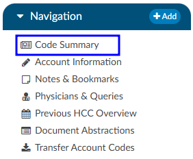

The Code Summary is the last viewer to be reviewed prior to chart submission. This screen shows a summary of activity on the account and provides activity buttons to **Claim Ownership**, **Show History**, and **Print Summary** *(if a printer is configured)*. This viewer also provides information on Current Owner, First Coder, Last Saver, and Last Submitter. Users can expand the width of the Code Summary viewer by clicking on the arrow in the top right of the viewer. 

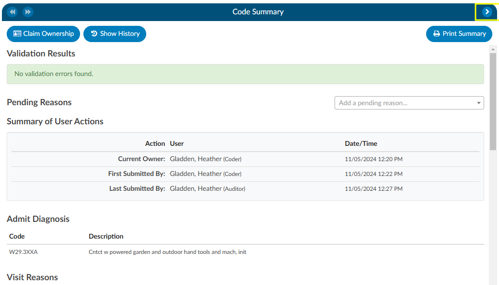

### Show History

The {}Show History{} button provides a timeline view of activity on the account along with an audit trail of account activity from point of admission to the current date. It includes a visual timeline and below the timeline there will be an audit trail of account activity. 

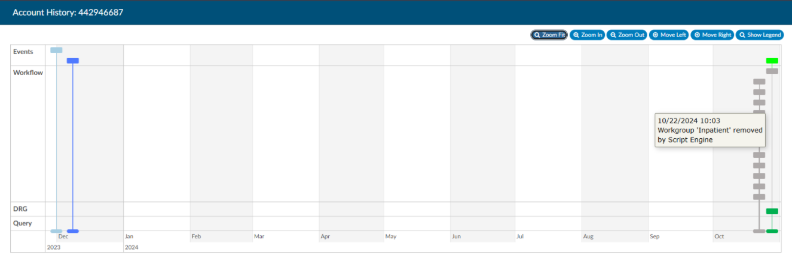

Upon opening Show History, users will see the entire history from a birds-eye view.  The user has the option of using the Zoom In and Zoom Out buttons to expand or collapse the timeline.  The Zoom Fit will bring the visual timeline back to its original collapsed grid.  Hover over any of the event boxes and the contents will be displayed. 

The legend can be found by clicking {}Show Legend{} button to let the user know what the colors represent without having to hover over them.  When clicked, it will open the Legend and the button name will change to "Hide Legend".  Click again to close. 

Click on an entry by date to view the changes that were made to the account on the date and time indicated.

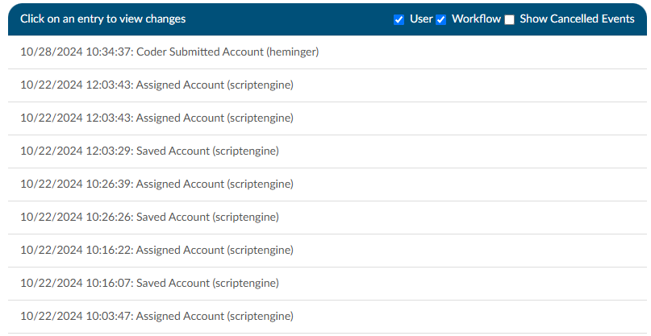

### Admit Diagnosis 

The Admit Diagnosis code and description are displayed below any Validation Results and/or Pending Reasons.

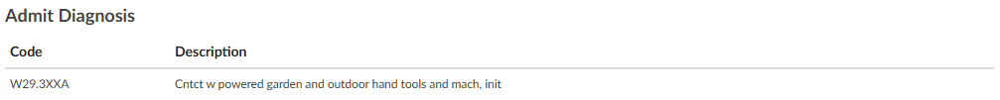

### Visit Reasons

Listed beneath Admit Diagnosis are the Visit Reason codes in code sequence order. The list includes the Visit Reason code and description.

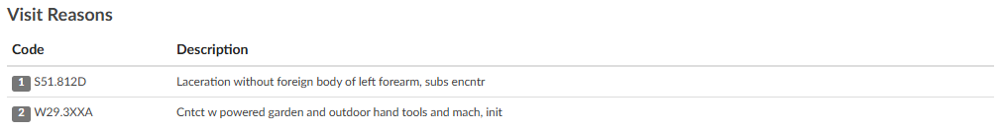

### Assigned Diagnosis Codes

The Assigned Diagnosis Codes are listed in code sequence order below Visit Reasons.  The listing includes the diagnosis code, description, and POA assignment (Y/N).

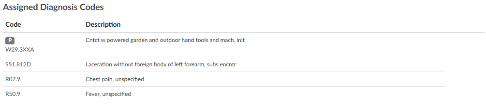

### Assigned Procedure Codes

Listed beneath Assigned Diagnosis Codes are the Assigned Procedure Codes in code sequence order. The list includes the procedure code, description, Service Date, and Physician.

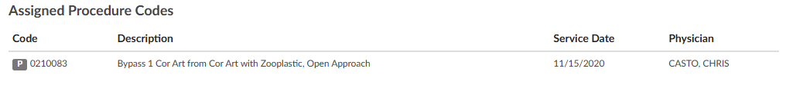

### Assigned CPT Codes

Listed beneath Assigned Procedure Codes are the Assigned CPT Codes in code sequence order. The list includes the CPT code, description, Service Date, and Physician.

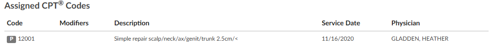

#### Print Summary
If a printer is configured for the computer, click on this button to print a copy of the abstract for this account. 

#### Claim Ownership
Use the Claim Ownership feature based on the organization’s requirements and procedures. Consult your {} manager for more information on claiming ownership of a chart. 

## Final Code Summary

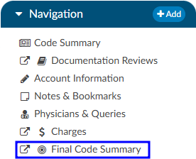

The Final Code Summary will only be available once the facility Coder clicks the {}Submit{} button. This provides transparency between CDI and physician coding teams (if also using Fusion CAC) as to what was coded. When a submitted chart is open again, users will see a new viewer under the navigation menu called the Final Code Summary. This will display what the coders coded along with code status details and sequencing. This data is viewable only for the role of [‘CDI’](https://dolbeysystems.github.io/fusion-cac-web-docs/cdi-user-guide/).  

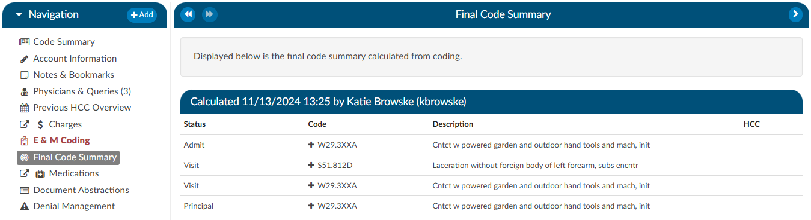

Clicking on the header will expand the selection to display the codes that were coded and DRG/APC, if applicable. Any codes with a plus (+) sign indicates the code has not been added to the account. The plus (+) sign *does not indicate* that the code needs to be added. It is for the user to quickly add the code if they determine it is needed using coding judgment and supporting documentation. If applicable, the code’s HCC designation will show the HCC number and its version.

## Physician Coding Summary

The Physician Code Summary will display if the *Physician Coders* are also coding within Fusion CAC, and they submit the chart. This provides transparency between the facility and physician coding teams as to what was coded.

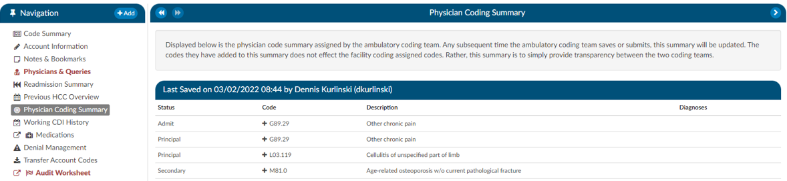

Clicking on the header will expand the selection to display the codes that were coded. Any codes with a plus (+) sign indicates the code has not been added to the account. The plus (+) sign *does not indicate* that the code needs to be added. It is for the user to quickly add the code if they determine it is needed using coding judgment and supporting documentation.

