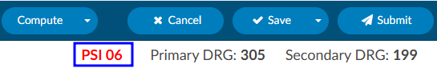
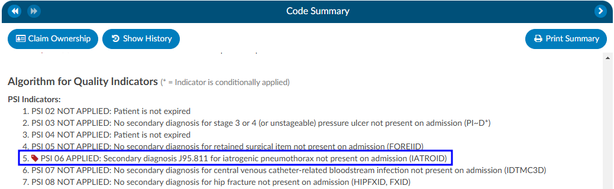
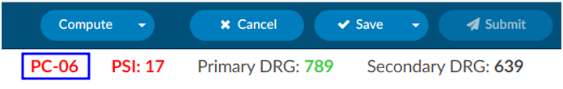
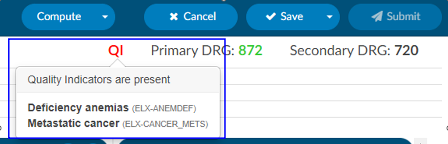
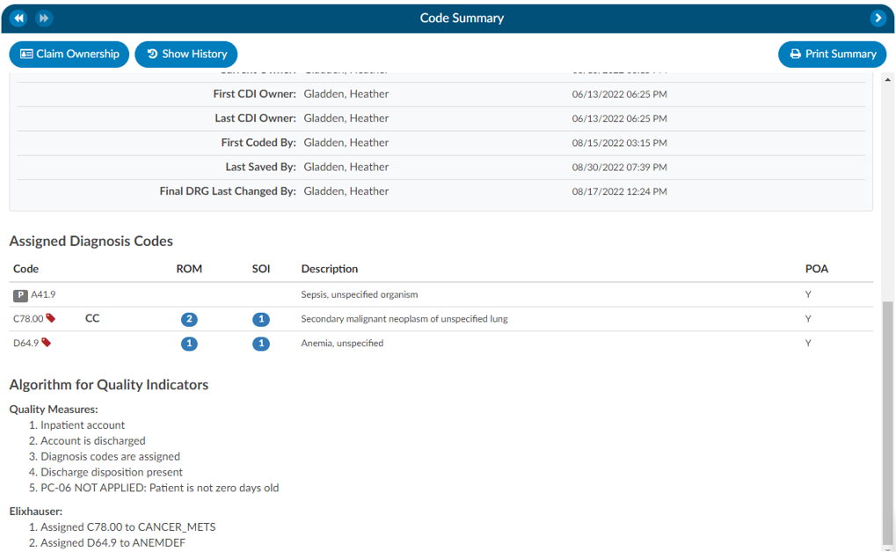
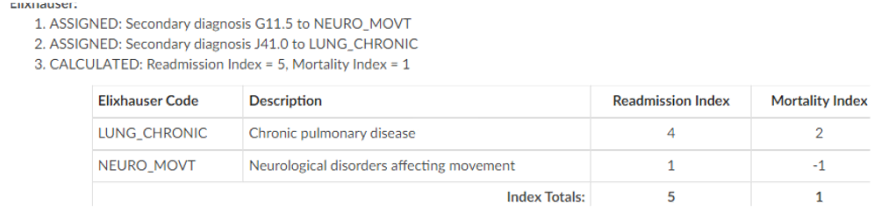

+++
title = 'Quality Indicators'
weight = 11
+++

In the Code Summary Viewer at the bottom, you'll find the Algorithm for Quality Indicators, which outlines the methodology used to identify Pediatric Quality Indicators (PDI), Patient Safety Indicators (PSI), Quality Measure PC-06, and Elixhauser Measures. 

## PSI Indicators

The PSI Module uses the PSI technical specification from Agency for Healthcare Research and Quality
U.S. Department of Health and Human Services from [www.qualityindicators.ahrq.gov](https://qualityindicators.ahrq.gov/).

Fusion CAC leverages the codes from the assigned code tree, along with other relevant patient data, to determine whether specific quality measures are met. Fusion CAC provides an indicator on the banner bar when codes coupled with patient demographics meet a PSI guideline.

The PSI is reported in one of two fields CDI PSI Indicator or PSI Indicator. The indicator can be used for workflow and/or reporting. When a PSI is applied to an account it will display in the algorithm section of the Code Summary viewer. A red tag will display next to the applied PSI for visibility. 

## PDI Indicator

The PDI Module uses the PDI technical specification from Agency for Healthcare Research and Quality
U.S. Department of Health and Human Services [www.qualityindicators.ahrq.gov](https://qualityindicators.ahrq.gov/).

The Pediatric Quality Indicators (PDIs) focus on potentially preventable complications and iatrogenic
events for pediatric patients treated in hospitals and on preventable hospitalizations among pediatric
patients, considering the special characteristics of the pediatric population.

This PDI indicator displays in the banner bar under the compute button. The PDI is reported in one of two fields CDI PDI Indicator or PDI Indicator if identified. The indicator can be used for workflow and/or reporting.

The algorithm for the PDI on if it applied or not is within the Code Summary viewer.

>[!Note] If a code that causes an exclusion for a PSI or PDI occurs in the top 25 codes (or custom limit set by the organization) the PSI/PDI will show in the banner, with an asterisk next to it, to indicate the PSI was conditionally applied.  The algorithm at the bottom of the Code Summary viewer will show the reason why. 

## PC-06 Indicator

The Quality Measure Module supports the PC06 measure and uses the Joint Commission technical
specification [https://manual.jointcommission.org/releases/TJC2018B/MIF0393.html](https://manual.jointcommission.org/releases/TJC2018B/MIF0393.html).

Fusion CAC uses the codes from the assigned code tree along with other patient data that meet each PC-06
guideline. Fusion CAC provides an indicator on the banner bar to a coder when codes coupled with
patient demographics meet a PC-06 guideline. The indicator can be used for workflow and/or reporting.

## Elixhauser Comorbidity Measure Indicator

The Elixhauser Comorbidity Index is a method of categorizing comorbidities of patients based on the
International Classification of Diseases (ICD) diagnosis codes. The indicator can be used for workflow
and/or reporting. 

The algorithm to determine the Elixhauser measure can be found on the code summary at the bottom under the assigned codes. A table under the Elixhauser section of the Code Summary sheet will appear, showing weight totals for each item that triggers.

