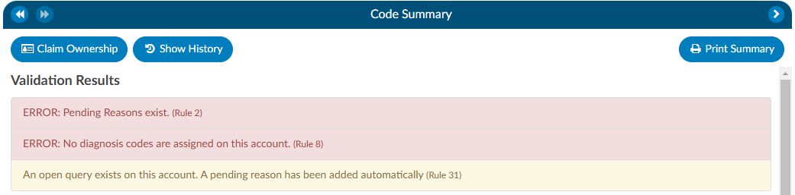

+++
title = 'Validation Results'
weight = 11
+++

When the Code Summary link displays **RED**, there are [validation errors](https://dolbeysystems.github.io/fusion-cac-web-docs/administrative-user-guide/validation-management/) on the chart that must be resolved prior to submission.

Any errors preventing submission of the chart will be highlighted in the box under Validation Results on the Code Summary screen. Validation Results within the chart that should be reviewed and validated before the chart is finalized and submitted for billing.

**ERROR** results will display in **RED**. These are hard stops that will prevent the chart from being submitted. The {}Submit{} button will be grayed out until errors have been resolved, including pending reasons that have been assigned.

**Warning** results will display in **YELLOW**. These are reminders/suggestions for the user. Warnings do *not need to be resolved* before submitting the chart. 

Once all necessary validations results are resolved, the Code Summary link in the Navigation tree will return to black and users can hit the {}Submit{} button to complete the chart.