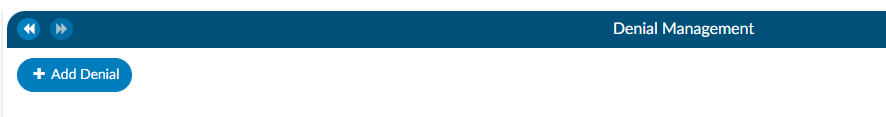
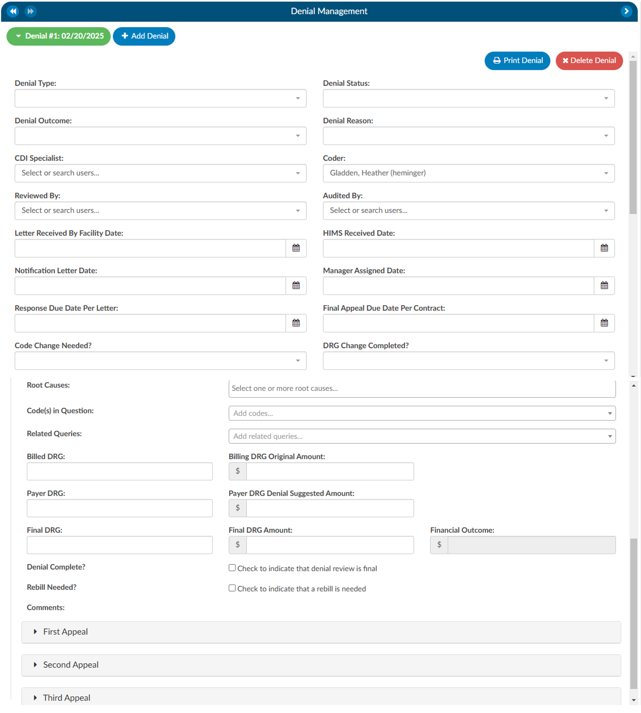
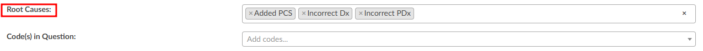
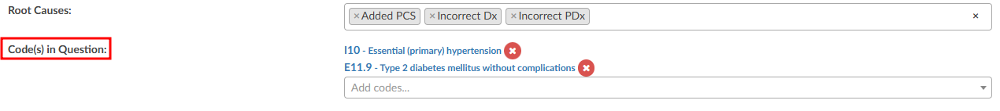
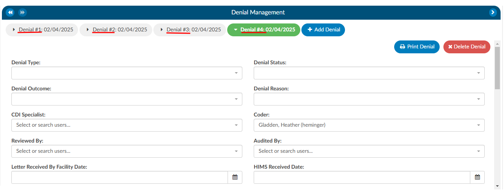
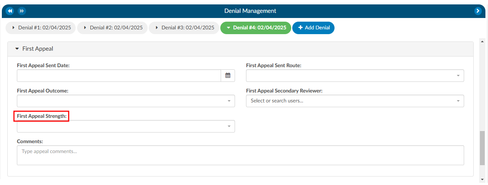
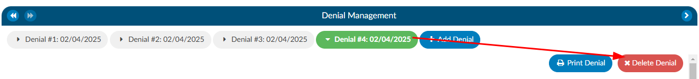

+++
title = 'Denial Management'
weight = 29
+++

{}

The denial management viewer displays on submitted accounts. Clicking on this viewer presents a form with several fields to be filled in when an account has been denied payment. 

Denial management tracking involves monitoring cases where a patient's submitted billing chart is rejected by the payer. Various reasons, such as medical necessity, code, or DRG assignment, could lead to these denials. This tool is designed to comprehensively record the specifics related to denial management and tracking. It is capable of documenting multiple denials for each chart, with the ability to log and categorize them for the purpose of tracking, managing workflows, and generating reports.

## Adding a Denial

To add a denial, select "Denial Management" in the Navigation Tree. This option will only be available if the account has been submitted. This will open up the Denial Management viewer in the center of the screen to then click on the {}+Add Denial{} button.

Once a denial has been added, a form with multiple fileds will need to be filled in by the user working the denial. The fields are made up of various drop-down options, dates, and financial information about the denial.

The **Root Cause** field has a drop down of options where one or more options can be selected.

There can also be multiple **Code(s) in Question** entered.

Options in the fields above with dropdown lists can be customized per organization by editing the appropriate mapping table in [Mapping Configuration](https://dolbeysystems.github.io/fusion-cac-web-docs/administrative-user-guide/tools/mapping-configuration/). These fields include the following:

- DenialType
- DenialStatus
- DenialOutcome
- DenialAppealRoute
- DenialReason
- DenialCodeChangeNeeded
- DenialDRGChangeNeeded
- DenialRootCauses

Each field (except Comments) can be added to [Grid Column Configuration](https://dolbeysystems.github.io/fusion-cac-web-docs/administrative-user-guide/tools/grid-column-configuration/) for display in Account Search. These fields can also be used in workflow if necessary. 

As needed, mutiple denial sheets can be created for a single account. To do this, click on the {}+Add Denial{} button. As more denials are added to an account, they will be listed at the top of the Denial Management viewer. The denial a user is working on will be indicated in green bubble. 

## Appealing a Denial

If a denial needs to be appealed, there are separate fileds to track when those appeals were sent, how it was sent, and the outcome of the appeal. A user can track the strength of the appeal as low, medium, and high based on their organizations preferences. Additionally, a comment section has been added for any free text the user would like to enter.

## Deleting a Denial

If a denial needs to be deleted from the account, click on the denial the user wishes to remove, which will bee in the green bubble, then click on the {}xDelete Denial{} button.

## Reporting Denials

For reporting within [Account Search](https://dolbeysystems.github.io/fusion-cac-web-docs/administrative-user-guide/reporting/account-search/), a Denials drilldown is available. **This drilldown only reports on the first denial on the account**. 