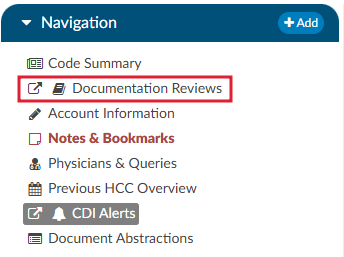
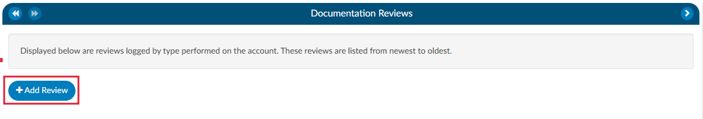
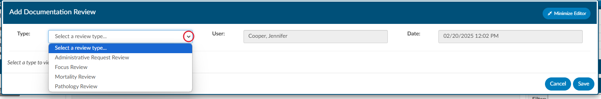

+++
title = 'Documentation Reviews'
weight = 29
+++

{}

The Documentation Reviewss module is designed to provide flexibility for sites that prefer a different style of Clinical Documentation Improvement (CDI) reviews or need alternative methods for tracking management reporting. This module allows users to customize and monitor documentation reviews by various topics and types. It is particularly useful when reviews do not fit the conventional workflows of initial, follow-up, or reconciliation reviews, such as for utilization management purposes.

### Why Use Documentation Reviews?
Sites sometimes choose to add documentation reviews because reporting productivity is more complex than tracking initial, follow-up, or reconciliation reviews. The module's flexibility allows CDI teams to capture and track additional review types that are essential for comprehensive reporting but might not fit within the standard review categories.

### Standard Review Definitions
Before exploring the customization capabilities of the Documentation Review module, it is essential to understand the baseline definitions of reviews in a CDI system:

* **Review:** A review is defined as a save on an account by a CDI Specialist (CDS) on a single day. For inpatient accounts, the specialist must also calculate a Working DRG. Multiple saves on the same account by the same CDS within the same day count as one (1) review. In other words, there can be only one review per account per CDS per day.

* **Initial Review:** The first review saved on an account by a CDs. For inpatient accounts, the CDS must calculate a Working DRG for it to count as an initial review. There can only be one initial review per account.

* **Follow-up Review:** A review saved on an account by either the same or a different CDS on a different day, following the initial review. No account will have more than one follow-up review per day for the same CDSS.

Example:

Day 1: CDI Specialist "A" saves an inpatient account with a Working DRG.

Day 1: CDI Specialist "A" updates the Working DRG (does not count as a separate review since it is within the same day).

Day 2: CDI Specialist "B" saves the account with the same Working DRG (counts as a follow-up review).

Day 3: CDI Specialist "A" saves the account with the same Working DRG.

Day 3: CDI Specialist "B" saves the account with a different Working DRG (counts as a follow-up review).

In this scenario, there is one initial review and three follow-up reviews. The change made by CDI Specialist "A" on Day 1 does not count as a follow-up because it occurred on the same day as the initial review.

### Customizing Documentation Reviews
By default, the Documentation Review module includes a free-form text field, allowing CDI specialists to capture detailed information about their reviews. However, sites can further customize the module by creating forms specific to different review types, enabling more structured and consistent data entry.

### Creating Custom Forms
Using the [Worksheet Designer](https://dolbeysystems.github.io/fusion-cac-web-docs/administrative-user-guide/tools/worksheet-designer/), sites can create tailored forms for different documentation review types. These forms can help standardize data collection and improve reporting accuracy. Some common examples of custom review types include:

* MD Advisor Response
* Query Opportunity Reply
* Coder Question Response
* Post-Discharge Follow-up
* Pre-Bill Review
* Retrospective Query Needed
* Query Review
* Case Management Review
* Quality Improvement (QI) Review
* Utilization Review
* Types of Reviews

Custom reviews allow CDI teams to track reviews that fall outside of traditional CDI workflows. These reviews can be particularly useful for:

* **Post-Discharge and Pre-Bill Reviews:** These reviews focus on ensuring documentation accuracy and completeness before the billing process, helping to reduce denials and optimize revenue capture.
* **Query and Retrospective Reviews:** These reviews allow CDI teams to capture follow-up actions taken after initial queries or when additional queries are required after discharge outside of a traditional review.
* **Utilization Management Reviews:** These reviews may not fit into the standard initial or follow-up workflows but are crucial for tracking how effectively hospital resources are used and ensuring proper reimbursement.
* **Reporting and Productivity:** Tracking productivity for non-standard reviews (such as utilization reviews or post-discharge follow-ups) can be more complex than traditional reviews. Customizing the module allows sites to generate more meaningful reports that reflect the variety of documentation efforts made by CDI teams.

In the CDI Summary section of the dashboard, counts of reviews are displayed, such as "In the Last 7 Days," excluding the current day. This allows for real-time tracking of CDI efforts and helps managers assess team productivity.

### CDI Productivity by Review Type
This report shows productivity by each user by custom documentation review type.

### CDI Detailed by Review
This report provides details about the custom documentation review type of CDI reviews performed by account.

### Navigating to Documentation Reviewss
Unlike the CDI Worksheet which is located under the Document tree, the Documentation Reviewss section is found on the Navigation tree within the user interface. This distinction allows easy access to reviews that are separate from the standard CDI workflows and documents.

### Steps to Access Documentation Reviews

1. Locate the Navigation tree: Once logged into the system, navigate to the left-hand side of the screen where the Navigation tree is displayed.
2. Select Documentation Review: Under the Navigation tree, will be the Documentation Reviews section. Click on it to open the review interface.

3. Adding a New Review: Upon opening the Documentation Reviews viewer, there will be the option to +Add Review. This allows the user to select the specific review type from the list of available choices. The choices available are customized per organization and can include any form types an organization has designed.

