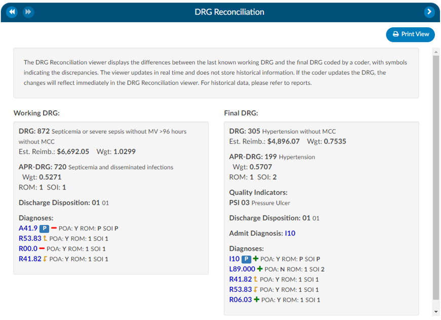

+++
title = 'DRG Reconciliation '
weight = 18
+++

{}

The DRG Reconciliation viewer displays the differences between the last known Working DRG and the Final DRG coded by a Coder, with symbols indicating the discrepancies. The viewer updates in real time and does not store historical information. If the Coder updates the DRG, the changes will reflect immediately in the DRG Reconciliation viewer. For historical data, please refer to reports.

