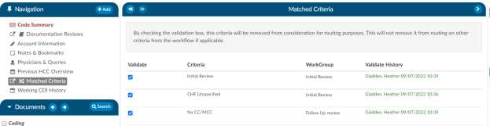

+++
title = 'Matched Criteria'
weight = 20
+++

> [!note] CDI Users Only
The Matched Criteria viewer is only visible if the active role is CDI Specialist.

The Matched Criteria viewer allows a user to see why the chart was routed to them. The matched criteria group is a list
of “Criteria Group” that the chart matched upon when it went through workflow. These criteria groups
are used to indicate a “possible” query opportunity based upon the criteria outlined in workflow.

### Prioritizing Workflow using Matched Criteria

Matched Criteria can be used to prioritize workflow using one of two fields:
1. **Criteria Group** - This field will tell the name of the criteria that the workflow routed the
chart to the CDI users. Often times the field is renamed to “Routed Reason” because this field represents
why the chart was routed to the user. If the chart matches multiple criteria groups the criteria group
that is displayed in this field is the first one that it matched. All others that it matched with will
display within the Matched Criteria viewer when the chart is opened.

2. **Active Matched Criteria Groups** - This is often renamed as “Opportunities” and is defined as the number of matched criteria groups the chart matched with, which reflects the total number of possible query opportunities currently present on the patient chart. This field can be used by the CDI user to sort the worklist based upon the charts that have the most to least possible query opportunities.

Once a CDI user validates a criteria group by checking the box next to its name in the Matched Criteria viewer, that criterion is removed from consideration for routing purposes. However, this does not affect other criteria that may still be active in the workflow.

If multiple worklists contain the same matched criteria group names and a chart has already had a prior matched criteria group with the same name validated, it will not be retriggered or displayed in the Matched Criteria viewer.

