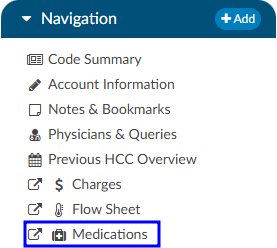
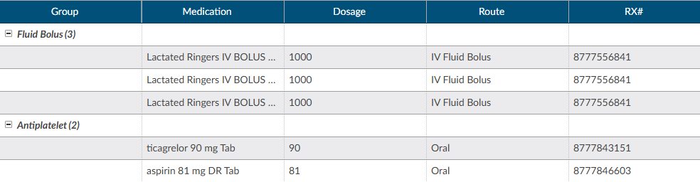
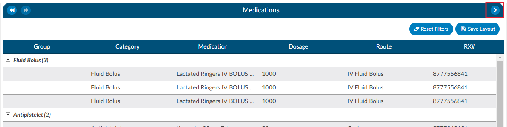

+++
title = 'Medications'
weight = 21
aliases = [
  '/general-user-guide/account-screen/navigation-tree/medications-viewer/',
  '/general-user-guide/account-screen/account-viewers/medications-viewer/',
]

+++

A Medication Administration Record (MAR, or eMAR for electronic versions), commonly referred to as a drug chart, is the report that serves as a legal record of the drugs administered to a patient at a facility by a health care professional. The MAR is a part of a patient's permanent record on their medical chart. The health care professional signs off on the record at the time that the drug or device is administered. 

### Activity Buttons

There are activity buttons to "Save Layout" or expand the Medications viewer. Users can expand the width of the Medications viewer to view more available columns by clicking on the arrow in the top right corner of the viewer. This viewer also provides columns that can be sorted or filtered based on the user's need. The columns include the medication Group, Category, Medication name, Dosage, Route, Rx#, Start Date/Time, and End Date/Time.

### Column Settings

Each column within the Medications grid has menu options to Pin Column, Autosize, and Reset Columns. Click on the Menu icon to view the drop-down listing. These options work the same way as in the Assigned Accounts grid; for details, see [Pin Column](https://dolbeysystems.github.io/fusion-cac-web-docs/general-user-guide/accessing-accounts/#pin-column) and [Autosize & Reset Columns](https://dolbeysystems.github.io/fusion-cac-web-docs/general-user-guide/accessing-accounts/#autosize--reset-columns). After making column setting selections, click on the {}Save Layout{} button to retain column settings for future coding sessions.
