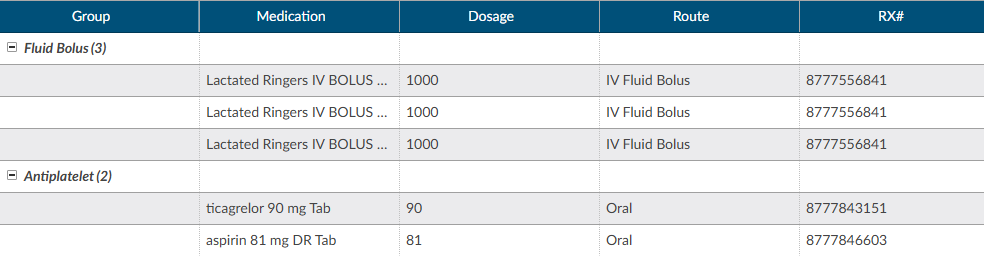

+++
title = 'Medications'
weight = 21

+++

A Medication Administration Record (MAR, or eMAR for electronic versions), commonly referred to as a drug chart, is the report that serves as a legal record of the drugs administered to a patient at a facility by a health care professional. The MAR is a part of a patient's permanent record on their medical chart. The health care professional signs off on the record at the time that the drug or device is administered. 

### Activity Buttons

There are activity buttons to "Save Layout" or expand the Medications viewer. Users can expand the width of the Medications viewer to view more available columns by clicking on the arrow in the top right corner of the viewer. This viewer also provides columns that can be sorted or filtered based on the user's need. The columns include the medication Group, Category, Medication name, Dosage, Route, Rx#, Start Date/Time, and End Date/Time.

### Column Settings

Each column within the Medications grid has menu options to Pin Column, Autosize, and Reset Columns. Click on the Menu icon to view the drop-down listing. After making column setting selections, click on the button to retain column settings for future coding sessions.

|Column Setting      |Definition|
|--------------------|----------|
|Pin Column          |Allows users to select the column and then pin it to the RIGHT or LEFT side of the assigned accounts grid. This function works similarly to freezing columns in Excel.|
|Autosize This Column|Select this option to change the column width to automatically size the width of the column for contents of the cells in this column.|
|Autosize All Columns|To quickly autosize all columns in the assigned accounts grid, click the Autosize All Columns button.|
|Reset Columns|Click on this option to Reset Columns to their default column width.|