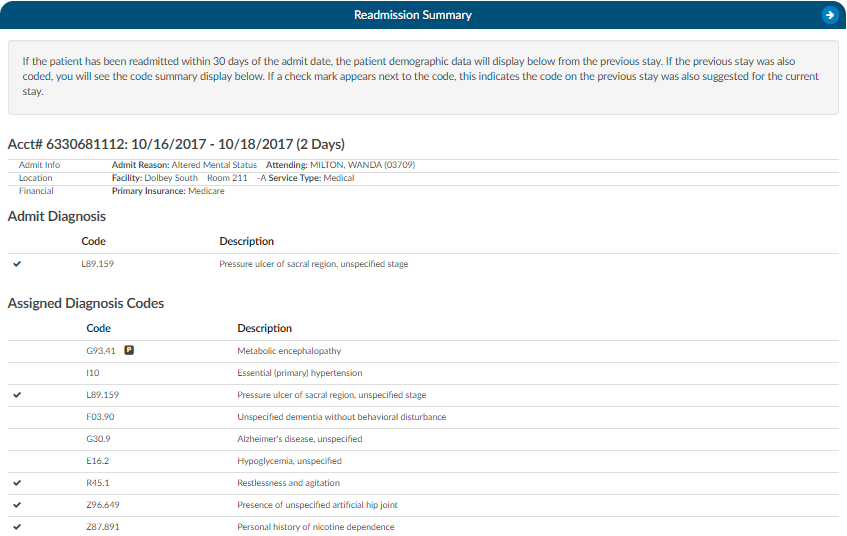

+++
title = 'Readmission Summary Viewer'
weight = 25
aliases = [
  '/general-user-guide/account-screen/navigation-tree/30-day-readmit/',
  '/general-user-guide/account-screen/account-viewers/30-day-readmit/',
]
+++

> [!note] Viewer Name and Availability
> The name of this viewer is set by each organization, so it may appear under a different name in the Navigation Tree, such as "Recent Visits." This viewer is not turned on at every organization. If you are unsure whether it is available, please contact your {} supervisor.

If the patient has been readmitted within 30 days of an admission date, the patient demographic data will display below from the previous stay. This is not just for inpatient readmissions, but also includes if the patient was ever seen for any patient type within the last 30 days. The 30 days look back can also be expanded to 45 or 90 days. If the previous stay was also coded, you will see the Code Summary display below. If a check mark appears next to the code, this indicates the code on the previous stay was also suggested for the current stay.

If an account has multiple readmissions, they will all show if they are in the default time of 30 days.  A setting can be changed to allow the number of days to be customized.  If the setting is updated to an amount other than 30, that new amount will show in the Readmission Summary Viewer AND in the red tag in the banner. *Please contact Support (cacsupport@dolbey.com) to have the setting configured, if desired.*