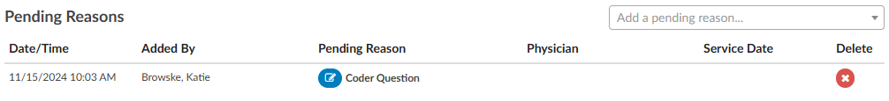
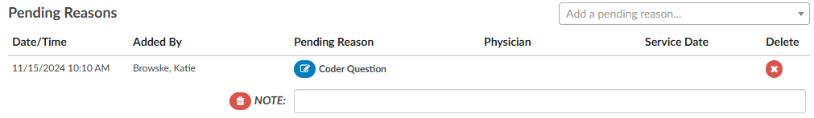

+++
title = 'Pending Reasons'
weight = 10
aliases = ['/account-navigation/navigation-tree/code-summary/pending-reasons/']
+++

### Pending Reasons

A list of Pending Reasons assigned to the account can be found within the Code Summary viewer below Validation Results.

Pending reasons are used when a chart cannot be completed or routed to another Workgroup. The number of pending reasons selected is unlimited.  Pending reasons will be different for each facility based on system configuration specifications.  Please contact your {} manager for definition and use of available pending reasons.

Pending Reasons can be added to the account by clicking on the drop-down menu and selecting the applicable Pending Reason. If the organization has selected to allow a physician to be tied to a pending reason, the user will be prompted to assign a physician to the pending reason, and will see an additional physician field in the list of pending reasons. 

>[!Note] If physicians have been turned on for pending reasons, not all pending reasons may be tied to a physician. This option is set within the mapping configuration.

If a pending reason is added to an account, the Submit button will be grayed out and unavailable.  Click on the Save button to save all changes and exit the chart. Charts with pending reasons will stay within the existing Workgroup until the Pending Reason is removed. Pending Reasons can also be deleted/removed from accounts by clicking on the "X" next to the Pending Reason to be removed. 

>[!Note] Pending Reasons Added by Validation Rules
>A Pending Reason that was added automatically by a [Validation Rule](https://dolbeysystems.github.io/fusion-cac-web-docs/account-navigation/navigation-tree/standard-viewers/code-summary/review-validation-rules/) cannot be deleted manually, and its Delete symbol is not available. It is removed once the Validation Rule no longer applies to the account.

##### Pending Reason Notes
On any account, an edit button will appear to the left of the pending reason. Clicking that button will drop down a note entry where the user can record a note. Pressing ENTER will record the note. Keep in mind that a note can be deleted by clicking a trash can symbol to its left. In Account Search, the "Pending Reasons" drill down will now include the "Note" field.

##### Filtering by Pending Reason
On the Autoload, Account List, and Account Search pages, the Pending Reasons column can be filtered. When a pending reason is unchecked in the column filter, accounts that have **only** that pending reason are removed from the grid. Accounts that have that pending reason along with other pending reasons still display.

Your organization can change this so that any account with the unchecked pending reason is removed, even if other pending reasons are also assigned.

> [!info] Additional Configuration Required
> Please contact Support to change how the Pending Reasons filter works.
