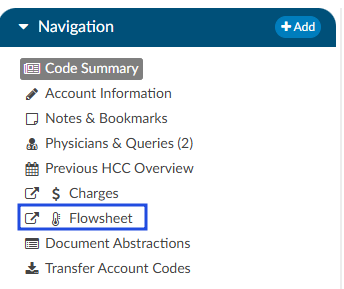
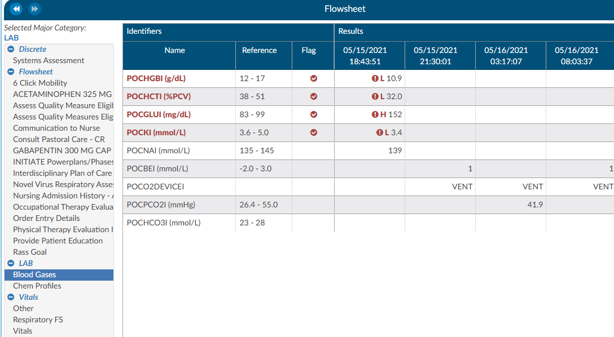
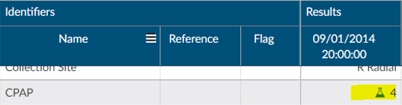
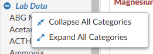

+++
title = 'Flowsheet'
weight = 40
+++

> [!note] Requirements
> This viewer requires a DTA interface with labs and/or flowsheets.

The Flowsheet viewer shows information found in nursing documentation such as nursing or respiratory assessments, skin assessments, intake and output data, etc. The viewer can be popped out into another window by clicking on a little square with an arrow pointing to the right in the navigation tree next to the viewer name.

The Flowsheet viewer is the most recent style of discrete data viewer. This viewer is organized much like a spreadsheet. Depending on configuration, users may see major categories on the left-hand side of the spreadsheet (there are many different options as each site is a little different.). Upon clicking on one of these items users will be presented with a grid to the right. That grid will have multiple columns, the first column being name. Hovering over the column name will display three little lines. Clicking on them, will allow the user to filter in order to narrow down the data. If any of those names appear in red that means that at least one of the data elements are outside of the normal limits if there is a range. 

To the right of the name, if applicable, is a reference column. This reference column will indicate if the value is within normal limits. This is data that the EHR system has sent to Fusion CAC. If the reference column is available, then to the right of that is a flag column. A checkmark in that field  also means the value is out of the normal range. This column can also be filtered if the user wants to look at everything outside of the normal limits. Next to that field is a date and time column. The user may see multiple dates and times depending on how the data is organized and how frequently it is documented. If a discrete value on the Flowsheet viewer has a specimen, it will show as a beaker symbol in the Results column. Hovering over the symbol will provide the name and site of the specimen. 

Right clicking in the Major Category column will show a menu allowing the user to expand or collapse all categories. That configuration will be saved for all accounts that have the Flowsheet Viewer, per user role.  Note that if a user collapses/uncollapses a major category in the pop-out, it will not be seen on the main page until the user moves to a different viewer and back.

