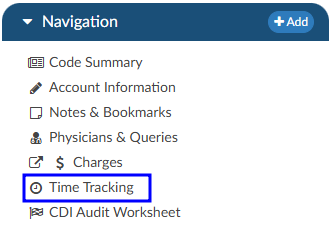
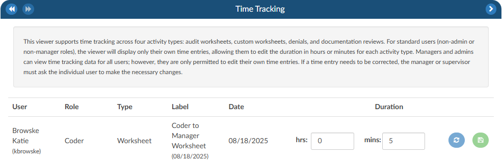

+++
title = 'Time Tracking Viewer'
weight = 26
+++

The Time Tracking Viewer allows for time-tracking on four types of documents:
- Denial worksheets
- Audit worksheets
- Documentation Reviews
- User added worksheets

The above worksheets will be read only until the Start button in the top right corner of the worksheet is clicked. 

Tracking will be stopped when:

- The user clicks the Stop button 
- The user opens another document and starts its time tracking
- The user exits the account

Users will be able to adjust their time in the Time Tracking viewer if necessary. Managers and admins can view time tracking data for all users; however, each user is only permitted to edit their own time entries. If a time entry needs to be corrected, the manager or supervisor must ask the individual user to make the necessary changes.

