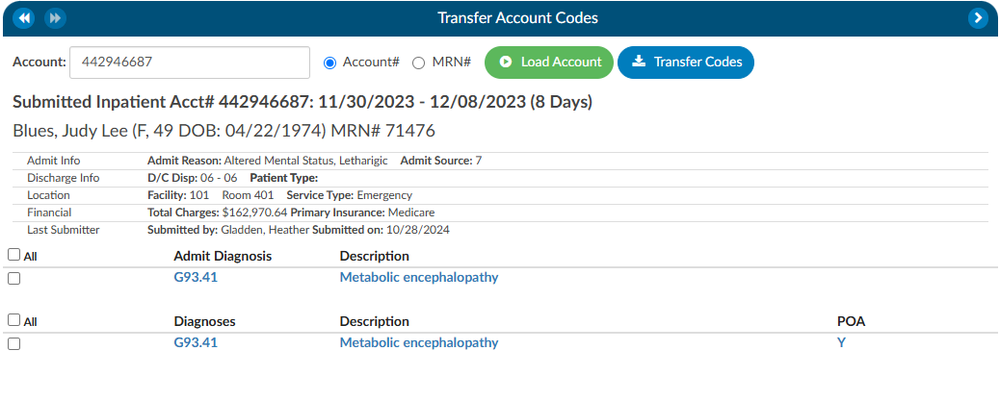

+++
title = 'Transfer Account Codes'
weight = 26
+++

Transfer codes can be used to help combine account codes into one encounter. Most sites leverage the ADT to combine the actual account; however, there are times it is necessary to copy codes from one encounter to another.

If a patient has two different accounts and the coder has already done work on each of the accounts, the Transfer Codes feature can be an easy way to post codes  when you’re within one account and want to search in another account, and have the ability to open that other account and see the codes. 

To transfer codes either select the Account# radio button and type in the account number, or select the MRN radio button where the MRN of the opened account will populate. Once either of those numbers are entered, click the {}Load Account{} button.  When the account or MRN is loaded, use the check boxes to the left of the codes to choose which codes will transfer. Once the needed codes are checked, click on the {}Transfer Codes {} button and the codes you selected will be added to the “Assigned” codes tree that is on the current account.