+++
title = 'Account Overview'
weight = 10
+++

Clicking on the **Accounts** tab at the top of the screen allows users to access accounts in the system. Click anywhere on the row of an account to open it.

## Account List

The main view for a workgroup is called the **Account List**, which displays accounts that need to be worked by the user. 

Accounts are commonly sorted into workgroups based on criteria set by the operational/management team. Each workgroup is a list of work that needs to be completed by users assigned to the workgroup. 

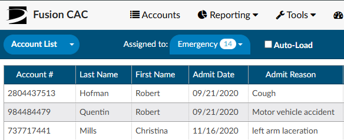

To access assigned worklists, click on the down arrow to the right of the {}Assigned to{} dropdown. Each of the user's assigned worklists will be listed along with a bubble showing the number of accounts in the group available for coding. By default, **a worklist must have at least one pending chart to display in the system**. Assigned Workgroups will not be visible here if there are no accounts available for coding for that specific Workgroup.

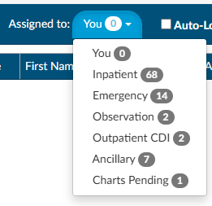

> [!note]
If there are no workgroups in the drop-down, ensure the drop-down menu to
the left of {}Assigned to{} says **Accounts**. If it does,
contact your {} supervisor.

For more information on workgroups at your organization, contact your {} supervisor.

### Auto-Load

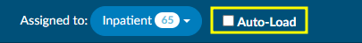

Checking the Auto-Load box before starting a session, or while in an assigned worklist, will automatically load the next chart in the selected Workgroup upon Save, Submit, or Cancel. Users can discontinue Auto-Load at any time by unchecking the Auto-Load box. This will return them to the Assigned to Workgroup for manual selection of the next chart in the selected Workgroup.

### Refresh Button

Fusion CAC is regularly reacting to account activity, submitting information to the encoder, updating Workgroups, and returning data to the EHR.  When working from the assigned accounts listing, it is recommended to occasionally refresh the data and update the Workgroups with recent information.

To ensure the most up-to-date information for accounts is presented in your assigned Workgroups, or when your current session of Fusion CAC has been idle for an extended period, hit the Refresh button, within the application, to update the session with recent activity. 

>[!Note]
>The refresh button within Fusion CAC is different from the refresh button in your browser. Using the browser refresh button is **NOT**  recommended as this will reload your session, resulting in a loss of work. 

## Assigned Account Grid

Each column within the Assigned Accounts Grid has menu options to pin, auto size, and reset columns as well as a Tool Panel to select which columns you want displayed in your view of the assigned accounts grid. Click on the Menu icon to view the drop-down listing.

### Pin Column

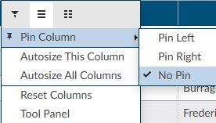

The Pin Column feature allows users to freeze desired columns to the right or left of the accounts grid pane. Doing so will keep these columns visible when moving to other areas of the assigned accounts grid. Columns can be rearranged after they have been pinned based on view preferences. To unpin a column, select the Pin Column option from the menu and choose No Pin.

### Autosize & Reset Columns

Within the assigned accounts listing, the default column width is based on the account with the data field with the most characters. Users can size individual columns, or all columns to automatically fit the width of contents of that particular column. To autosize just one column, select the menu button for the column, then select "Autosize This Column". To automatically fit the width of contents for ALL columns, select the menu button for any column, then select "Autosize All Columns". To return column widths to their default settings, select the menu button for any column, then select "Reset Columns".

### Tool Panel

The Tool Panel feature gives users the flexibility to customize which columns are displayed within their Assigned Accounts Grid.

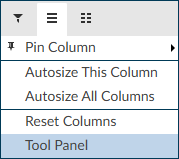

Click on "Tool Panel" from the Column Setting drop-down listing to view the Tool Panel selection menu.  Select/deselect columns to be displayed and then click on "Tool Panel" again to hide the Tool Panel selection menu.

### Grid Column Fields

Users can choose which columns to view when displaying their assigned accounts list by clicking on the Columns icon in any column on the assigned accounts listing.

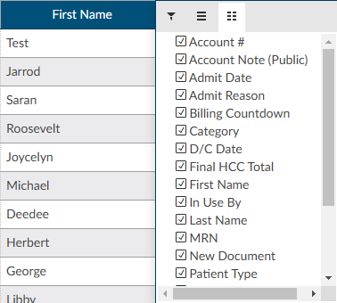

Tool Panel settings will remain for all future coding sessions and subsequent logins. To bring all columns back into view, click on Reset Columns from the Column Settings drop-down listing.s

### {} Sorting and {} Filtering

After selecting a workgroup, a list of accounts will appear in the grid. The displayed grid can be customized using the column menu settings to pin, auto size, sort, filter, and select columns to display. Columns can also be re-ordered by clicking and dragging the column headings. These setting are custom and "sticky", meaning they can be set per user and remembered for future logins.

  

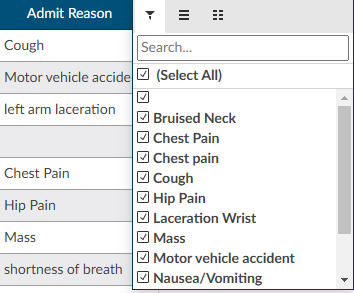

Using the filter menu allows users to narrow down and isolate the accounts to be worked based on data elements within the selected column. For example, the filter menu for the D/C Date column allows the user to filter the account list by selected dates using the checkboxes or entering specific dates in the Search box. A {} icon in front of the column heading means that a filter has been applied. 

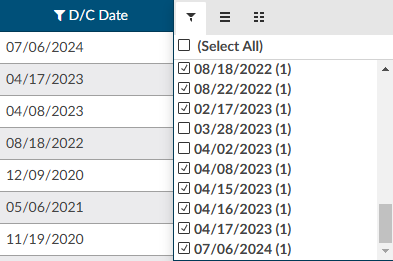

To remove any selected filters, click on the {} and then check the box for (Select All) to remove all filters. 
When filtering more than one column, use the ‘Reset Filter’ button to remove all filters instead of removing the filter from individual columns. 

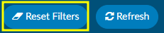

Sorting information in the assigned accounts grid allows users to see data the way they want and find accounts quickly. Data can be sorted by text (A to Z or Z to A), numbers (smallest to largest or largest to smallest), and dates (oldest to newest and newest to oldest). To sort a single column, click once on the column header of the column you want to sort.  The column header will change to an up arrow. This will sort the column first in ascending order (A-Z).  Click the column header again to change to a descending (Z-A) sort with a down arrow. Clicking on the column heading a third time will return the column to the default sort and the arrow will disappear.

#### Ascending Sort: 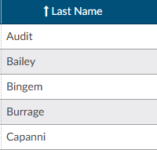

#### Descending Sort: 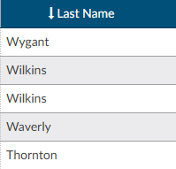

Users can select multiple columns for ascending and descending sorts. To sort multiple columns, click the column heading of the first column in the selection, then hold down the SHIFT button while clickiing the column headings of other columns to be added to the selection for sorting. Click the column header for sort selection (ascending, descending, default) until the individual column is sorted in the preferred sort order.  After all selections have been made, release the keys for the sort results.

## Manually Loading an Account

If a specific account is needed, it can be accessed by typing the account number into the {}Account #{} field on the right side of the Account List bar. The entered account will open after the user hits the {}Enter{} key or
clicks the {} List icon.

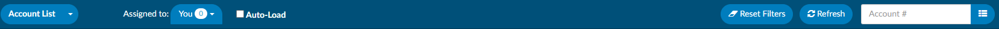

## Alternate Views

Other special-case views are available by clicking the drop-down next to **Account List** and selecting the appropriate option:

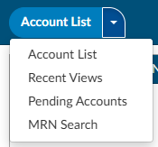

### {} Recent Views

The Recent Views menu item allows users to quickly find accounts accessed within the last 24 hours in sequenced order.

### {} Pending Accounts

The Pending Accounts menu item displays all of the accounts that currently have a **Pending Reason** set by the user.

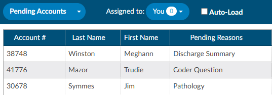

### {} MRN Search

The MRN Search field allows users to search accounts by MRN. The grid will display MRNs that match the search.

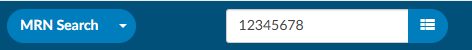

