+++
title = 'Adding/Validating Codes'
weight = 11

+++

{}

### Validating a Code

Codes can be validated/added to the chart as Assigned Codes while reviewing documents and the suggested codes within each document.
Right-click on the code to Edit/Assign the code.

|Code Highlight|Meaning|
|--------------|--------|
|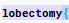|If the background of the text suggestion has a purple background, the text matches a code suggestion|
|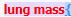|If the background of the text suggestion has a red background, the text matches only a secondary token|
|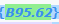|If the background of the code has a green background this means the code was already validated on a different document

### Adding a Code

There are multiple ways to add a code to a chart, if it has not already been suggested by the engine

#### Add Code via Right Click

After reviewing all suggested codes from either the Documents viewer or the Unassigned code tree, users can add a code to a text document by highlighting the relevant word(s) or phrase and then right-clicking to open the Add Code menu. 

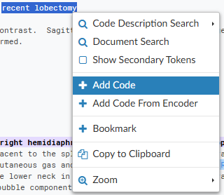

#### Add Code via Direct Entry

The {}Add Code{} box can be used when the code to be assigned is known and encoder is not needed. 

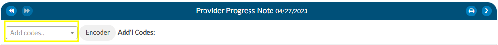

Alternatively, the user can highlight a term, right click, and select +Add Code. 

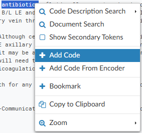

Enter at least the first 2 characters of the code to bring up the drop-down list of available codes for the main term, then scroll down the listing for codes to confirm the sub-term and select the appropriate code for complete coding. From the Code Editor window, users can also confirm the code description, set the POA Indicator, and designate the code as Admit, Principal or Secondary.
Users may also enter the text description of the code and select the code that way. 

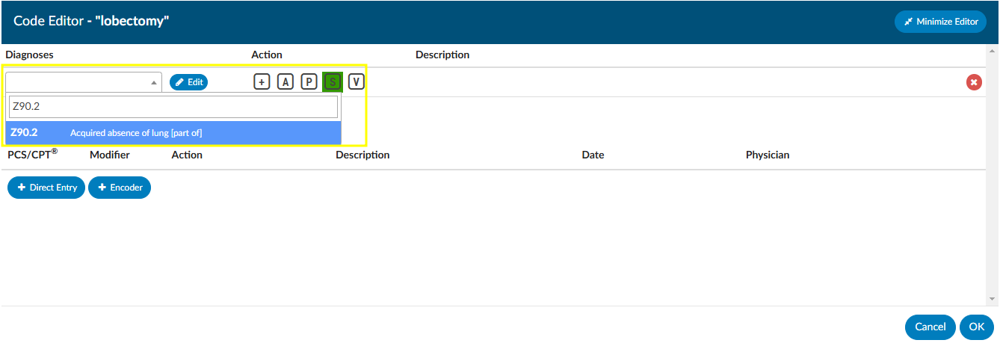

>[!Note] Either a Diagnosis or Procedure/CPT® code can be entered from the Code Editor window. 

#### Add Code From Encoder

Users can add a code to a text document by highlighting the relevant word(s) or phrase and then right-clicking to open the Add Code menu. Left-click and drag the mouse to highlight the selected text for code addition, then right-click to open the Add Code Menu. 
Click on the Add Code from Encoder  +  sign to launch the Encoder. Continue to use the encoder and accept the final code which will be returned to your chart.

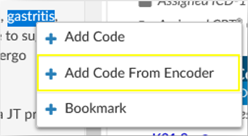

#### Add Code to Scanned Documents

The engine does not suggest codes from scanned documents. Users can add codes to scanned documents for codes not assigned elsewhere within the chart.  Adding codes to scanned documents is recommended *only* when a code has not already been added to a text document within the chart or documentation to be coded is not found elsewhere.

To add a code to a scanned document, start typing the code in the {}Add Code{} box or click on the Encoder button in the bar above the scanned document.

Codes added to the scanned document will appear in the Additonal Codes space at the top of the document viewer.

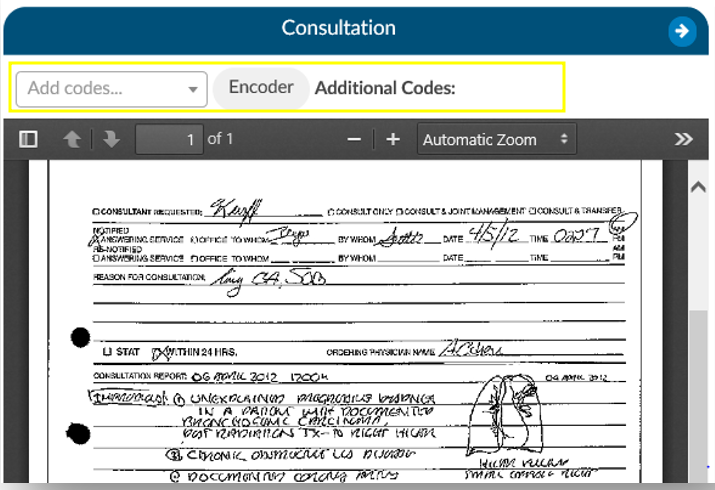

#### Add Code From Codebook

Users can add a code to a text document by highlighting the relevant word(s) or phrase and then right-clicking to open the Add Code menu. Left-click and drag the mouse to highlight the selected text for code addition, then right-click to open the Add Code Menu. 
Click on Add Code from Encoder + to launch the Encoder. Continue to use the encoder and accept the final code which will be returned to the chart.

>[!Note] The exact functionality of adding a code from encoder can vary depending on organizational settings and the encoder used.  Please consult your {} supervisor if you need further instructions.

### Code Description Search

Left-click and drag the mouse to highlight the selected text for code addition, then right-click to open the Add Code Menu. Click on Code Description Search to have Fusion CAC present any relevant code based on the highlighted word or phrase. If the correct code appears in this list, clicking on it will add the code to the document.

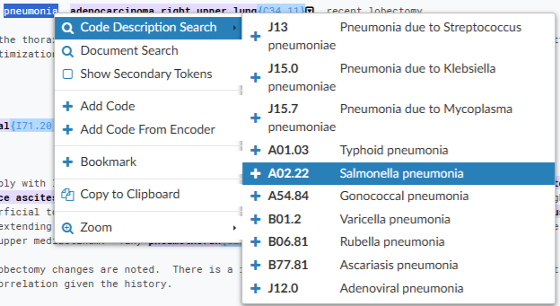

### Supporting Evidence 

Supporting evidence is defined as the components within the chart that were used to make up any suggested codes.

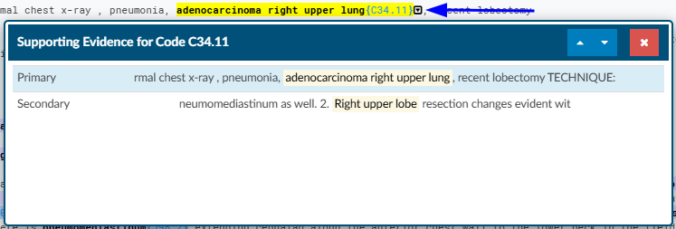

The supporting details help the user understand why the engine suggested a code. Clicking on the down arrow next to the code will show the words/phrases used to create the code. This linkage will allow users to determine if the code is correct or if it tried to put two thoughts together together incorrectly. 
  
