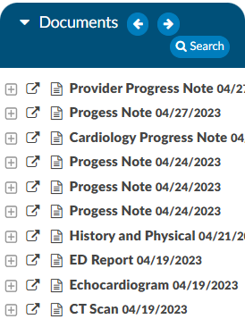
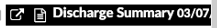
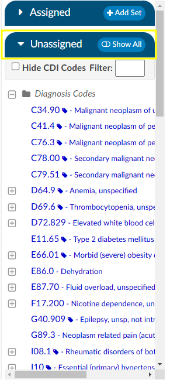
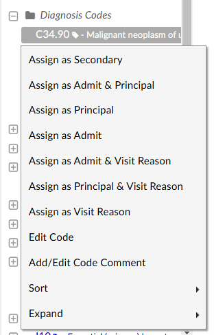

+++
title = 'Navigation Tree'
weight = 10
+++

## Account Action Bar

The blue bar accross the top of the screen is the Account Action Bar. This bar displays specific account information such as the account status,the account number, and the dates of service. Additonally, the Account Action Bar houses buttons allowing the user to compute, cancel, save, or submit the account as needed.

|Button |Function|
|-------|--------|
|Compute|Launches the encoder.  This button should be used to COMPUTE the DRG or view encoder Edits.|
|Cancel |This button will CANCEL any changes made to the account and return to the Assigned Accounts Listing for selection of a new account.|
|Save   |This button will SAVE any changes made to the account during the current session and return to the Assigned Accounts Listing for selection of a new account.|
|Submit |The SUBMIT button will save and send any changes made to the account downstream based on facility requirements (usually billing or abstraction). |

## Banner Bar

Below the Accounts Action Bar is the Banner Bar.

### Patient Information 

Information in the banner bar may include:

- Admit details
- Discharge details
- Patient Name – Last Name, First Name & Middle Initial
- Gender
- Patinet Age and date of birth
- Medical Record Number (MRN)

> [!info] Banner Bar Collapse/Expand
> Clicking the patient's name will collapse the banner bar to provide more vertical screen space.
> Clicking the patient's name again will expand the banner bar and the information displayed. 

### DRG/APC

From the Banner Bar, you can toggle between demographic information and Primary DRG
information by clicking on the Primary DRG hyperlink. 

The DRG view displays information available from the encoder for the computed DRG. The DRG or APC information will appear on the Banner Bar after codes have been assigned and DRG or APC computed and returned from the encoder.

## Navigation Tree

The Navigation Tree sits above the Documents Pane on the left-hand side of the Account Screen. 
The Navigation Tree includes hyperlinks, or [viewers](https://dolbeysystems.github.io/fusion-cac-web-docs/general-user-guide/account-screen/account-viewers/), to pages within the chart providing summary views of
coding information, demographic information, as well as clinical documentation, workflow, and 
worksheets.

Any Navigation link highlighted in **RED**
indicates action items  required to finalize the chart or  additional information available for review and reference. 

### +Add

Click on the +Add document button to add a document configured based on your user role. 

Available document types are configured with the operational/management team per organization. 

## Document Tree

The Documents Tree includes a listing of all documents in a patient chart categorized by document type, as configured by the organization. It frames the Documents Tree and is located on the left-hand side of the Account Screen. Icons next to document names in the Documents Tree indicate document types. Each document in the Documents Tree uses an icon or bolding to give information about the document.

|Icon    |Meaning |
|--------|--------|
||Open document in new tab/window to allow continued access to the document while working in other areas of the chart.|
||Image/scanned document|
|| Text document|
||Bold document titles indicate the document has not been viewed by the current user|
||Document with engine code suggestions|
||Archived documents that contain codes assigned by coders.  This document will appear in the Documents pane with white text against a black background.  Bookmarks on those documents will also be retained.  Doing a Ctrl Click on the document header in the viewer will now show the archive date and time.|

For convenience, users may want to pop out the document into a separate window to continue viewing it while accessing other areas of the chart.

On the documents panel users will see a backward and a forward arrow. This will allow the user to move up and down through the documents listed in the panel. 

### Document Codes

If the document has a plus sign to the left of the document name, there are codes within the document for review and validation. Click on the {}**+**{} next to a document to expand and show all codes found on the selected document.

   
Clicking on a document will load the document in the document viewer. Clicking on a suggested code listed underneath the document will take you to highlighted text within the document that triggered the engine to make that code suggestion. 

### Sort Documents

Sorting documents within the Documents tree is done by right-clicking on a document within the pane and selecting Sort, then Default, A-Z, Z-A, Date Ascending, or Date Descending. 

Users can reorganize the Document Tree by right clicking on the documents. Clicking on sort will allow users to sort the documents within the folders alphabetically or date. Documents can also be sorted chronologically which removes all folders and will organize all documents in chronological order.

### Text Document Visual Differences

**For text only documents**, users can view the differences between two documents. Attempting to use images or manual documents will result in a red toast message advising the user to use a different document.   

To see differences, the user must first open a document.  Next, they will right click on another document in the document tree and select View Diff from the menu.  

This will bring up a new tab. The left side of the tab will show the older document, and the right side will show the newer document. The older document will show red highlights wherever something was changed, and the right side will show blue highlights for anything that was added. 

### Search Button

The Documents tree includes a Search button.  

Click on the Search button to open and enter the specific terms or phrase to be found within the documents in the chart. Upon clicking the search button, a floating window will now open and will fill with all results for the search word.  Each result will display the name and date of the document along with a short portion of the sentence containing the word. The arrows allow you to move up and down through the list. This window stays active when using auto-load and will update with each account’s search results. The window can be minimized to a ‘Restore’ button on the Document tree. Clicking on the Restore button will re-open the search window and will display the results.  

After pressing the Enter key, documents that include the searched term or phrase will be highlighted in RED. 

Click on the document highlighted in RED to view the searched term/phrase within the document.  Each occurrence of the searched term/phrase will be highlighted in yellow.

### Expand Documents 

Right-click on a document within the Documents pane and select Expand to visualize all documents within a documents folder or all suggested codes within each document. The default view is Expand Documents, with options to Collapse All. This allows the user to see the whole folder structure to see what options they have before they open a folder to view specific documents.

The right click zoom will not be available for photo documents or pdf documents, since they have their own.  Zoom will also not be available on worksheets. **This feature is not compatible for Firefox users because Firefox does not support the style.**

### Read/Unread

When returning to a chart after new documents have been added, documents that have not previously been reviewed by the current user will appear in **BOLD** text.  Documents that have been previously viewed will appear in normal text.

## Document Pane

The document pane is in the middle of the screen to display the document or viewer clicked on within the document tree or Navigation Tree.

On the left hand side of main header are backward and forward arrows. These arrows will allow users to move back and forth through documents that have been opened in the document the viewer screen. 

>[!Note] When a user arrows back and forth, then clicks on another document, the user starts a new history for that option. 

If there is a physician on a document, the name will show in the document viewer header, on the popout, and in the Ctrl+ click of the header.

Click on the pop out icon to open the selected document in a new window. The document opens in a new window for continued viewing while other areas of the chart are accessed during the current coding session.

### Zoom Documents 

To adjust the level of zoom on a document, right-click within the document and click “Zoom”. This feature is available both on the main page and in popped out documents. When a user selects a zoom level, that level will be retained for all documents. The last zoom level used before sign out is the zoom level the user will get when they sign back in. 

## Code Panes

Upon opening the account for initial coding review, all the engine suggested codes will be listed in the Unassigned pane on the right-hand side under the Assigned Codes pane. This allows the user to view each code with a link to the documentation and context of words and phrases which prompted the code suggestion. If the code has a {}**+**{} to the left of the code, there are codes within the document for review and validation.

### Unassigned Codes

There are 2 different symbols that may display next to the code(s). If there is not an icon next to the code, then the engine suggested these codes.

|Code Icon| Meaning|
|---------|--------|
||The Person icon indicates a user manually entered this code and the system did not suggest it. Hovering over this icon will display the user who manually added it.|
||The exclamation mark icon indicates a user manually entered this code *and* the system suggested it. Clicking on the {}**+**{} next to the code then hovering over the person icon will display the user whom manually added it.|

Codes are categorized by Diagnosis Codes, Procedure Codes, and then CPT® Codes. 

Alternatively, users can toggle between showing All Codes or just the Unassigned Codes. Click on the Show All button to toggle between showing All Codes suggested by the engine on this account or Show Unassigned to view just the suggested codes pending validation to be moved to the Assigned Codes pane. If there is a code that appears on multiple document types and one of those is assigned, it will appear as **BOLD** in the Show All codes tree. 

Users can right-click on a code, then either Assign or Edit the selected code.

Selecting Edit will open a window to review the code, code description, set the POA indicator, and designate the code status as Admit, Principal or Secondary.

Clicking OK after making these selections will then move the selected code to the Assigned Codes pane.

Left-clicking on an Unassigned Code will open the relevant document in the center document viewer and highlight instances of the suggested code in yellow. 

 

Continue reviewing all Unassigned Codes until all Assigned Codes have been validated with POA indicator and status.

#### Procedure Codes

Under Unassigned Diagnosis Codes are listed all unassigned Procedure Codes that have been suggested by the engine for validation. Left-clicking on the procedure code will take the user to the location within the document that prompted the code suggestion. 

#### CPT Codes

Under Unassigned Procedure Codes are listed all unassigned CPT® Codes that have been suggested by the engine for validation. Left-clicking on the CPT® code will take you to the location within the document that prompted the code suggestion. 

#### Hide CDI Added Codes

If a CDI adds codes to a document, they can be hidden by the Coder. When the Coder opens the account, a box in the Unassigned Codes Pane will be viewable.  When checked, any code added to a document by a CDI will be hidden from the list. 

#### Code Comments

A comment can be added to a code on the [document tree](https://dolbeysystems.github.io/fusion-cac-web-docs/general-user-guide/account-screen/#document-tree), or the Unassigned/Show All code tree. 

Comments will show as a green flag in the code trees **and** on the code in the document tree. The comment is readable via a hover over; in the document itself, the flag can be clicked to open the comment. The comment can be added to or deleted by erasing the text. The comment will show in its own section in the Notes and Bookmarks viewer, and can be edited or deleted there.   

### Assigned Codes

The Assigned pane sits above the Unassigned pane on the right-hand side of the Account Screen. The Assigned pane includes Admit Diagnosis, Principal and/or Visit Reasons Assigned Diagnoses, Principal and Secondary ICD-10 Procedures and Assigned CPT® Codes. Once a Coder validates a code from the document or right clicks and assigned a code from the unassigned codes menu, they will appear in the assigned codes pane. All codes on submit within this pane will go outbound to the abstraction or billing system. Codes can be removed from here by right-clicking and selecting unassign. 

Codes falling below the 25th position will display within a light purple color. 

 
#### Admit Diagnosis

 Listed first in the Assigned pane is the Admit Diagnosis. Users can right-click on any assigned diagnosis code and select Assign as Admit Diagnosis to add the code as the Admit Diagnosis. This right click menu will change depending on if you click on diagnosis or procedures and if the user is in an inpatient vs outpatient chart.

#### Assigned Diagnoses

Under Admit Diagnosis are all Assigned Diagnoses as they are validated and added via direct entry or using the encoder. There is no designation for principal, the code will display as the first listed under assigned diagnosis and will appear in bold text. Users will need to right click on desired code to add as an assigned principal code to see the bold text.

#### Assigned ICD-10 Procedures

Listed beneath Assigned Diagnoses are all Assigned ICD-10 Procedures as they are validated and added using the encoder.

#### Assigned CPT® Codes

Following the listed Assigned ICD-10 Procedures are the Assigned CPT® Codes.

#### Code Editor

An additional, quicker, way to open the Code Editor dialog via the right-click menu right from the assigned code tree. When clicking on the code from the assigned code tree, user will edit only the code along with the position they have clicked on. However, if using the hot key from the unassigned code tree will open a full code editor, since no action has been assigned yet to that code.

#### Add Code Set Button

Users have the option of adding codes from a code set for standard procedures based on facility settings.

Click on the Add Set button to open the Add code from code set window then click on the down arrow to review a menu of code sets.

Click on the Code Set to view a listing of the codes for this code set.

Click OK to simultaneously add all codes from this code set to the chart.

