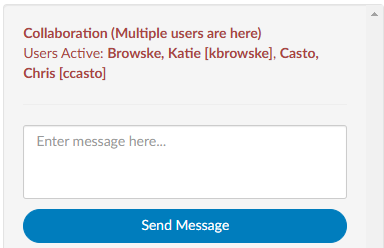
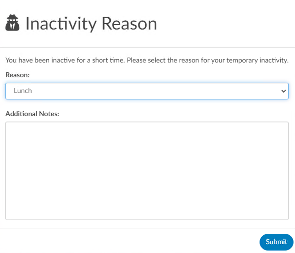
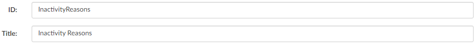
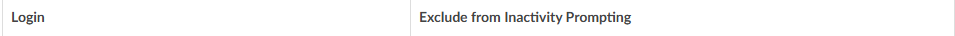

+++
title = 'Administrative'
weight = 11
+++

## Chat Room

A chat room feature is available in most administrative tools, including User Management, Workflow Management, Validation Management, Query Designer, and Worksheet Designer. This feature allows users to communicate in real-time while working within these tools.

The chat room is only active when multiple users are simultaneously accessing one of the administrative tools to ensure that changes are not lost when multiple users are working in the same tool. When two users are in the same tool and one saves data, the other user will see a red button indicating that changes are out of sync. Clicking the button will refresh the page with the other user's changes.

>[!note]
>Please note that chat history resets upon logging off.

## Inactivity Timeout

A configurable "inactivity reason" prompt can be displayed upon login, if the user has been logged out for a specified amount of time. 

If the user attempts to log in after having logged out between the minimum and maximum minutes, the user must record an "inactivity reason". There is a default set of dropdown options for the reason, which can be customized in Mapping Configuration. 

Additionally, Role Management contains an option to exclude user roles from being prompted upon login.

When enabled, this functionality allows management to track why users were idle during the day. The User Audit Trail report shows the inactivity reason that was selected. 

Please contact CAC Support (cacsupport@dolbey.com) to have the inactivity timeout enabeled. 

## Unlocking an Account

Fusion restricts account access to one active user at a time. When a user opens an account, that account enters a locked status to prevent simultaneous edits. This ensures data integrity and prevents conflicting updates.

An account remains locked until:
- The user leaves the account by clicking Cancel, Save, or Submit, or
- The session times out after 60 minutes of inactivity

However, if a user unexpectedly loses their connection (for example, due to a network interruption or application crash), the account may remain locked even though the user is no longer active. In such cases, a Manager-level user or above can manually unlock the account.

**Automatic Unlock**

Accounts that remain locked due to inactivity will automatically unlock after 8 hours. Manual unlocking should only be performed when necessary (e.g., when the account needs immediate access).

**Manual Unlock Procedure**

Prerequisites
1. You must have Manager or higher privileges in Fusion.
2. Confirm that the account is locked and that the user is no longer actively working in it.

Steps to Unlock an Account
- Navigate to [Account Search](https://dolbeysystems.github.io/fusion-cac-web-docs/administrative-user-guide/reporting/account-search/):
  - Go to the Reporting tab → Account Search.
- Search for the Locked Account:
  - In the Account Number field, enter the HAR or account number.
  - In the Locked By field, enter the user’s last name.
- Select and Unlock the Account:
  - Locate the correct account in the results list.
  - Right-click on the row entry and select Unlock Account.
  - When prompted, click Yes to confirm the unlock action.

## 
{}