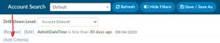
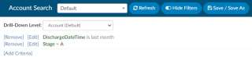
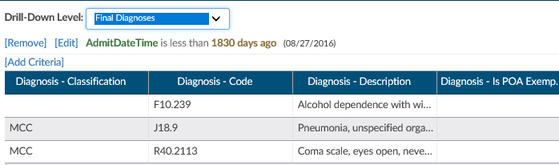
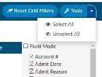
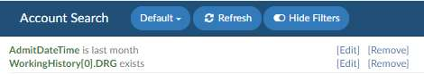
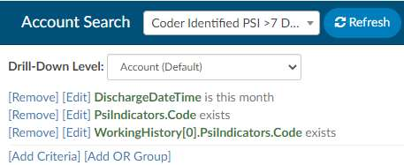
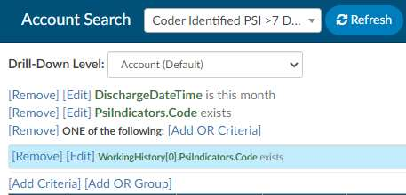
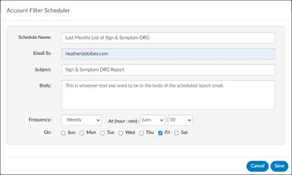
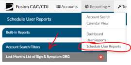

+++
title = 'Account Search'
weight = 10
+++

Account Search is helpful for reporting when creating a report that is not in the default user reports.
Account Search allows you to search most data points to export the raw data into a CSV file. To begin
creating an account search, think about what you want to gain for the data. A few examples:

1. How many inpatient charts were discharged last month with a principal diagnosis of sepsis?

2. What charts that were discharged have pending reasons?
3. Of the inpatient types discharged last month and coded, what is the total of each CC and MCCs?
To do any of the above you will need to filter the data because the account search can pull all chart data
available in the system.
1. Start by clicking on ‘Add Criteria’ and
select the fields to constrain the data.
2. Looking for submitted data? Use Stage =
Submitted
3. Looking for data discharged from last month? Click on edit next to admit datetime and change
to discharge date is last month.

Continue to constrain the data based upon what you are looking for. There are about 100+
fields that you can use to constrain the data. Each site will have their own custom fields,
depending on how the system was configured.

## Account Search Drilldown Level

Account search allows for the ability to search for account level data or drill down to an array of
different data collections.

- Account (Default)
- Denials
- Final Assigned Codes
- Final CPT Codes
- Final Diagnoses
- Final Procedures
- Final Visit Reasons
- Pending Reasons
- Physician Coding Assigned Codes
- Physicians
- Queries
- Working Assigned Codes
- Working CPT Codes
- Working Diagnoses
- Working Procedures
- Working Visit Reasons

When a choice other than Account, which is the default view, is selected the columns for that choice are
added to the beginning of the original grid.

The above shows some of the rows associated with the **Drill-Down Level** of Final Diagnosis. The drill-
down level can be saved to the grid. For example, if there is a grid the user has called Unsubmitted, and
the user added the Final Procedure drill-down to it, then when Unsubmitted is pulled up in Account
Search, it will include the drill-down columns and the name of the drill-down will appear in the drill-
down level field instead of the default of Account

Once you have the data constrained, select the columns you want to display by selecting the Tools Button.
If you click on the drop down arrow on the “Tools” Button you can select or unselect all columns. Use the
check box to indicate you want to display the column and uncheck to remove the column from the account
search or scheduled account search report.

## Searching for Data

The data filter allows you to constrain the data before returning results in account search grid.
For example, if you are looking for patient charts that CDI reviewed for the month of April you can run a
filter that looks like this. If you want to learn more about the fields and how they are defined you can
navigate to the fields collection chapter in this user guide.

## Adding Criteria

Account searches can be created using AND or OR criteria. Account Search is super dynamic in the types
of data points you can pull. Account Search, much like workflow, has two different options to create a
filters using the AND/OR criteria.

1. AND criteria
2. OR Criteria.

### Example of AND Criteria

At the end of each criterion, you add an “AND” (see below). This criterion will cause the account search
to display results if the patient chart had both the coder AND the CDI user identifying a PSI.

### Example of OR Criteria

At the end of each criterion, you add an “OR” (see below). The OR criteria will display in blue to
differentiate between the first and second criteria that will trigger the results. This criterion will cause
the account search to display results if the patient chart had either the coder OR the CDI user identifying
a PSI.

## Column Filter

Each column, when you hover over the column, has menu options to filter the data to restrict the view
for only the data the user has defined.

How to manually filter:

1. Click the bar icon on the column you wish to filter.
2. Click on the Filter icon.
3. Check or uncheck the boxes depending on the data you wish to filter, then click on the filter to close the box.
4. The new filter will be applied.

Once you return the data you can then choose the columns you wish to display data. Initially when you
return results there will be more column fields displayed than what you really need. You can pair down
the columns by removing or adding the columns that are needed.

## Group Rows

You can additionally choose to group the data creating a pivot table by grouping rows to provide a
different view for the data.

Using the data to create a pivot table allows you to reorganize the selected columns and rows of data in
account search grid table to obtain a desired report. The fields that can be filtered on and/or displayed
can be found in the available fields section of this document.

## Export to CSV

Export in the CSV format which allows you to view in Excel. Exporting will maintain the columns and
grouping.

## Account Search Report Scheduler

A button will appear for users in Account Search to open a dialog box to create/edit/delete a schedule,
which will be limited to one schedule per filter. To schedule an account search
report, first create a filter and save. Then you will see the new button called “+
Add Report Scheduler”.

Fill in each of the boxes shows below.

Once you fill this out and save you will notice the button changes so you can edit the scheduled report
from account search.

You can also see the account searches that were scheduled under the reporting tabs and scheduled user
reports.

