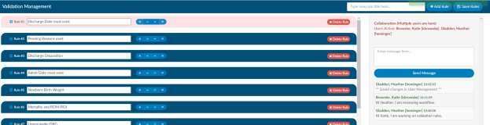

+++
title = 'Chat Room'
weight = 130
+++

A chat room is available on most admin tools workflow, form designer, user management, validation
management. This chat room allows users to communicate when they are working in the admin tools.
The chat is only available on one of these admin tool pages while another user is also in one of these
tools. The chat will reset upon log off.

