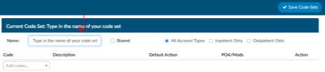

+++
title = 'Code Set Management'
weight = 60
+++

Code sets are groups of codes that users can save that they commonly use or are difficult to code. Codes
sets can be saved by topic to provide a quick code assignment. Code sets can be created at a
management level to push out to coders and/or users can create their own.

> [!info]
> Code sets do need to be maintained since you are creating codes sets codes if they deleted or
> modified with the code changes each year they may become obsolete however, if a coder adds an
> invalid code from a code set you produce an error that you have an invalid code.

## How to Create a Code Set

1. Click on the “+ Add” button in the navigation menu called “Active Code Sets”

2. Type in the name of your code set, name it something meaningful so you remember what codes it contains.
3. Select if you would like to share your code set, check with your manager to see if this is an option at your organization.
4. Then choose what patient type this code set is relevant to, for example if it contains PCS codes you would commonly choose inpatient and for CPT you would commonly select outpatient.
5. Then add codes into the “Add Code Box.
6. Click Save Code Sets when completed.

