+++
title = 'Dashboard'
weight = 30
+++

A user with administrative rights is now provided with overviews of Coder and CDI activity. The admin
user can also select to look specifically at Coder or CDI information by selecting the appropriate
dashboard button.

The dashboard is shown when you log in and after you login it can be access by clicking on the Fusion
CAC/CDI in the top left corner of the application or my clicking on the reporting menu item and selecting
dashboard. The software has 4 main dashboards with drill down data. These dashboards are separated
by:

1. Administrative Dashboard
2. Coder Personal Dashboard
3. CDI Management Dashboard
4. CDI Personal Dashboard
5. Audit Management Dashboard
6. Audit Personal Dashboard

## Administrative Dashboard

The administrative dashboard is only available for those users with an admin role. This dashboard
displays quick data at a glance. Clicking on any of the numbers in blue will open a grid to display the data
that goes into the number displayed.

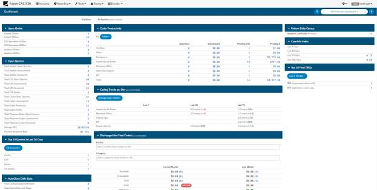

### Users Online

This displays the users online or offline broken out user type. The blue numbers are links to view the
users behind the number you selected.

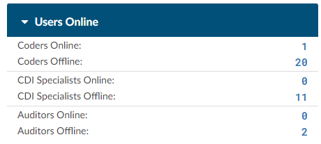

If you click on any of the blue “online” numbers you can see how long and what account the user is
within. If you right click on the grid you can export to csv.

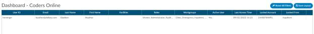

### Open Queries

This displays the open queries, unanswered vs. answered per role along with average TAT and provider
response rate.

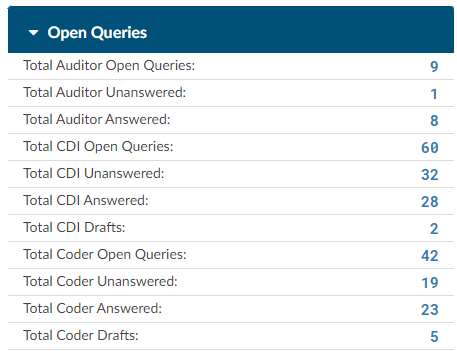

If you click on any of the blue numbers you can see the data behind that number. If you right click on the
grid you can export to csv.

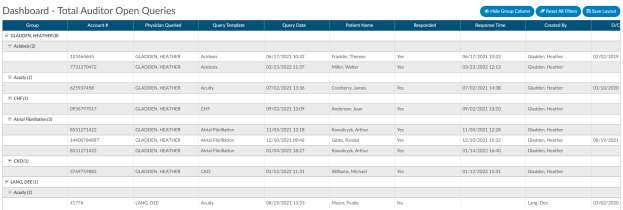

### Top 10 Queries in Last 30 Days

This displays the 10 most used query templates within the last 30 days.

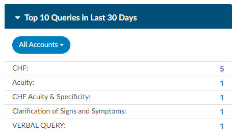

If you click on any of the blue numbers you can see the data behind that number. If you right click on the
grid you can export to csv.

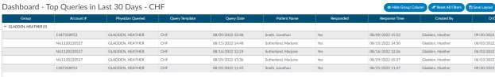

### AutoClose Daily Stats

This displays the AutoClose stats including charts autoclosed today, rejected today and then data for
month to date. If you click on any of the blue numbers you can see the data behind that number. If you
right click on the grid you can export to csv.

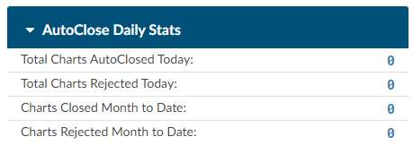

### Coder Productivity

This displays the coders productivity by charts submitted and those that are pending.

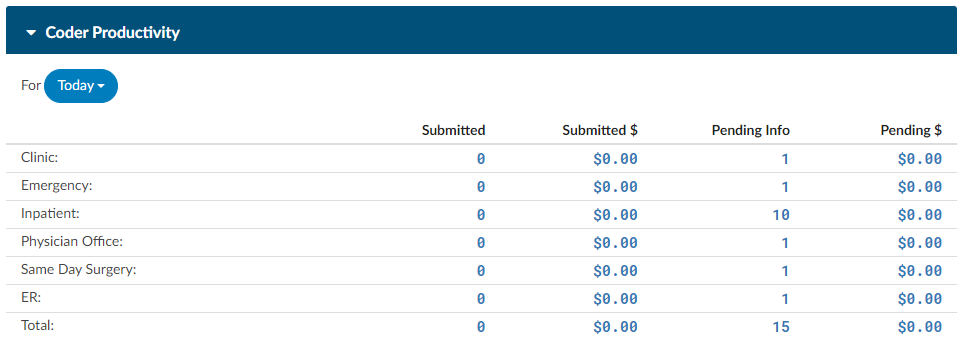

If you click on any of the blue numbers you can see the data behind that number. If you right click on the
grid you can export to csv.

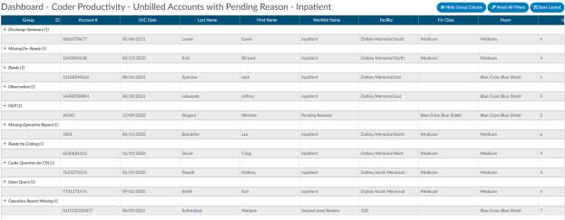

### Coding Trends per Day

Coding Trends per day combines "Average Daily Coded" and "Average TAT to Submit" to show
averages over last 7, last 30, and last 90 days compared to the prior 7, prior 30, or prior 90 days,
grouped by category

## Average Daily Coded

This displays the current average productivity per category to date compared to last 3 months break
out per category.

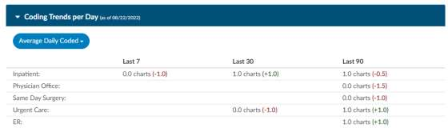

## Average TAT to Submit

This displays the average TAT from Discharge to Submit per Category then break out by This Week,
Last Week, Last Month, Last 90 Days.

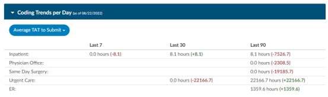

### Discharge Not Final Coded (DNFC)

This section provides the admin staff the ability to see where they are in regards to outstanding the
sum of total charges per charts outstanding for the current month also known as discharge not final
coded. The admin staff can also see if they are meeting their goal for how many charts are
outstanding at the end of the month. A comparison is displayed to show total charges for the current
month compared to compared to the previous month.

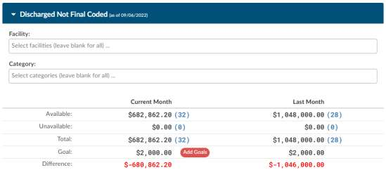

#### Filtering Discharge Not Final Coded (DNFC)

This section can be filtered by facility and/or category. By leaving the filters blank it will combine all
facilities and all patient types. You can use the filter to filter by a facility by clicking on the drop down
or you can also include a category so that it only displays inpatient information.

#### Available

Defined as all patients discharged and not submitted within a coding worklist (Workgroup Type must
equal coding) per either the “current month” or “previous month” depending on the column reported.
Next to each value should be a number in blue that represents the number of charts that make up the
dollar value. Users can click these numbers to drill down and display the chart details

#### Unavailable

Defined as all patients discharged and not submitted and not within a coding worklist (Workgroup Type
not equal to coding) per either the “current month” or “previous month” depending on the column
reported. Next to each value should be a number in blue that represents the number of charts that
make up the dollar value. Users can click these numbers to drill down and display the chart details. In
the drill down it would be helpful to pivot the list first on the Workgroup Type and then by Pending
Reason.

#### Total

This will be the total of both available and unavailable for coding.

#### Goal

This section of the dashboard allows you to set a target goal for your discharge not final coded. You can
set the goal by clicking on the red button that indicates “Add Goals”.

By clicking on “Add Goals” you can set the goals per facility and per category.

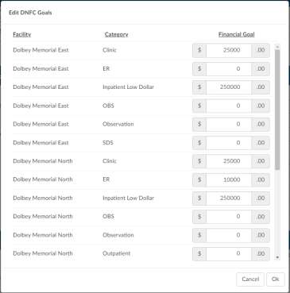

#### Difference

The difference between the goal and actual (Goal - Total DNFC). For visual clarity, the number will be
displayed in green if the difference is less than or equal to the goal. If the total is greater than the goal,
the difference will be displayed in red.

### Work Available Queue

This section will show how much work is in the queue to code for any given day. This allows the Coder
User to plan their workload based on availability and frees up management from having to monitor and
communicate with the coding staff. If you click on any of the blue numbers, you can see the data behind
that number. If you right-click on the grid you can export to csv.

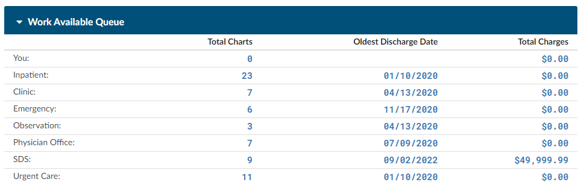

### Patient Daily Census

This displays the patient daily census on patients discharged or still inhouse. If you click on any of the
blue numbers, you can see the data behind that number.

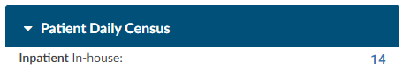

If you click on any of the blue numbers you can see the data behind that number. If you right click on the
grid you can export to csv.

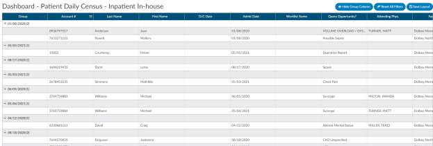

### Case Mix Index

This section will display the case mix for the Last 7 Days, Last 30 Days, Last 90 Days and Last 180 Days

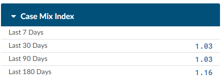

### Top 10 Final DRGs

This displays the 10 most coded DRG’s within the last 30 days

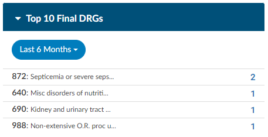

## Coder Personal Dashboard

The Coder dashboard is only available for users with a coder role. This dashboard displays quick data at a
glance personal statistic. Clicking on any of the numbers in blue will open a grid to display the data that
goes into the number displayed.

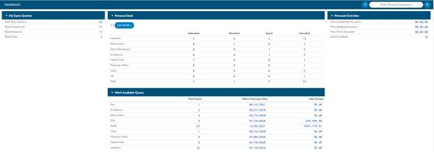

## CDI Management Dashboard

The CDI Management Dashboard is available for management users with CDI role and can be deployed
with a special role to CDI users if they have a need to see a team view of what all CDI users are doing.
This dashboard displays at a glance team statistics. Clicking on any of the numbers in blue will open a
grid to display the data that goes into the number displayed.

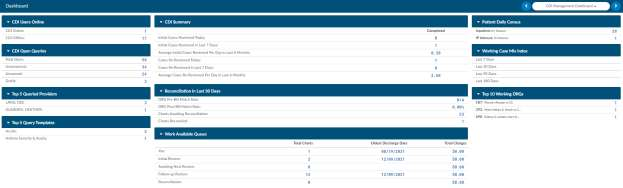

## CDI Personal Dashboard

The CDI Personal Dashboard is available users with CDI role for users to see their personal statics
separate from the team view. This dashboard displays at a glance personal statistics. Clicking on any of
the numbers in blue will open a grid to display the data that goes into the number displayed.

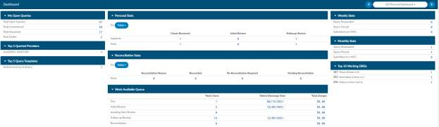

## Audit Management Dashboard

The Audit Management Dashboard is available to users with Auditor role to see team view of what all
Auditor users are doing. This dashboard displays quick data at-a-glance team statistics. Clicking on any of
the numbers in blue will open a grid to display the data that goes into the number displayed.

## Audit Personal Dashboard

The Audit Personal Dashboard is available to users with Auditor .U to see their personal statistics
separate from the team view. This dashboard displays quick data at-a-glance personal statistics. Clicking
on any of the numbers in blue will open a grid to display the data that goes into the number displayed.

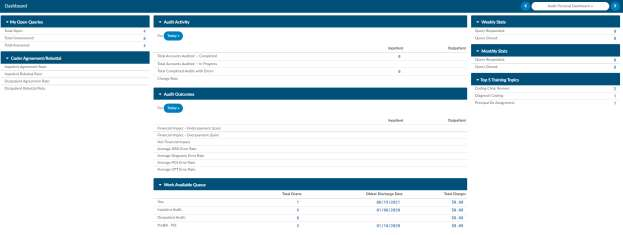
