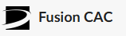
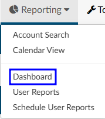

+++
title = 'Dashboards'
weight = 30
+++

Fusion CAC provides dashboards that give users quick access to information related to their role and workflow. Dashboards provide summarized data and visualizations for Coding, CDI, Audit activities, and Alerts information with options to view additional details where available.

## Accessing Dashboards

The dashboard is displayed when you log in to Fusion CAC. After login, you can return to the dashboards at any time using either of the following methods:

- Click Fusion CAC in the upper-left corner of the application.

- From the Reporting menu, select Dashboard.

## Dashboard Permissions

The dashboards available to you are based on your assigned user role and permissions. You may have access to one or more dashboards depending on your responsibilities within Fusion CAC.

Management dashboards provide an overview of activity and performance across applicable users and workflows. Personal dashboards focus on information specific to the logged-in user's work and activity.

## Available Dashboards

Fusion CAC includes the following dashboards:

1. [Administrative Dashboard](https://dolbeysystems.github.io/fusion-cac-web-docs/administrative-user-guide/dashboard/administrative-dashboard/) – Provides management-level information about coding activity, productivity, workload, and performance.

2. [Coder Personal Dashboard](https://dolbeysystems.github.io/fusion-cac-web-docs/administrative-user-guide/dashboard/coder-personal-dashboard/) – Provides coders with information about their individual workload, productivity, performance, and coding activity.

3. [CDI Management Dashboard](https://dolbeysystems.github.io/fusion-cac-web-docs/administrative-user-guide/dashboard/cdi-management-dashboard/) – Provides management-level information about CDI reviews, queries, team performance, and related CDI metrics.

4. [CDI Personal Dashboard](https://dolbeysystems.github.io/fusion-cac-web-docs/administrative-user-guide/dashboard/cdi-personal-dashboard/) – Provides CDI specialists with information about their individual reviews, queries, performance, and CDI activity.

5. [Audit Management Dashboard](https://dolbeysystems.github.io/fusion-cac-web-docs/administrative-user-guide/dashboard/audit-management-dashboard/) – Provides management-level information about audit activity, auditor productivity, findings, and audit performance.

6. [Audit Personal Dashboard](https://dolbeysystems.github.io/fusion-cac-web-docs/administrative-user-guide/dashboard/audit-personal-dashboard/) – Provides auditors with information about their individual audit workload, productivity, findings, and performance.

7. [Alerts Performance](https://dolbeysystems.github.io/fusion-cac-web-docs/administrative-user-guide/dashboard/alerts-performance-dashboard/) - 

Select the appropriate dashboard to view detailed information about its available metrics, panels, and functionality.

