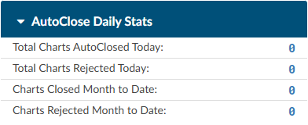

+++
title = 'Dashboards'
weight = 30
+++

A user with administrative rights is provided with overviews of Coder and CDI activity. The administrative
user can also select to look specifically at Coder or CDI information by selecting the appropriate
dashboard button.

The dashboard is shown when the user logs in and after login, it can be accessed by 
- Clicking on Fusion CAC in the top left corner of the application
  

- Clicking on the reporting menu item and selecting dashboard
  

The software has 6 main dashboards with drill down data:

1. Administrative Dashboard
2. Coder Personal Dashboard
3. CDI Management Dashboard
4. CDI Personal Dashboard
5. Audit Management Dashboard
6. Audit Personal Dashboard

## Administrative Dashboard

The administrative dashboard is only available for those users with the administrator role. This dashboard
displays data at a glance. Clicking on any of the blue numbers will open a grid to display the data
that goes into that number.

The dashboard can be filtered by facility. Leaving the filter blank will combine all facilities and all patient types. 

### Users Online

This displays the users online or offline broken out user type. The blue numbers are links to view the
user detail behind the number you selected.

Users can right click on the grid to export to CSV.

### Open Queries

This section displays open, unanswered, and answered queries per role along with average turn around time (TAT) and provider
response rate.

Click on any of the blue numbers to see the data behind that number. Right clicking on the
grid provides the option to export to CSV.

### Top 10 Queries in Last 30 Days

This displays the 10 most used query templates within the last 30 days.

Click on any of the blue numbers to see the data behind that number. Right clicking on the
grid provides the option to export to CSV.

### AutoClose Daily Stats

This section displays AutoClose stats, including charts autoclosed and rejected on the current day. It also includes data for
month to date. 

Click on any of the blue numbers to see the data behind that number. Right clicking on the
grid provides the option to export to CSV.

### Coder Productivity

This displays the coders productivity by charts submitted and those that are pending.

Click on any of the blue numbers to see the data behind that number. Right clicking on the
grid provides the option to export to CSV.

### Coding Trends per Day

Coding Trends per day combines "Average Daily Coded" and "Average TAT to Submit" to show
averages over the last 7, 30, and 90 days compared to the prior 7, 30, or 90 days, grouped by category.

### Discharge Not Final Coded (DNFC)

This section provides the admin staff the ability to see where the organization is in regards to the outstanding sum of total charges. The data broken down by total outstanding charges per charts outstanding for the current month also known as discharge not final
coded. The admin staff can also see if the team is meeting their goal for how many charts are
outstanding at the end of the month. A comparison is displayed to show total charges for the current
month compared to the previous month. Next to each value should be a number in blue that represents the number of charts that make up the
dollar value. Users can click these numbers to drill down and display the chart details

|Term     |Definition|
|---------|----------|
|Available|All patients discharged and not submitted within a coding worklist per either the “current month” or “previous month” depending on the column reported. **Workgroup Type must equal coding**.|
|Unavailable|Defined as all patients discharged and not submitted and not within a coding worklist per either the “current month” or “previous month” depending on the column reported. **Workgroup Type *not* equal coding**.|
|Total|The total of both available and unavailable for coding.|
|Goal|The target goal set per organization for the discharge not final coded. Users can set the goal by clicking on the red **{}Add Goal {} ** button. |
|Difference|The difference between the goal and actual. For visual clarity, the number will be displayed in green if the difference is less than or equal to the goal. If the total is greater than the goal, the difference will be displayed in red.|

### Work Available Queue

This section will show how much work is in the queue to code for any given day. This allows users with the role of Coder to plan their workload based on availability and frees up management from having to monitor and communicate with the coding staff. Clicking on any of the blue numbers, will display the data behind that number. Right-clicking on the grid allows the user to export to csv.

### Patient Daily Census

This displays the patient daily census on patients discharged or still inhouse. Clicking on any of the blue numbers, will display the data behind that number. Right-clicking on the grid allows the user to export to csv.

### Case Mix Index

This section will display the case mix for the Last 7, 30, 90, and 180 Days

### Top 10 Final DRGs

This displays the 10 most coded DRG’s within the current month, prior month, or last 6 months.

## Coder Personal Dashboard

The Coder dashboard is only available for users with a coder role. This dashboard displays quick at a
glance personal statistics. Clicking on any of the numbers in blue will open a grid to display the data that
goes into the number displayed.

## CDI Management Dashboard

The CDI Management Dashboard is available for management users with the CDI role. It can be deployed
with a special role to CDI users if they have a need to see a team view of what all CDI users are doing.
This dashboard displays at a glance team statistics. Clicking on any of the numbers in blue will open a
grid to display the data that goes into the number displayed.

## CDI Personal Dashboard

The CDI Personal Dashboard is available users with the CDI role. Users can see their personal statics
separate from the team view. Clicking on any of the numbers in blue will open a grid to display the data that goes into the number displayed.

## Audit Management Dashboard

The Audit Management Dashboard is available to users with the Auditor role to see a team view of statistics. Clicking on any of
the numbers in blue will open a grid to display the data that goes into the number displayed.

## Audit Personal Dashboard

The Audit Personal Dashboard is available to users with Auditor role to see their personal statistics. Clicking
on any of the numbers in blue will open a grid to display the data that goes into the number displayed.

