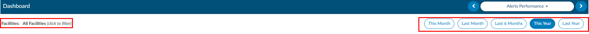
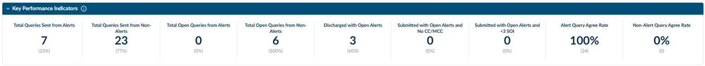
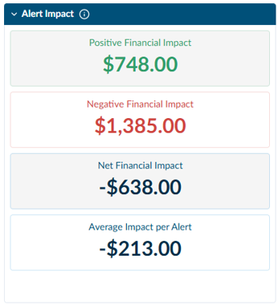
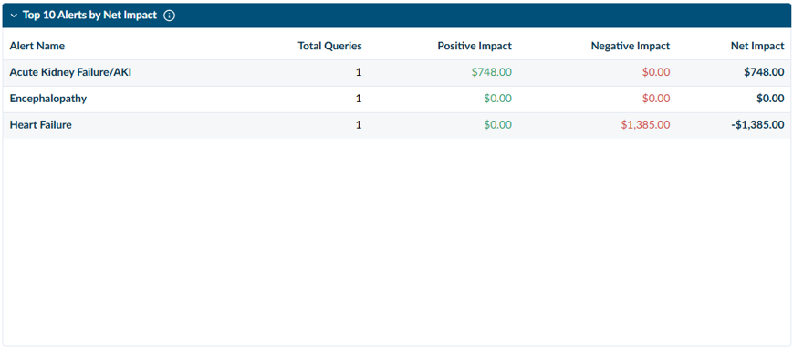
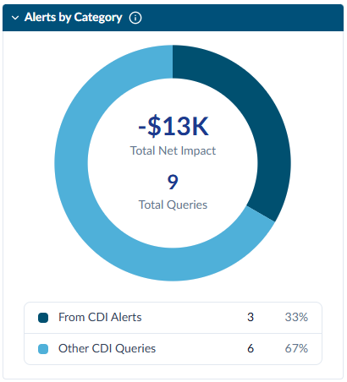
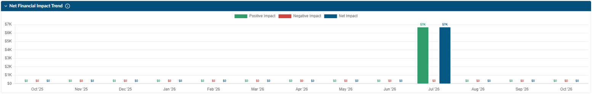
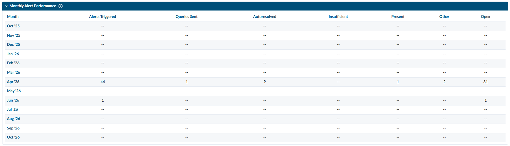
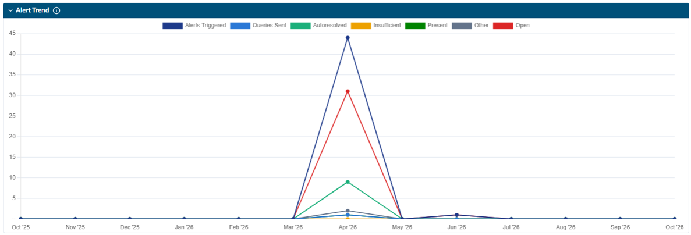
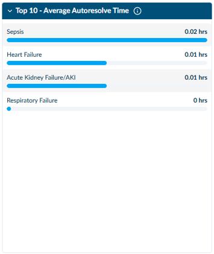
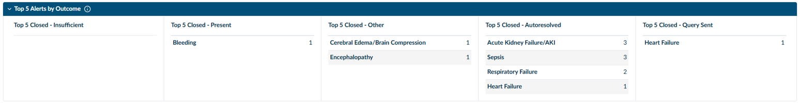

+++
title = 'Alerts Performance Dashboard'
weight = 30
+++

The Alerts Performance Dashboard brings [CDI/Clinical Alert](https://dolbeysystems.github.io/fusion-cac-web-docs/general-user-guide/account-screen/navigation-tree/cdi-clinical-alerts/) activity, outcomes, and impact together in one view. It shows how Alerts contribute to CDI queries, which Alerts lead to different outcomes, and how financial impact changes over time.

> [!info] Access
> Access to this dashboard is controlled by the **View Alerts Performance Dashboard** privilege in [Role Management](https://dolbeysystems.github.io/fusion-cac-web-docs/administrative-user-guide/tools/role-management/). Contact your administrator if you need access.

The dashboard opens in full screen. It uses the same timeframe buttons and shared Facility filter as the other management dashboards. To see more information about the data in a panel, click the **i** icon in the panel header.

## Timeframe Buttons

The **This Month**, **Last Month**, **Last 6 Months**, **This Year**, and **Last Year** buttons at the top of the dashboard set the date range for the following sections:

- Alert Key Performance Indicators
- Alert Impact
- Top 10 Alerts by Net Impact
- Queries from Alerts (Alerts by Category)
- Top 5 Alerts by Outcome
- Top 10 Average Auto Resolve Time

The **Net Financial Impact Trend**, **Monthly Alert Performance**, and **Alert Trend** sections always show the most recent 12 months.

> [!info] Financial Impact Values
> All financial impact values on this dashboard are estimates and may not represent the organization's actual final payment. Financial impact should be considered alongside documentation accuracy, clinical validity, quality outcomes, query volume, and compliance. It should not be used as the only measure of Alert performance.

## Alert Key Performance Indicators

This section summarizes Alert query activity, unresolved Alert opportunities, and provider agreement for the selected timeframe.

Canceled queries and queries closed with an outcome of **No Response** are not included in the query performance calculations. Queries that are still open and waiting for a response are included in the open query metrics.

|Metric|Definition|
|------|----------|
|Total Queries Sent from Alerts|Number of qualifying CDI queries generated from a CDI Alert. The percentage is the portion of all qualifying CDI queries that came from Alerts. **Formula:** Qualifying queries from CDI Alerts ÷ total qualifying CDI queries sent × 100%.|
|Total Queries Sent from Non-Alerts|Number of qualifying CDI queries that did not come from a CDI Alert. The percentage is the portion of all qualifying CDI queries that were not generated by an Alert. **Formula:** Qualifying non-Alert CDI queries ÷ total qualifying CDI queries sent × 100%.|
|Total Open Queries from Alerts|Number of Alert-generated queries currently waiting for a provider response. The percentage is the portion of all open queries that came from Alerts.|
|Total Open Queries from Non-Alerts|Number of non-Alert queries currently waiting for a provider response. The percentage is the portion of all open queries that did not come from Alerts.|
|Discharged with Open Alerts|Number of discharged accounts that still had at least one open CDI Alert. **Formula:** Discharged accounts with an open Alert ÷ total discharged accounts × 100%.|
|Submitted with Open Alerts and No CC/MCC|Number of accounts submitted with at least one open Alert and no documented CC or MCC. The percentage is the portion of submitted accounts without a CC or MCC that still had an open Alert.|
|Submitted with Open Alerts and &lt;3 SOI|Number of accounts submitted with at least one open Alert and a Severity of Illness (SOI) level below 3. The percentage is the portion of submitted accounts with an SOI below 3 that still had an open Alert.|
|Alert Query Agree Rate|Percentage of eligible, responded Alert-generated queries where the provider agreed. The count in parentheses is the number of agreed responses. **Formula:** Agreed responses to Alert-generated queries ÷ eligible responded Alert-generated queries × 100%.|
|Non-Alert Query Agree Rate|Percentage of eligible, responded non-Alert queries where the provider agreed. The count in parentheses is the number of agreed responses. **Formula:** Agreed responses to non-Alert queries ÷ eligible responded non-Alert queries × 100%.|

Use these indicators to compare Alert and non-Alert query performance, monitor open queries and Alerts, and find documentation opportunities that were still open when an account was discharged or submitted.

## Alert Impact

The Alert Impact metrics summarize the estimated financial impact of qualifying CDI/Clinical Alert queries for the selected timeframe.

|Metric|Definition|
|------|----------|
|Positive Financial Impact|Total estimated reimbursement increase attributed to qualifying CDI Alert queries.|
|Negative Financial Impact|Total estimated reimbursement decrease attributed to qualifying CDI Alert queries.|
|Net Financial Impact|Overall estimated financial impact after combining positive and negative changes. **Formula:** Positive financial impact + negative financial impact.|
|Average Impact per Alert Query|Average net financial impact for each qualifying query generated from a CDI Alert. **Formula:** Net financial impact ÷ qualifying CDI Alert queries.|

Use this section to evaluate the financial contribution of Alert-generated queries and compare results across reporting periods.

## Top 10 Alerts by Net Impact

This section lists the ten Alert types with the highest net financial impact for the selected facility and timeframe, ranked from highest to lowest.

|Column|Definition|
|------|----------|
|Alert Name|The CDI Alert that triggered the query. Encounters with multiple Alerts are counted under each Alert that generated a query.|
|Total Queries|Alert-generated queries sent for that Alert type during the period.|
|Positive / Negative Impact|Reimbursement gained and lost on answered queries for that Alert type. Impact is calculated using the site's configured impact method: Post-Query DRG minus Pre-Query DRG, or Impact Viewer values where used.|
|Net Impact|Positive impact plus negative impact for that Alert type.|

A large positive and negative impact combined with a small net impact means the Alert is moving reimbursement in both directions. That Alert may be a candidate for tuning.

## Alerts by Category

This donut chart (Alerts by Category) compares the number of CDI queries that came from Alerts with other CDI queries for the selected timeframe.

|Metric|Definition|
|------|----------|
|Total Net Impact|Combined estimated financial impact from all qualifying CDI queries, including queries from Alerts and other CDI queries. **Formula:** Total positive financial impact + total negative financial impact.|
|Total Queries|Total number of qualifying CDI queries in the selected period.|
|From CDI Alerts|Number and percentage of queries generated from a CDI Alert.|
|Other CDI Queries|Number and percentage of CDI queries that did not come from a CDI Alert. **Formula:** Query category ÷ total qualifying CDI queries × 100%.|

Use this section to see how much of the organization's query volume comes from Alerts.

## Net Financial Impact Trend

This graph shows the estimated monthly net financial impact of Alert queries over the most recent 12 months, including both positive and negative values.

|Line|Definition|
|----|----------|
|Positive Impact|Estimated reimbursement increases attributed to CDI Alert queries.|
|Negative Impact|Estimated reimbursement decreases attributed to CDI Alert queries. Negative values appear below the zero line.|
|Net Impact|Overall estimated financial impact after combining positive and negative changes. **Formula:** Positive financial impact + negative financial impact.|

## Monthly Alert Performance

This section is a monthly summary of Alert volume and outcomes over the most recent 12 months.

|Column|Definition|
|------|----------|
|Alerts Triggered|Total number of CDI Alerts generated during the month.|
|Queries Sent|Alerts that resulted in a CDI query being sent to a provider.|
|Autoresolved|Alerts closed automatically because the Alert criteria were no longer met after additional documentation or clinical information became available.|
|Insufficient|Alerts closed because there was not enough clinical or documentation support to send a query.|
|Present|Alerts closed because the condition or documentation opportunity was already documented in the patient record.|
|Other|Alerts closed for a reason not covered by the other outcome categories.|
|Open|Alerts that are still open and need CDI review or action.|

Use this section to compare Alert volume and outcomes from month to month and to identify trends that may point to Alert tuning or CDI education opportunities.

Use this chart to monitor changes over time and identify months that may need further review.

## Alert Trend

This line chart shows monthly Alert volume and outcomes over the most recent 12 months. It uses the same categories as **Monthly Alert Performance**: Alerts Triggered, Queries Sent, Autoresolved, Insufficient, Present, Other, and Open.

- Click a colored category at the top of the chart to show or hide its line.
- Hover over a data point to see the volume for that month.

## Top 10 Average Auto Resolve Time

This section shows the ten Alert types with the longest average time to autoresolve during the selected timeframe.

|Item|Definition|
|----|----------|
|Average Autoresolve Time|Average time between an Alert being triggered and the Alert closing automatically because its criteria were no longer met. **Formula:** Total elapsed time for autoresolved Alerts ÷ total number of autoresolved Alerts for that Alert type.|
|Bar Length|The bars give a visual comparison of average autoresolve time across Alert types.|

Click **View All** to see autoresolve times for additional Alerts.

A long autoresolve time may mean an Alert stayed open for an extended period when a query could have been sent, and the diagnosis was documented later in the encounter. These Alerts may need further review of query timing, workflow, and missed opportunities.

## Top 5 Alerts by Outcome

This section shows the five Alert types with the highest volume for each closed outcome during the selected timeframe. The number beside each Alert type is the number of Alerts closed with that outcome.

|Outcome|Definition|
|-------|----------|
|Closed – Insufficient|Alerts closed because there was not enough clinical or documentation support to send a query.|
|Closed – Present|Alerts closed because the condition or documentation opportunity was already documented in the patient record.|
|Closed – Other|Alerts closed for a reason not covered by the other outcome categories.|
|Closed – Autoresolved|Alerts closed automatically because additional documentation or clinical information meant the Alert criteria were no longer met.|
|Closed – Query Sent|Alerts closed after the CDI Specialist used the opportunity to send a provider query.|

Click **View All** within an outcome to see additional Alert types. Comparing outcomes can help identify opportunities for Alert tuning and CDI education.

