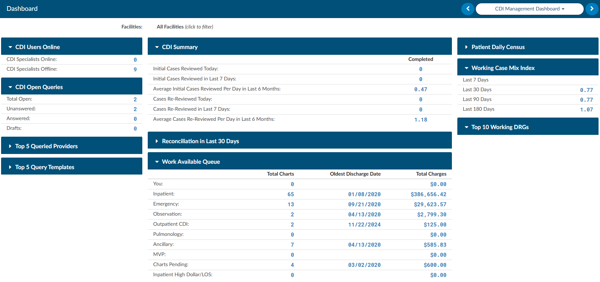

+++
title = 'CDI Management Dashboard'
weight = 30
+++

## CDI Management Dashboard

The CDI Management Dashboard is available for management users with the CDI role. It can be deployed with a special role to CDI users if they have a need to see a team view of what all CDI users are doing. This dashboard displays team statistics at a glance, making performance trends and available work easier to review. Clicking on any of the numbers in blue will open a grid to display the data that goes into the number displayed.

To see more information about the data in a panel, click the **i** icon in the panel header.

### Filters

The dashboard can be filtered by facility. The date range filters in the upper corner of the dashboard applies to the **Key Performance Indicators**, **Activity Summary**, and **CDI Team Performance** sections. The other sections use the time periods described below.

### Key Performance Indicators

Key Performance Indicators are shown for defined periods, such as **This Month** and **Last Month**. Use the dropdown to calculate these metrics by **Admit Date** or **Discharge Date**.

### Activity Summary and CDI Team Performance

The Activity Summary displays CDI activity for the selected date range. CDI Team Performance appears beneath the Activity Summary and uses the same date range.

### Top 10 Concurrent LOS Variance

This list shows length of stay (LOS) variance for patients who are currently in house. Discharged patients are not included.

### Query Performance

The following sections show data from the last 60 days:

- **Query Performance Trends**
- **Top 10 Query Template Performance**
- **Top 10 Provider Query Performance** - The columns in this section are in the same order and use the same labels as Top 10 Query Template Performance.

### CMI Trend and CC/MCC Capture Rate Trend

The **CMI Trend** and **CC/MCC Capture Rate Trend** charts show a rolling 13-month range. The CC/MCC Capture Rate Trend chart includes separate trend lines for **Medical DRG**, **Surgical DRG**, and **Combined Capture**.

### Work Available Queue

The Work Available Queue section at the bottom of the dashboard shows the CDI work available in each queue, including the oldest admit date for each queue.