+++
title = 'CDI Management Dashboard'
weight = 30
+++

The CDI Management Dashboard is available for management users with the CDI role. It can be deployed
with a special role to CDI users if they have a need to see a team view of what all CDI users are doing.
This dashboard displays team statistics at a glance, making performance trends and available work easier to review. Clicking on any of the numbers in blue will open a
grid to display the data that goes into the number displayed.

To see more information about the data in a panel, click the **i** icon in the panel header.

## Timeframe Filters

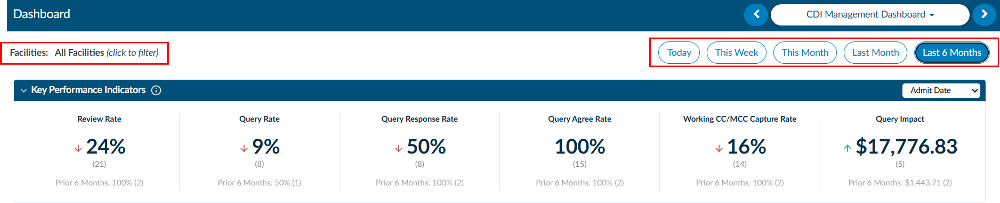

The dashboard can be filtered by facility. The date range filters in the upper corner of the dashboard (**Today**, **This Week**, **This Month**, **Last Month**, and **Last 6 Months**) apply only to the **Activity Summary** and **CDI Team Performance** sections. The other sections use the time periods described below.

The following sections show current information and are not affected by the date range filters:

- CDI Users Online
- Aging Queries
- Top 10 Concurrent LOS Variance
- Work Available Queue

## Key Performance Indicators

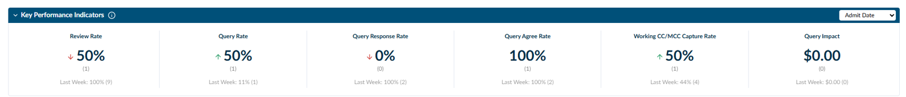

Key Performance Indicators are shown for defined periods, such as **This Month** and **Last Month**. Use the dropdown to calculate these metrics by **Admit Date** or **Discharge Date**.

These metrics are based on inpatient accounts with an admit date or discharge date in the applicable calendar month. The large value is the current month. The smaller value below it is a comparison with the previous month.

|Metric|Definition|
|------|----------|
|Review Rate|The percentage of eligible accounts reviewed by CDI. An account is counted as reviewed when a CDI user saves changes with a Working DRG. The count in parentheses is the number of accounts reviewed. **Formula:** Accounts reviewed by CDI ÷ total inpatient accounts within the admit or discharge month × 100%.|
|Query Rate|The percentage of reviewed accounts that had at least one CDI query. Canceled queries are not included. The count in parentheses is the number of queried accounts. **Formula:** Reviewed accounts with a qualifying CDI query ÷ inpatient accounts reviewed by CDI within the admit or discharge month × 100%.|
|Query Response Rate|The percentage of CDI queries that received a provider response. Queries with a response of **No Response** or **Canceled** are not included. The count in parentheses is the number of queries with a response. **Formula:** Queries with a provider response ÷ eligible queries sent × 100%.|
|Query Agree Rate|The percentage of responded CDI queries where the provider agreed with the clinical clarification or opportunity. The count in parentheses is the number of agreed responses. **Formula:** Agreed query responses ÷ queries with a provider response × 100%.|
|Working CC/MCC Capture Rate|The percentage of reviewed accounts with at least one captured CC or MCC. The count in parentheses is the number of accounts with a captured CC or MCC. **Formula:** Reviewed accounts with at least one CC or MCC ÷ accounts reviewed by CDI × 100%.|
|Query Impact|The total estimated financial impact of qualifying CDI queries during the period. The count in parentheses is the number of queries or accounts that contribute to the financial impact. **Formula:** Sum of the estimated financial impact attributed to qualifying CDI queries.|

## CDI Users Online

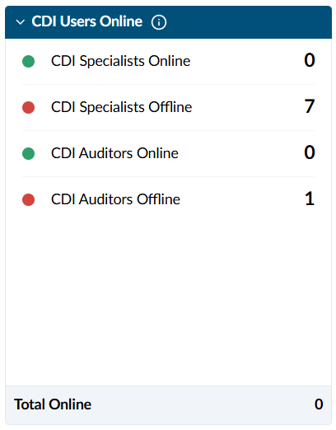

This section shows the current status of active CDI users, separated by role. Green indicates users who are online. Red indicates users who are offline.

|Metric|Definition|
|------|----------|
|CDI Specialists Online/Offline|Number of CDI Specialists currently signed in or signed out.|
|CDI Auditors Online/Offline|Number of CDI Auditors currently signed in or signed out.|
|Total Online|Combined number of CDI Specialists and CDI Auditors currently online.|

User status is based on current system activity. Inactive users are not included in the offline counts.

## Activity Summary and CDI Team Performance

The Activity Summary displays CDI activity for the selected date range. CDI Team Performance appears beneath the Activity Summary and uses the same date range. Changing the date range recalculates both sections.

### Activity Summary

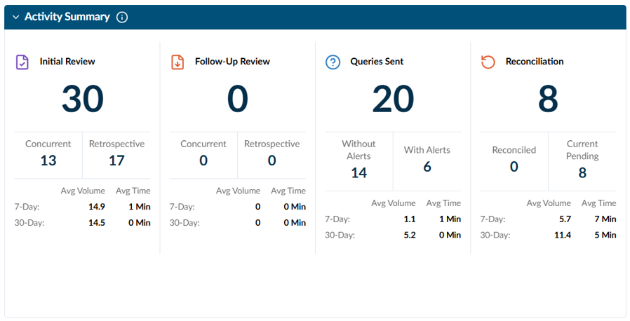

|Metric|Definition|
|------|----------|
|Initial Review|The number of accounts that received their first CDI review during the selected period. **Concurrent** reviews were completed while the patient was still admitted. **Retrospective** reviews were completed after the patient was discharged.|
|Follow-up Review|The number of additional CDI reviews completed on previously reviewed accounts during the selected period, divided into concurrent and retrospective reviews.|
|Queries Sent|The number of CDI queries sent to providers during the selected period. **Without Alerts** queries did not come from a CDI Alert. **With Alerts** queries were created from a CDI Alert opportunity.|
|Reconciliation|Reconciliation activity for the selected period. **Reconciled** accounts have completed reconciliation. **Pending** accounts are waiting for reconciliation.|
|Average Volume|The average number of activities completed per day over the displayed 7-day or 30-day period.|
|Average Time|The average amount of time needed to complete that activity.|

### CDI Team Performance

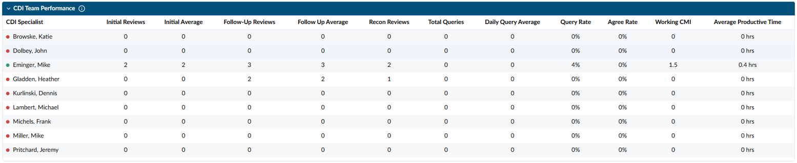

This section shows productivity and performance metrics for each CDI Specialist. The status icon beside each user shows their current online status and is not based on the selected date range. Green means the user is online. Red means the user is offline.

|Column|Definition|
|------|----------|
|Initial Reviews|Number of accounts where the CDI Specialist completed the first CDI review.|
|Initial Average|Average number of initial reviews completed per day.|
|Follow-up Reviews|Number of additional reviews the CDI Specialist completed on previously reviewed accounts.|
|Follow-up Average|Average number of follow-up reviews completed per day.|
|Recon Reviews|Number of reconciliation reviews completed by the CDI Specialist.|
|Total Queries|Number of qualifying CDI queries sent by the CDI Specialist. Canceled queries are not included.|
|Daily Query Average|Average number of qualifying CDI queries sent per day.|
|Query Rate|Percentage of the CDI Specialist's reviewed accounts that had at least one qualifying CDI query. **Formula:** Queried accounts ÷ accounts reviewed by CDI × 100%.|
|Agree Rate|Percentage of the CDI Specialist's responded queries where the provider agreed. **Formula:** Agreed responses ÷ queries with a provider response × 100%.|
|Working CMI|Average Case Mix Index based on the Working DRG assigned to the CDI Specialist's reviewed inpatient accounts.|
|Average Productive Time|Average amount of productive time recorded for the CDI Specialist per day.|

These metrics should be reviewed together, with case complexity, assigned patient populations, coverage responsibilities, and organizational goals in mind.

## Aging Queries

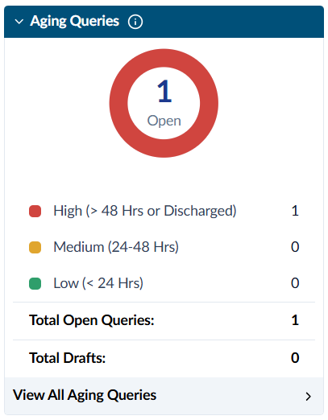

This section shows all currently open CDI queries by how long it has been since each query was sent to the provider. It is a current snapshot and is not affected by the date range filters.

|Category|Definition|
|--------|----------|
|High|Queries open for 48 hours or longer, and all open queries on discharged accounts.|
|Medium|Queries open for 24 hours to less than 48 hours.|
|Low|Queries open for less than 24 hours.|

**Total Open Queries** is the total number of queries currently waiting for a provider response. Click **View All Aging Queries** to see the detailed list. Counts update as queries are sent, answered, canceled, or closed.

## Top 10 Concurrent LOS Variance

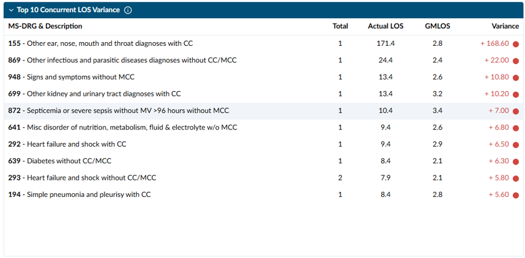

This list shows the MS-DRGs with the greatest length of stay (LOS) variance for patients who are currently in house. Discharged patients are not included. Accounts are removed from the list once the patient is discharged.

|Column|Definition|
|------|----------|
|MS-DRG & Description|The patient's current Working MS-DRG and its description.|
|Total|Number of currently admitted patients assigned to the MS-DRG.|
|Current LOS|Average number of days the patients have been admitted so far.|
|GMLOS|Average geometric mean length of stay for the Working MS-DRG.|
|Variance|The difference between the current average LOS and the GMLOS. A positive variance means the current LOS is above the expected GMLOS. A negative variance means it is below. Color indicators show the degree of variance. **Formula:** Current LOS − GMLOS.|

Use this section to find in-house patients who are staying longer than expected and to prioritize concurrent CDI review and collaboration with case management.

## Query Performance

### Query Performance Trends

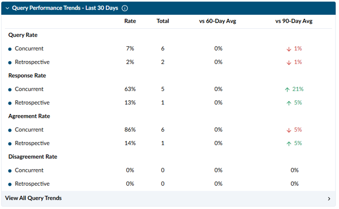

This section compares query performance for concurrent and retrospective CDI activity over the last 30 days. **Concurrent** queries were started while the patient was still admitted. **Retrospective** queries were started after discharge.

|Metric|Definition|
|------|----------|
|Query Rate|Percentage of reviewed accounts that had at least one qualifying CDI query. **Formula:** Queried accounts ÷ accounts reviewed by CDI × 100%.|
|Response Rate|Percentage of eligible queries that received a provider response. **Formula:** Queries with a provider response ÷ eligible queries sent × 100%.|
|Agreement Rate|Percentage of responded queries where the provider agreed. **Formula:** Agreed responses ÷ queries with a provider response × 100%.|
|Disagreement Rate|Percentage of responded queries where the provider disagreed. **Formula:** Disagreed responses ÷ queries with a provider response × 100%.|
|Rate & Total|**Rate** is the current calculated percentage. **Total** is the number of accounts or queries in the numerator of that metric.|
|Vs 60-/90-Day Avg|Shows how the current rate compares with the 60-day and 90-day rolling averages. Arrows show whether the rate went up or down. Green is a favorable change and red is an unfavorable change. For Disagreement Rate, a decrease is favorable.|

### Top 10 Query Template Performance

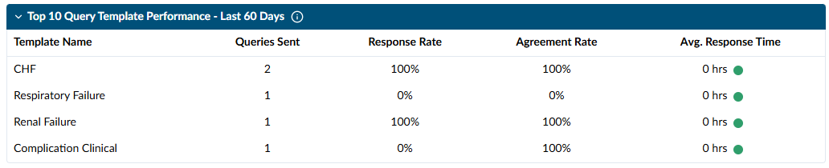

This section shows the 10 query templates used most often in the last 60 days, based on the query created date. Templates are ranked by the number of qualifying queries sent. Canceled queries are not included.

|Column|Definition|
|------|----------|
|Template Name|Name of the query template.|
|Queries Sent|Total number of qualifying queries sent using the template.|
|Response Rate|Percentage of eligible queries that received a provider response. **Formula:** Queries with a provider response ÷ eligible queries sent × 100%.|
|Agreement Rate|Percentage of responded queries where the provider agreed. **Formula:** Agreed responses ÷ queries with a provider response × 100%.|
|Avg. Response Time|Average time between the query being sent and the provider's response.|

Click **View All Templates** to see performance for templates outside the top 10.

### Top 10 Provider Query Performance

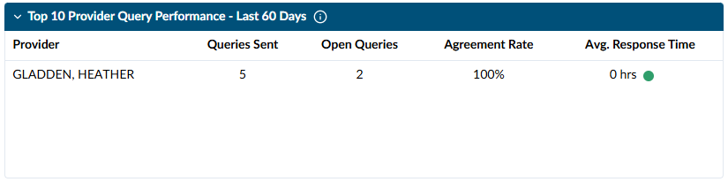

This section shows the 10 providers who received the most qualifying CDI queries in the last 60 days. Canceled queries are not included.

|Column|Definition|
|------|----------|
|Provider|Provider the queries were sent to.|
|Queries Sent|Total number of qualifying CDI queries sent to the provider.|
|Open Queries|Number of queries currently waiting for a response from the provider.|
|Agreement Rate|Percentage of the provider's responded queries where the provider agreed. **Formula:** Agreed responses ÷ queries with a provider response × 100%.|
|Avg. Response Time|Average time between a query being sent and the provider's response. The colored indicator shows the response time category: green is under 24 hours, orange is 24–48 hours, and red is over 48 hours.|

Click **View All Providers** to see performance for providers outside the top 10.

## CMI Trend and CC/MCC Capture Rate Trend

The **CMI Trend** and **CC/MCC Capture Rate Trend** charts show a rolling 13-month range. Hover over a data point to see the value for a specific month.

### CMI Trend

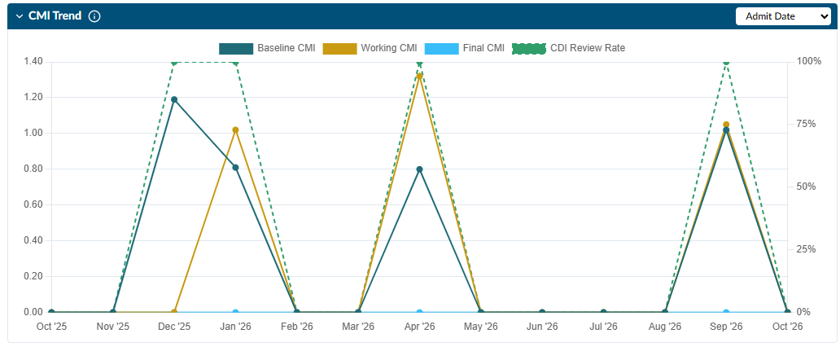

This chart shows monthly Baseline, Working, and Final Case Mix Index (CMI), along with the CDI Review Rate. The left axis shows CMI. The right axis shows CDI Review Rate.

|Line|Definition|
|----|----------|
|Baseline CMI|Average DRG weight based on the DRG set as the Baseline by the CDI Specialist. This is the starting point for measuring changes during the CDI and coding process.|
|Working CMI|Average DRG weight based on the most recent Working DRG assigned during CDI review.|
|Final CMI|Average DRG weight based on the final DRG after coding and reconciliation are complete. **Formula:** Sum of the applicable DRG weights ÷ accounts included in the CMI calculation.|
|CDI Review Rate|Percentage of eligible inpatient accounts reviewed by CDI. **Formula:** Accounts reviewed by CDI ÷ eligible inpatient accounts × 100%.|

CMI should be reviewed alongside patient population, service-line volume, payer mix, and other clinical or operational changes.

### CC/MCC Capture Rate Trend

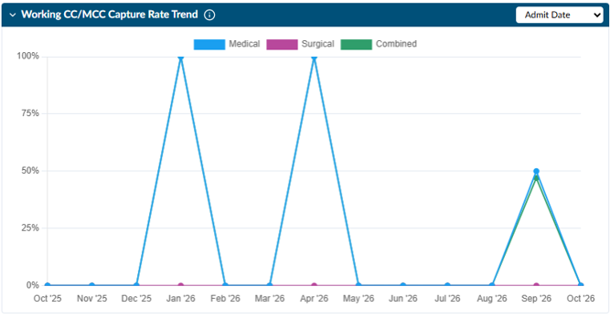

This chart shows the monthly CC/MCC capture rate, with separate trend lines for **Medical DRG**, **Surgical DRG**, and **Combined Capture**. The left axis shows the capture rate from 0% to 100%.

Capture is measured by DRG assignment, not by counting individual diagnoses. Each final-coded inpatient account is scored by which side of a severity-paired DRG it grouped to:

- The higher-severity "with CC/MCC" DRG is counted as **captured**.
- The base DRG is counted as a **missed opportunity**.

DRGs that do not vary by CC/MCC, such as transplant, tracheostomy, newborn, and psych/rehab DRGs, are not included.

|Line|Definition|
|----|----------|
|Medical DRG|Capture rate for accounts grouping to medical DRGs. **Formula:** Medical accounts coded to a "with CC/MCC" DRG ÷ (those accounts + medical accounts on the base DRG that could have supported a CC/MCC) × 100%.|
|Surgical DRG|Capture rate for accounts grouping to surgical DRGs, using the same calculation as Medical DRG.|
|Combined Capture|Capture rate for all qualifying medical and surgical accounts together.|

## CDI Team Quality Performance

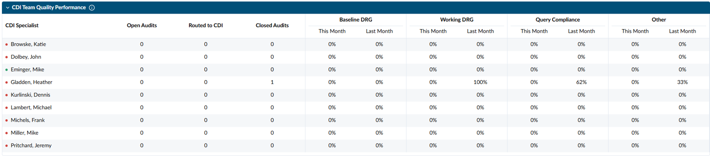

This section shows audit workload and accuracy results for each CDI Specialist, comparing the current calendar month with the previous calendar month. The status icon beside each CDI Specialist shows their current online status. Green means the user is online. Red means the user is offline.

|Column|Definition|
|------|----------|
|Open Audits|Number of audits assigned to the CDI Specialist that are still open.|
|Routed to CDI|Number of audits routed back to the CDI Specialist for review, correction, or follow-up.|
|Closed Audits|Number of audits completed and closed for the CDI Specialist.|
|Baseline DRG Accuracy|Percentage of audited Baseline DRGs found to be accurate.|
|Working DRG Accuracy|Percentage of audited Working DRGs found to be accurate.|
|Query Compliance Accuracy|Percentage of audited queries found to be accurate and compliant with query requirements.|
|Other Accuracy|Percentage of audited items found to be accurate in all other audit categories.|
|This Month / Last Month|Calendar-month comparison of each accuracy category.|

**Accuracy Formula:** Accurate audited items ÷ total audited items in the category × 100%.

Accuracy results should be reviewed alongside audit volume and case complexity. Smaller sample sizes may cause larger changes from month to month.

## Work Available Queue

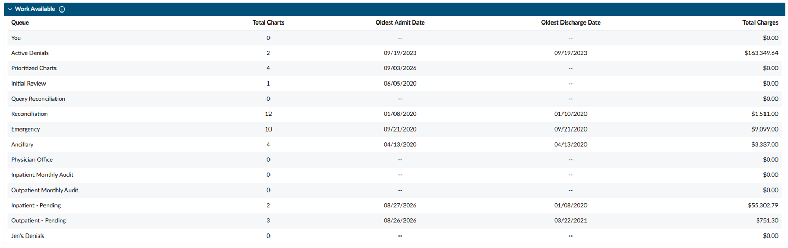

The Work Available Queue section at the bottom of the dashboard shows the CDI work currently available in each queue the user has access to. It is not affected by the date range filters.

|Column|Definition|
|------|----------|
|Queue|Name of the work queue. Queue names and criteria may vary based on your organization's setup.|
|Total Charts|Number of charts currently in the queue.|
|Oldest Admit Date|Earliest admit date among the charts in the queue.|
|Oldest Discharge Date|Earliest discharge date among the charts in the queue.|
|Total Charges|Combined charges for the charts in the queue.|

A dash means the queue does not have an applicable date.

> [!info] Queue Totals
> A chart may be in more than one queue. Do not add the totals across queues together to get a count of unique charts.