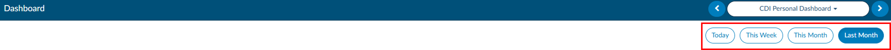
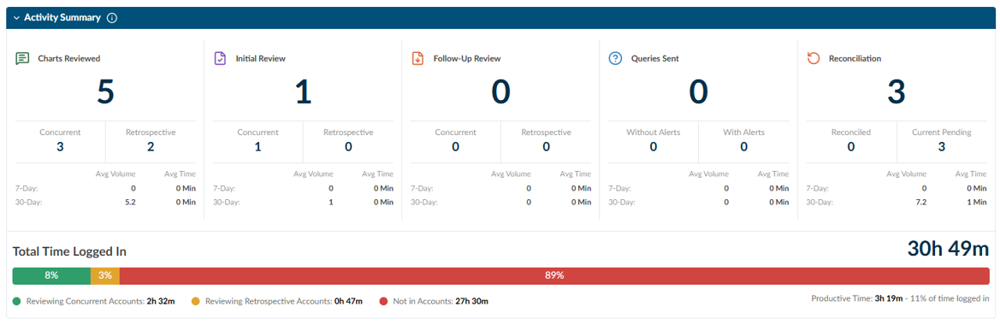
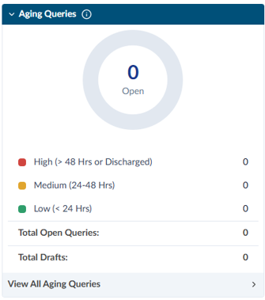
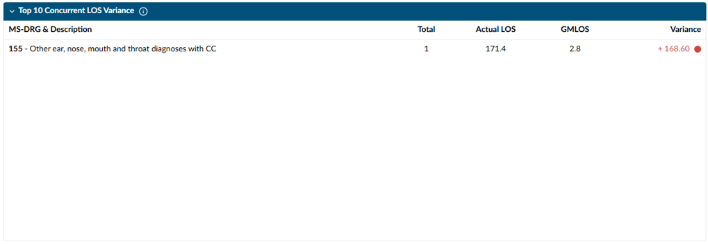
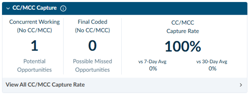
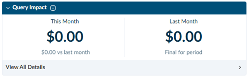
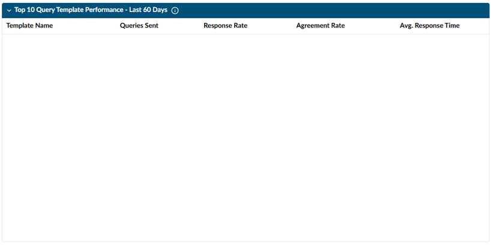
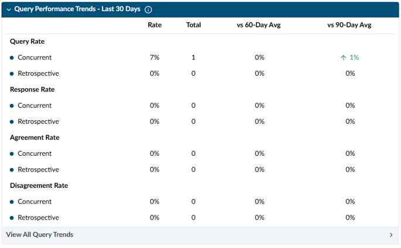
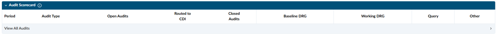
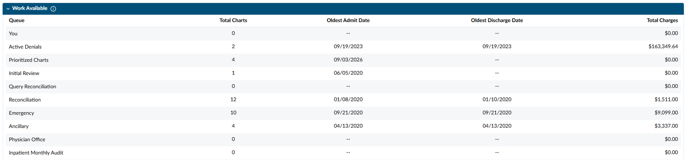

+++
title = 'CDI Personal Dashboard'
weight = 30
+++

The CDI Personal Dashboard is available to users with the CDI role. Users can see their personal statistics
separate from the team view, making individual performance and current work easier to review. Clicking on any of the numbers in blue will open a grid to display the data that goes into the number displayed.

The CDI Personal Dashboard does not include a Facility filter. To see more information about the data in a panel, click the **i** icon in the panel header.

The **Today**, **This Week**, **This Month**, and **Last Month** selections at the top of the dashboard set the reporting period for the **Activity Summary**. The **Aging Queries** and **Work Available** sections show current information and are not affected by these selections.

## Activity Summary

The Activity Summary shows the CDI Specialist's activity and logged-in time for the selected reporting period.

|Metric|Definition|
|------|----------|
|Charts Reviewed|Number of unique accounts the CDI Specialist reviewed. **Concurrent** accounts were reviewed while the patient was admitted. **Retrospective** accounts were reviewed after discharge.|
|Initial Review|Number of first CDI reviews completed, separated into concurrent and retrospective reviews.|
|Follow-up Review|Number of additional reviews completed on previously reviewed accounts, separated into concurrent and retrospective reviews.|
|Queries Sent|Number of qualifying CDI queries sent. **Without Alerts** queries did not come from a CDI Alert. **With Alerts** queries were generated from a CDI Alert opportunity.|
|Reconciliation|Reconciliation activity. **Reconciled** accounts have completed reconciliation. **Pending** accounts are assigned to the CDI Specialist and waiting for reconciliation.|
|7-Day and 30-Day Averages|**Average Volume** is the average daily activity volume during the rolling period. **Average Time** is the average time spent completing each activity during the rolling period.|
|Total Time Logged In|Total time the CDI Specialist was logged in to the application during the selected period.|
|Productive Time|Combined time spent reviewing concurrent and retrospective accounts. **Formula:** (Time reviewing concurrent accounts + time reviewing retrospective accounts) ÷ total time logged in × 100%.|

The colored **Time Distribution** bar shows how logged-in time was spent. The percentage in each color is that activity's portion of the total logged-in time.

- **Green – Reviewing Concurrent Accounts:** Time spent reviewing accounts while the patient was admitted.
- **Yellow – Reviewing Retrospective Accounts:** Time spent reviewing accounts after discharge.
- **Red – Not in Accounts:** Logged-in time spent outside a patient account.

Green and yellow together make up productive time.

## Aging Queries

The Aging Queries donut chart shows the CDI Specialist's outstanding queries by how long it has been since each query was sent to the provider. It is a current snapshot and is not affected by the date range selections.

|Category|Definition|
|--------|----------|
|High|Queries open for 48 hours or longer, and all open queries on discharged accounts.|
|Medium|Queries open for 24 hours to less than 48 hours.|
|Low|Queries open for less than 24 hours.|

**Total Open Queries** is the total number of queries currently waiting for a provider response. Click **View All Aging Queries** to see the detailed list. Counts update as queries are sent, answered, canceled, or closed.

## Top 10 Concurrent Length of Stay Variance

This list shows the MS-DRGs with the greatest length of stay (LOS) variance for patients who are currently admitted. Discharged patients are not included. Accounts are removed from the list once the patient is discharged.

|Column|Definition|
|------|----------|
|MS-DRG & Description|The patient's current Working MS-DRG and its description.|
|Total|Number of currently admitted patients assigned to the MS-DRG.|
|Actual LOS|Average number of days the patients have been admitted so far.|
|GMLOS|Average geometric mean length of stay for the Working MS-DRG.|
|Variance|The difference between the actual average LOS and the GMLOS. A positive variance means the LOS is above the expected GMLOS. A negative variance means it is below. Color indicators show the degree of variance. **Formula:** Actual LOS − GMLOS.|

Use this section to find in-house patients who are staying longer than expected and to prioritize concurrent CDI review and collaboration with case management.

## CC/MCC Capture

This section shows CC/MCC capture for the CDI Specialist's reviews. Reviews still in progress without a CC or MCC are shown as **Working, No CC/MCC**.

|Metric|Definition|
|------|----------|
|Concurrent Working – No CC/MCC|Number of accounts currently assigned a Working DRG without a CC or MCC. These accounts may be documentation opportunities that need more review.|
|Final Coded – No CC/MCC|Number of finalized accounts assigned a Final DRG without a CC or MCC. These accounts may be missed opportunities that could benefit from retrospective review.|
|CC/MCC Capture Rate|Percentage of qualifying accounts reviewed by the CDI Specialist that captured at least one CC or MCC. **Formula:** Qualifying reviewed accounts with at least one CC or MCC ÷ total qualifying accounts reviewed × 100%.|
|Vs 7-Day Avg and Vs 30-Day Avg|Shows how the current capture rate compares with the CDI Specialist's 7-day and 30-day rolling averages. An up arrow means the rate increased. A down arrow means the rate decreased. No arrow means the rate did not change. Green is a favorable change. Red is a change that may need attention.|

Click **View All CC/MCC Capture Rate** to review the accounts included in these metrics.

## Query Performance

### Query Impact

The Query Impact panel shows the estimated financial impact of the CDI Specialist's queries. The panel includes a tooltip with more detail.

Impact is counted for submitted accounts where the CDI Specialist is the **First CDI Saver**. The First CDI Saver is the CDI Specialist who first saved the account during the CDI workflow.

|Item|Definition|
|----|----------|
|This Month|Estimated financial impact from qualifying accounts submitted during the current calendar month. This value may change as more accounts are submitted during the month. The amount below it shows the difference from last month. An up arrow (green) means impact increased. A down arrow (red) means impact decreased. No arrow means no change.|
|Last Month|Estimated financial impact from qualifying accounts submitted during the previous calendar month. **Final for period** means the reporting period has ended.|

**Financial Impact Calculation:** By default, financial impact is the difference in estimated reimbursement between the Post-Query DRG and the Pre-Query DRG.

**Formula:** Post-Query DRG estimated reimbursement − Pre-Query DRG estimated reimbursement.

If the organization uses the Impact Viewer, the impact assigned to the query is used instead. Impact is included only after the account has been submitted.

Click **View Details** to review the accounts included in the totals.

> [!info] Financial Impact Values
> Financial impact is an estimate and may not represent the organization's actual final payment.

### Top 10 Query Template Performance

This section shows the 10 query templates the CDI Specialist used most often in the last 60 days, based on the query created date. Templates are ranked by the number of qualifying queries sent. Canceled queries are not included.

|Column|Definition|
|------|----------|
|Template Name|Name of the query template.|
|Queries Sent|Total number of qualifying queries sent using the template.|
|Response Rate|Percentage of eligible queries that received a provider response. **Formula:** Queries with a provider response ÷ eligible queries sent × 100%.|
|Agreement Rate|Percentage of responded queries where the provider agreed. **Formula:** Agreed responses ÷ queries with a provider response × 100%.|
|Avg. Response Time|Average time between the query being sent and the provider's response.|

Click **View All Templates** to see performance for templates outside the top 10.

### Query Performance Trends

This section compares query performance for concurrent and retrospective CDI activity over the last 30 days. **Concurrent** queries were started while the patient was still admitted. **Retrospective** queries were started after discharge.

|Metric|Definition|
|------|----------|
|Query Rate|Percentage of reviewed accounts that had at least one qualifying CDI query. **Formula:** Queried accounts ÷ accounts reviewed by CDI × 100%.|
|Response Rate|Percentage of eligible queries that received a provider response. **Formula:** Queries with a provider response ÷ eligible queries sent × 100%.|
|Agreement Rate|Percentage of responded queries where the provider agreed. **Formula:** Agreed responses ÷ queries with a provider response × 100%.|
|Disagreement Rate|Percentage of responded queries where the provider disagreed. **Formula:** Disagreed responses ÷ queries with a provider response × 100%.|
|Rate & Total|**Rate** is the current calculated percentage. **Total** is the number of accounts or queries in the numerator of that metric.|
|Vs 60-/90-Day Avg|Shows how the current rate compares with the 60-day and 90-day rolling averages. Arrows show whether the rate went up or down. Green is a favorable change and red is an unfavorable change. For Disagreement Rate, a decrease is favorable.|

## Audit Scorecard

The Audit Scorecard shows the CDI Specialist's personal audit results, including audit workload, errors, and accuracy for the current and previous calendar months. Results are displayed by audit type and category.

|Item|Definition|
|----|----------|
|Audit Type|The type of audit. Audit types are set up by each organization, so their names and number may vary. If the organization uses more than one audit type, each may be displayed separately.|
|Open Audits|Number of the CDI Specialist's assigned audits that are still open or waiting to be completed.|
|Routed to CDI|Number of audited accounts routed back to the CDI Specialist for review, correction, or follow-up.|
|Closed Audits|Number of the CDI Specialist's audits completed and closed during the month.|
|Baseline DRG Accuracy Rate|Percentage of audited Baseline DRGs found to be accurate.|
|Working DRG Accuracy Rate|Percentage of audited Working DRGs found to be accurate.|
|Query Accuracy Rate|Percentage of audited queries found to be accurate and compliant with query requirements.|
|Other Accuracy Rate|Percentage of audited items found to be accurate in all other categories.|
|Total and Errors|**Total** is the number of items evaluated in the category. **Errors** is the number of those items found to be inaccurate. Click a number under Total or Errors to open the audit details.|
|Current-Month Comparison|When displayed, the arrow beside the current month's accuracy rate compares it with the previous month. An up arrow means accuracy increased. A down arrow means accuracy decreased. No arrow means accuracy did not change.|

**Accuracy Formula:** (Total audited items − errors) ÷ total audited items × 100%.

Click **View All Audits** to see the full audit list. Accuracy results should be reviewed alongside audit volume and case complexity. Smaller sample sizes may cause larger changes from month to month.

## Work Available

This section shows the charts currently available in each queue the user has access to. It is not affected by the date range selections.

|Column|Definition|
|------|----------|
|Queue|Name of the work queue. Queue names and criteria may vary based on your organization's setup.|
|Total Charts|Number of charts currently in the queue.|
|Oldest Admit Date|Earliest admit date among the charts in the queue.|
|Oldest Discharge Date|Earliest discharge date among the charts in the queue.|
|Total Charges|Combined charges for the charts in the queue.|

A dash means the queue does not have an applicable date.

> [!info] Queue Totals
> A chart may be in more than one queue. Do not add the totals across queues together to get a count of unique charts.