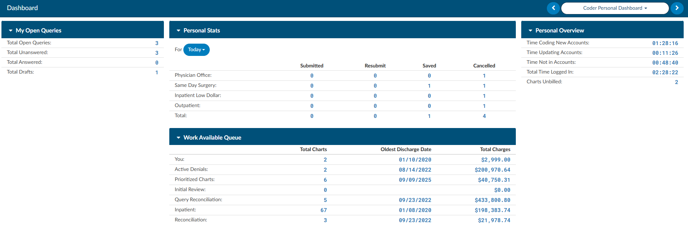
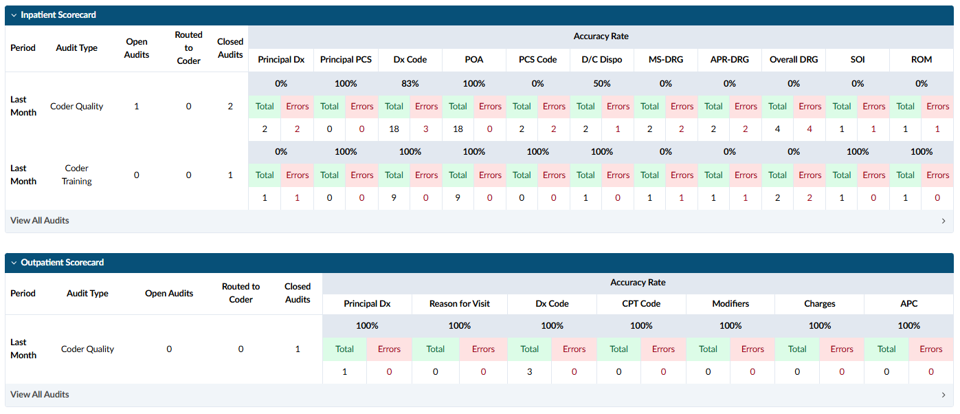
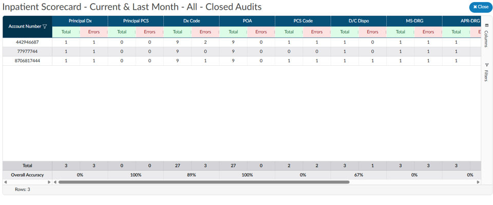

+++
title = 'Coder Personal Dashboard'
weight = 30
+++

The Coder dashboard is only available for users with a coder role. This dashboard displays quick at a
glance personal statistics. Clicking on any of the numbers in blue will open a grid to display the data that
goes into the number displayed.

## Coder Scorecard

The Coder Scorecard shows the coder's accuracy results and how each accuracy score is calculated. The Coder Scorecard also appears on the Forced Autoload dashboard.

Beneath each accuracy percentage, the scorecard shows the **Total Opportunities** and **Total Errors** used to calculate it. 

**Closed Audit:** Click the Closed Audit metric to open a detailed view. This view lists each audited account number, along with its errors, accuracy results, and overall accuracy.

**Routed to Coder:** This section lists charts that have been routed to the coder. It helps coders identify work that is waiting for them, particularly at sites that do not use workflow.

**View All Audits:** Click View All Audits to open the Accuracy Rate table, along with the charts included in its results, in a new tab.

