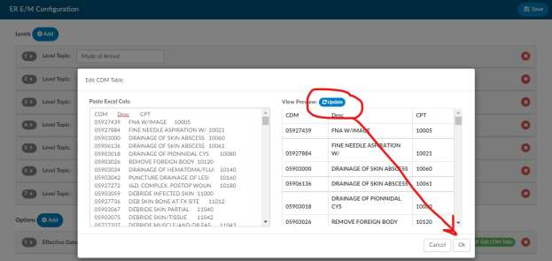

+++
title = 'Er Em Configuration Page'
weight = 110
+++

The E/M Configuration page must be set up by the Dolbey Team therefore the
below is to show you what is within this page. If you need more information on the
set up of this page, please contact the SME Team (smeteam@dolbey.com).

The ER E/M Configuration can be found within the Tools menu. If enabled, you will
see it beneath the Validation Management.

Upon clicking on ER E/M Configuration, you will be presented with the
configuration page which should look similar to the below.

Within the configuration page, you can configure the E/M Level Matrix and other components. If a user
has a Facility Mapping, the EM E/R Configurations can now be copied between the various facilities. If
the user has a Facility mapping, a new option will appear in the top right of the screen allowing selection
of one of the facilities. Once a facility is chosen, that facility’slevels will appear. A new Copy button will
show at the top of the Levels section. Clicking it will open a dialog asking the user what facility to copy
those current levels to. The levels will be presented in a dropdown. In this case, I am in Dolbey South –
Cincinnati, and when I select the copy button, I have the option to pick another facility to copy those
levels to:

This option will overwrite and copy the current levels that are onscreen to the facility that is selected. If the user
does not have a Facility mapping, then these copy options will be hidden.

## Configuring the E/M Matrix

The table below shows how the E/M Matrix will display to the end user. You can configure the verbiage
on this table to control what is displayed for end users.

The E/M Coding Matrix has horizontal columns which display the E/M Level across the top. Below each
level are selections that make up the level. There are a few categories under each of the levels which, by
default, include the following topics:

1. Mode of Arrival
2. Disposition
3. Testing
4. Medication
5. Behavioral
6. Procedures
7. Other Criteria

Under the levels, you will have seven topics that drive each of those levels. These topic names are
configurable, as some of the default topics may not pertain to your facility.

Each of the topics under the levels will have a list of items that are applicable to the topic and the
corresponding level. However, this E/M Matrix configuration will allow you to change the content within
each of those fields underneath of the corresponding E&M level as your facility may have different items
to list under each code, per topic.

To make changes to the default you can click on the grey number to open the matrix configuration.

Once you have opened the number, you will see each of the levels with corresponding codes. Next to each
of the levels under Level Topic you will see a +Add button. Clicking on this +Add button will allow you to
add another selection. Clicking on this button, display an open text field where you can type in what you
want the choice to be. Remember this verbiage should be short and simple.

You can also remove selections under each topic and level by selecting the X button. This will remove the
selection.

You can also change the default verbiage we provided by simply placing your cursor into each topic and
level. You can remove or change any of the verbiage that is in these fields

## Configuring Charging Options and CDM

Below the E/M Matrix configuration you will see a section for “Other”. The other section allows you add
in charging components attached to a charge master. To make changes to the default, you can click on
the grey number to open the charge and CDM configuration.

The effective date field the date on which the CDM table in the new charges once you open up the table
will take effect. This way, if you have a new updated CDM table or if you were trying to plan for the
future you can stage when these tables are available to the Coding Team.

## Updating the CDM

Click on the green “Edit CDM Table”button to the right of the effective date.

By clicking the button it will open up the edit CDM table this is asking for you to paste from your Excel
spreadsheet.

Best practice is to paste in the CDM column, then the description, then the CPT code. This step is
extremely important because any assigned CDM will need to be sent in the outbound interface,
therefore, your CDM table needs to match whatever is going to be downstream from Dolbey.

Once you paste it in the information, click on the update button to ensure the preview looks correct. If
so, click on the OK button to continue.

Once you’ve dropped in the CDM table you can now edit the categories within the option section. There
are a few different default options:

- Trauma
- No charges
- Medication quantity
- Medication time/modifier
- Additional charges

To edit any of these options you can click on the gray date next to each of these options to open them.
Some of these options may not pertain to you. If so, you can remove all the options underneath the
sections and that section will be removed from the E/M coding page for your users.

## Trauma Section

When you open the trauma section, you will have an item name. Some data will be defaulted here. Each
of these items have a CDM attached per E/M level, including critical care. Ensure that the CDM
underneath each of the levels corresponds to what your CDM table indicates.

For your end users this will be a drop-down menu. For example, when the user
selects **Pre-Hospital Notification**, they do not have to select the E/M level. Based
upon the matrix and what they selected, it will drop in the associated CDM code
based upon the level they have assigned.

> [!info]
If your CDM does change you will have to update this table as well.

## No Charge Section

Once you have reviewed the Trauma section you can then click on the gray date next to no charge. This
option is set up a little bit differently. The item field will be the verbiage that you want to correspond to
the CPT code to the right.

For your end users, this box will drop-down. The user will choose the item and in the outbound interface
we will drop in both the CPT code and the corresponding CDM code that you have listed in this table.

## Medication Quantity

Once you have reviewed the No Charge section you can then click on the gray date next to Medication
Quantity. Within this section you can list the item name in which we had provided a default description,
these items will match to corresponding CPT and CDM code

The medication quantity as well as the medication time modifier is not about the medication. rather the
way the medication was administered. This allows you to charge for any injections, infusions, IV pushes,
immunizations, and hydration. The medication administration quantity allows you to define how many
of each occurred on a particular date, if the ER visit occurred over more than one day, and other
modifiers which can be added as needed.

To the end-user this looks like a table where they can pick all the medication administrations to apply
and provide dates and modifiers. There is a section for the end users to enter a note to keep everything
in line so that they can indicate which medications they have already charged for. This helps the end-
user keep their thought process together, and also provides information in the event that there is an
audit.

## Medication Time/Modifier

Medication administration time/modifier is very similar to the medication administration quantity. The
only difference is that you are able to indicate that there are, for example, multiple infusions. If there
are different drugs involved you can copy the individual lines so that you can add in the durations of
each medication along with the date and modifier if the modifiers are different.

Some organizations like to have medication administration quantity and medication administration
time/modifier, however, other organizations will relocate all of the items within the medication
administration to the medication administration time/modifier section so that all medications are within
the same section.

Within this section, you can list the item name in which we provided a default description, these items
will match to corresponding CPT and CDM codes.

To the end-user, this looks like a table where they can pick all the medication administrations to apply
and provide date and modifiers. There is also a section for the end users to enter a note to keep
everything in line so that they can indicate which medications that they have already charged for. This
helps the end-user keep their thought process together, but also provides information if there is an
audit. There is also a copy button to the left of the note that allows the end user to copy if there are
more than one medication that needs to be considered.

## Additional Charges

This allows you to enter in some of the things that are common to be charged for within the ER. We
have indicated that there are four common ones however, you can add as many as you like by clicking
on the plus add button. You can also remove any default items if you do not charge for these by
selecting the delete button next to the defaults provided.

Within the section you can list the item name in which we had provided a default description, these
items will match to corresponding CPT and CDM codes.

To the end-user this looks like a table where they can quickly add a quantity, date, and modifier if any of
the default charges are applicable.

