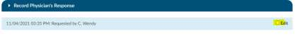

+++
title = 'Form Designer'
weight = 150
+++

The form designer is used to create worksheets for CDI, Coders, Shared Worksheets, Physician Coder,
Documentation Review Forms and Query templates.

A "Shared Worksheet" is a worksheet that can be used by both CDI Specialists and Coders, unlike "CDI
Worksheet" and "Coder Worksheet" which are exclusive to CDI and Coding, respectively.

Forms are used to collect data and/or take notes. For example, CDI Worksheets are used for a CDI to
document their thoughts while reviewing a chart.

Query templates are frequently created and saved as a base template with most of the query written to
show as read only text. The creator can then add open fields for the user to add additional questions to
the base query template.

To add a form, simply click on the **+Add button** in the section you wish to add a new form to, or you can
click on an existing worksheet or query to edit the template.

## Creating a New Worksheet/Query

To create a new form, first start by entering a document name; name the worksheets or queries unique
for reporting purposes, then you can start designing.

You can start with a document that you have already created. Copy the text and paste it into the form
designer. You may have to change the formatting once pasted depending on the document format you
copied it from.

Any text you copy or type into a form will be read only to the end user
creating the form it’s a template they will follow. However, you can
create fields that they can enter information into the form by clicking
on Add Field will present an updated dialog that includes a new
"Account Field" type.

In this dialog, the field name should be unique, so you can do reporting.
You can also make fields required by checking the box or not if it’s
optional. After clicking OK, another dialog will appear to
select the field to display. After selecting a field, a box will display in Form Designer as a
placeholder for the field that you selected. Chose the type of field that makes sense
based on the form.

In the Physician Query Dialog or in a manually added worksheet within an account, the
placeholder will be replaced with bolded text representing the field's actual value

## Creating a Blank Query Template

If a Physician Query is exactly called “Blank Query Template” in the Form Designer then an additional
‘Query For’ field will appear for the user to enter plain text.
In applicable reports, the Query template column will show “Blank Query Template”: followed by the
value for the ”Query For” field.

## Verbal Query

You can request with CAC Support a verbal query template that will not be sent outbound. CAC Support
can add logic into the script so that when a template named “VERBAL QUERY” is used it will not be sent
outbound to the provider. To ensure you can still report on the topics of the query we would
recommend creating a template using the exact name “VERBAL QUERY” and then select the check box
Add Field For 'Query For'

If this box is checked, when the end users use this template to record the verbal query outcome they
will be presented with a box to add in what the query was for, it should be something like Sepsis or CHF
that follows the normal template names so the reporting is still available.

## Creating Dynamic Sections

What is a Dynamic Section? This allows users to create a template for the user creating the query to
customize the query by removing sections as needed from the template or to
rearrange the order of information.

The Field Name will be displayed in the template above its section. Text and
fields can be inserted into a section; sections cannot be inserted in other sections.
When the template is added to a query, each section will now show an up and
down arrow for movement, along with an X to delete that section from the query.

Once sections are created, they will look like the below within form designer:

Once sections are created, they will look like this when a user created a query within an account

A user can move sections up or down, or remove sections. If you remove a section you will be presented
with an undo button to place it back into the query.

## Creating Internal Notes

Internal only notes can now be added to Physician Query templates from
the form designer. On a template, clicking the Insert dropdown will now
show a new option of Add Internal Note. The Internal note is only
displayed for the user filling out the query and is not set to the provider
receiving the query.

Selecting this option will add a highlighted free text line to the
document.

When adding a physician query the user will see the highlighted section in the query when that template
is selected.

After sending the query, this note will no longer be seen unless the user has the privilege of ‘Edit Open
Queries to resend’ in Role Management. An Edit checkbox will show on the date line, and checking it
will show the query with the internal note.

In user reports, the following
reports will display the "Query For" field in the same field as the "Query Template" column separated
with a colon:

- Outstanding Queries
- Query Impact by Discharge Date
- Query Impact Report
- Query TAT by Author Report
- Query Template Volume Overview

Form Designer will create a history for changes made to templates in Form Designer. Once a change is
made on a form and saved, a Show History button will show in the top right of the worksheet. Clicking
on it will bring up a notes box, just like in Workflow Management.

