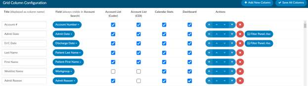

+++
title = 'Grid Column Configuration'
weight = 120
+++

The "Grid Column Configuration" page is an administrative page used to identify the columns displayed
in Account List, Account Search, Calendar Stats by Day, and Dashboard pages. You can identify which
columns you want to display for each of the default user types including: coder, physician coder, single
path, auditor and CDI.

All columns added in Grid Column Configuration appear in Account Search, and selected columns can be
made visible in the other three pages.

> [!info]
Ordering is not necessarily important here, but it serves as the default order for new users.

Each user can rearrange the order of the columns per their liking on the specific pages, which is saved
automatically (Account List) or manually (Account Search, Calendar Stats by Day, Dashboard).

## Add/Remove Column

To add a column, click “+ Add New Column” in the top right of the screen. You will then be navigated to
the bottom of the screen where a new column was added, you will notice the title column is blank. First,
select the field you wish to add, then, to the left of the column, type in the friendly name you wish to
give to the field. This name will be what the end users see instead of the field name, which is not always
a friendly name. To the right of the fields you will see 4 check boxes, by checking the boxes you will have
accessibility to these fields from each of the locations Account List, Calendar Stats and Dashboard.
