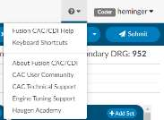
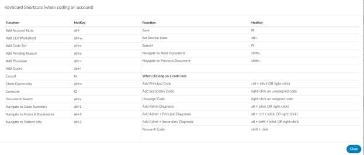

+++
title = 'Help Menu'
weight = 170
+++

The help menu can be found using the ? in the top right corner of the
application. You will find a few resources under this menu. By clicking on the
Fusion CAC/CDI Help you will find this user guide that you are viewing currently.
You will also find how to reach out to our support and tuning resources in
additional Keyboard short cuts.

## Keyboard Shortcuts

Keyboard shortcuts can be used to use key strokes vs. mouse movements to do
somethings within the software. The keyboard short cuts can be changed by an administrator under
tools and Shortcut Configuration.

