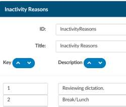
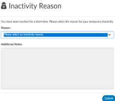
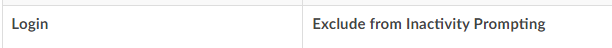

+++
title = 'Inactivity Timeout'
weight = 35
+++

Logins can be set to trigger an ‘inactivity reason’ via settings added to the Web.config file. With
these settings, any user logging in after a certain period receives a pop-up window box which will ask
them to select a reason they have been inactive and add any other notes they want to add. Inactivity
Reasons are created in Mapping Configuration. This feature will help managers see where and why
inactivity occurs during the workday.

Role Management contains an option to exclude user roles from being prompted.

