+++
title = 'Account Search'
weight = 20
+++

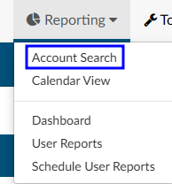

Account Search is helpful for reporting when creating a report that is not in the default user reports. Account Search allows the user to search most data points to export the raw data into a CSV file. 

Sample Use Cases:
- How many inpatient accounts were discharged last month with a pricipal diagnosis of sepsis?
- What accounts were discharged with pending reasons?
- Of the inpatient accounts coded and then discharged last month, what is the total of each CC and MCC?

To answer any of the questions above, the data will need to be filtered as Account Search can pull all account/chart data available in the system.

## Setting Criteria

Account Search is highly dynamic in the types of data users can pull. Account Search, much like workflow, has two different options to create a filters using the AND/OR criteria. 
- AND criteria 
- OR Criteria

### AND Criteria

When using AND criteria, think about adding **AND** at the end of each criterion. For example, this criteria will cause the account search to display results if the patient chart had both the coder **AND** the CDI user identifying a PSI.

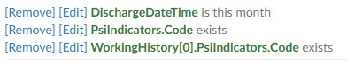

### OR Criteria

When using OR criteria, think about adding **OR** at the end of each criterion. The OR criteria will display in blue to differentiate between the first and second criteria that will trigger the results. For example, this criteria will cause the account search to display results if the patient chart had either the Coder **OR** the CDI user identifying a PSI.

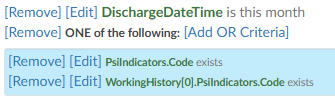

Start to filter the data by clicking the appropriate criteria button and selecting fields to constrain the data. 

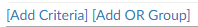

Continue to constrain the data for the desired results. There are over 250 fields that can be used to constrain the data. Each organization will have their own custom fields, depending on how the system was configured.

## Selecting Columns

Once the data has been constrained, select the columns to display by selecting {}Columns{}. 

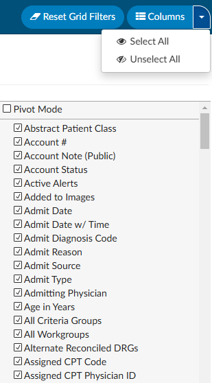

When the results are initally returned, there will be more column fields displayed than needed. Users can pair down the columns by removing or adding the columns as needed. Clicking on the drop-down arrow on {}Columns{} allows the user to select or unselect all columns. Use the check box to indicate the column should display and uncheck it to remove the column from the Account Search or Scheduled Account Search report. 

## Drill-Down Level

Account Search allows for the ability to search for account level data or drill down to an array of different data collections. 

- Account (Default)
- Audits
- CDI/Clinical Alerts
- Denials
- Final Assigned Codes
- Final CPT Codes
- Final Diagnoses
- Final Procedures
- Final Visit Reasons
- Pending Reasons
- Physician Coding Assigned Codes
- Physicians
- Queries
- Working Assigned Codes
- Working CPT Codes
- Working Diagnoses
- Working Procedures
- Working Visit Reasons
- Worksheet History

When a choice other than Account, which is the default view, is selected the columns for that choice are added to the beginning of the original grid. The drill-down level can be saved to the grid. For example, if there is search the user has saved called Unsubmitted, and the user added the Final Procedure drill-down to it, then when Unsubmitted is pulled up in Account Search it will include the drill-down columns. Additionally, the name of the drill-down will appear in the drill-down level field instead of the default of Account.

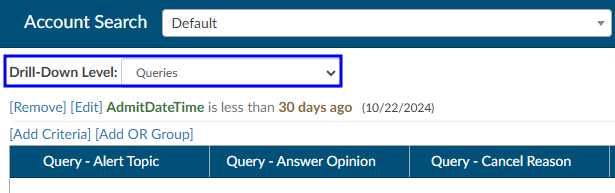

## Searching for Data

The data filter allows user to constrain the data before returning results in account search grid. 

For example, a search for patient charts that CDI reviewed in the previous month might look like this: 

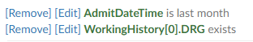

To learn more about the fields and how they are defined, navigate to the [Fields](https://dolbeysystems.github.io/fusion-cac-web-docs/fields/) section in this user guide.

## Sort and Filter Results

Each column has menu options to filter the data to restrict the view for only the data the user has defined.

To manually filter:

- Click the 3 lines on the column to be filtered
- Click on the Filter icon
- Check or uncheck the boxes depending on the data to be filtered
- Click on the filter to close the box

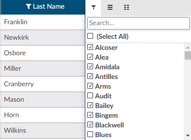

Additionally, users can choose to group the data creating a pivot table.

Using the data to create a pivot table allows users to reorganize the selected columns and rows of data in the account search grid table to obtain a desired report. The fields that can be filtered on and/or displayed can be found in the [Fields](https://dolbeysystems.github.io/fusion-cac-web-docs/fields/) section in this user guide.

## Saving a Search

Account searches can be saved for future use.

When saving a search, a new field will show in the save box called Filter Summary.  If filled out, the summary will show in the banner of the search next to the Drill-Down Level. 

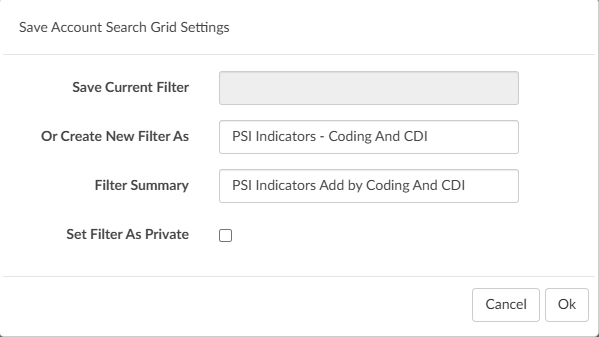

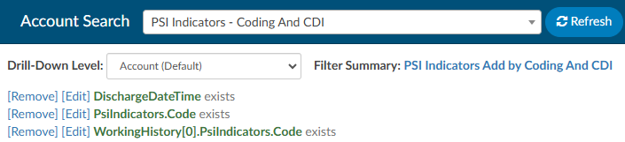

## Scheduling a Report

When a search is saved, a {}+Add Scheduler{} button will appear for users in Account Search to open a dialog box to create/edit/delete a schedule. Each saved search can have one schedule.

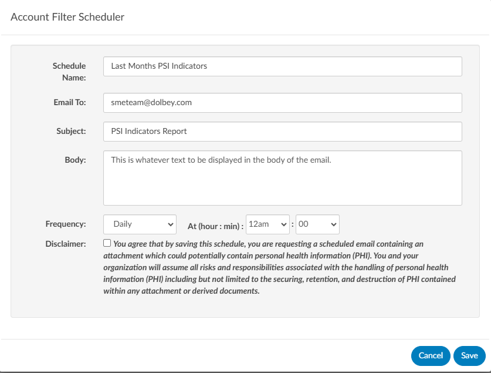

Once the user fills this out and saves, the button changes so the user can edit the scheduled report from account search.

Users can also see the account searches that were scheduled under the reporting tabs and scheduled user reports.

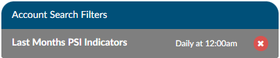

## Export to CSV

Search results can be exportd from the right click menu. Exporting in the CSV format allows users to view them in Excel. Exported results will maintain the columns and grouping. 

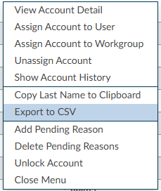

