+++
title = 'Account Search'
weight = 20
+++

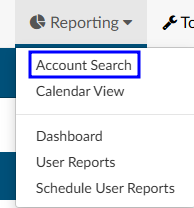

When the report you need doesn't already exist as a default user report, Account Search lets you build it yourself. It lets you search across most data points in the system and export the raw results to a CSV file.

Sample Use Cases:
- How many inpatient accounts were discharged last month with a principal diagnosis of sepsis?
- What accounts were discharged with pending reasons?
- Of the inpatient accounts coded and then discharged last month, what is the total of each CC and MCC?

To answer any of these questions, you'll need to filter the data, since Account Search can pull from all account and chart data available in the system.

## Setting Criteria

Account Search is highly flexible in the types of data you can pull. Like Workflow Management, it uses two criteria options to build your filters:

- AND criteria 
- OR Criteria

### AND Criteria

With AND criteria, every condition must be met for an account to appear in your results. For example, the criteria below returns charts where both the Coder and the CDI user identified a PSI.

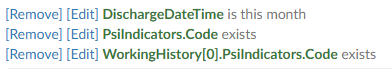

### OR Criteria

With OR criteria, an account only needs to meet one of the conditions to appear in your results. OR criteria appears in blue so it stands out from AND criteria. For example, the criteria below returns charts where either the Coder or the CDI user identified a PSI.

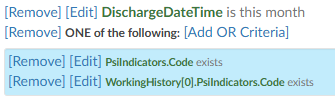

To start filtering, click the appropriate criteria button and select the fields you want to constrain the data by.

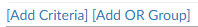

Keep adding criteria until the results match what you're looking for. There are over 250 fields available to filter on, and your organization may also have its own custom fields depending on how your system is configured.

## Selecting Columns

Once your data is filtered, choose which columns to display by clicking {}Columns{}. 

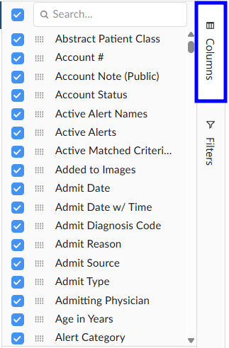

Your initial results will usually include more columns than you need. You can pare these down by adding or removing columns as needed. Clicking the drop-down arrow on Columns lets you select or unselect all columns at once. Check a box to display that column, or uncheck it to remove it from the Account Search or Scheduled Account Search report. As you type in the filter box above the column list, it narrows down the available fields.

## Drill-Down Level

Account Search allows for the ability to search for account level data or drill down to an array of different data collections. 

- Account (Default)
- Audits
- CDI/Clinical Alerts
- Denials
- E/M Charges
- Final Assigned Codes
- Final CPT Codes
- Final Diagnoses
- Final Procedures
- Final Visit Reasons
- Pending Reasons
- Physician Coding Assigned Codes
- Physicians
- Queries
- Working Assigned Codes
- Working CPT Codes
- Working Diagnoses
- Working Procedures
- Working Visit Reasons
- Worksheet History

When you choose anything other than Account (the default view), that drill-down's columns get added to the front of your grid. The drill-down level is saved along with the search itself. For example, if you have a saved search called Unsubmitted and you add the Final Procedure drill-down to it, pulling up Unsubmitted later will include those drill-down columns automatically, and the drill-down level field will show Final Procedure instead of the default Account.

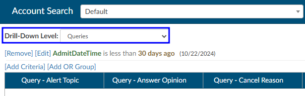

## Searching for Data

The data filter lets you constrain your data before Account Search returns results in the grid.

Here's an example: a search for patient charts that CDI reviewed last month might look like this:

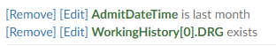

To learn more about individual fields and how they're defined, check out the [Fields](https://dolbeysystems.github.io/fusion-cac-web-docs/fields-and-definitions/fields/) section of this user guide.

## Sort and Filter Results

Each column includes menu options that let you filter the view down to only the data you want to see.

To manually filter:

- Click the 3 lines on the column to be filtered
- Click on the Filter icon
- Check or uncheck the boxes depending on the data you want to filter
- Click on the filter to close the box

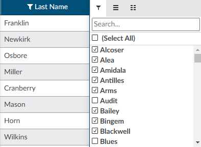

Additionally, users can choose to group the data creating a pivot table.

You can also group the data to create a pivot table. Creating a pivot table lets you reorganize the columns and rows in your Account Search grid to build exactly the report you need. You can find the full list of fields available to filter on or display in the [Fields](https://dolbeysystems.github.io/fusion-cac-web-docs/fields-and-definitions/fields/) section of this user guide.

## Saving a Search

You can save an Account Search to reuse it later.

When you save a search, you'll see a new field called Filter Summary. If you fill it out, that summary appears in the search's banner next to the Drill-Down Level, a handy reminder of what the search actually filters for.

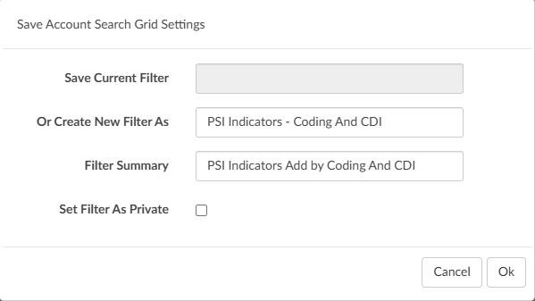

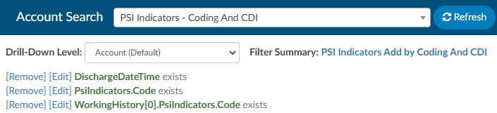

## Scheduling a Report

Once a search is saved, an {}+Add Scheduler{} button appears in Account Search, letting you open a dialog to create, edit, or delete a schedule. Each saved search can have one schedule.

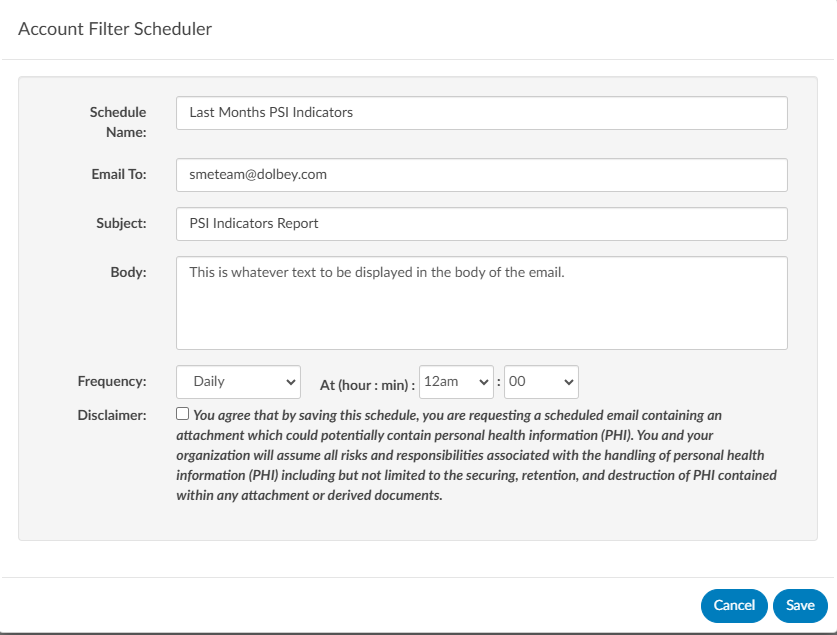

Once you fill this out and save it, the button changes so you can edit the scheduled report directly from Account Search.

You can also see the account searches that were scheduled under the Reporting tabs and Scheduled User Reports.

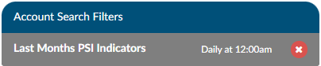

## Export to CSV

Search results can be exported from the right-click menu. Exporting in CSV format lets you view them in Excel, and exported results keep their columns and grouping.

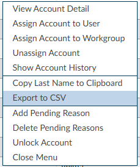

# Operators

Account Search uses the same set of operators as Workflow Management, since both features compare the value you enter against the value stored in a field. The right operator depends on whether you're checking for an exact match, a range, a list of options, or a date.

## Matching a Single Value

| Operator             | Description | Example |
| -------------------- | ----------- | ------- |
| Equals               | The field must match your value exactly (nothing more, nothing less). Uppercase/lowercase matters. |Setting Equals → "Inpatient" will only match accounts where the field says exactly "Inpatient," not "inpatient" or "Inpatient Chart."|
|Not Equal             | The field must not match your value. Uppercase/lowercase matters. |Not Equal → "Inpatient" matches every account except those marked exactly "Inpatient."|

## Comparing Numbers or Amounts

| Operator             | Description | Example |
| -------------------- | ----------- | ------- |
| < (less than)        | The field's value must be smaller than the number you enter.|< 5 matches 4, 3, 0, not 5 itself. |
| > (greater than)     | The field's value must be larger than the number you enter.|> 5 matches 6, 7, 100, not 5 itself. |
| <= (less than or equal to) | The field's value must be smaller than or the same as the number you enter. |<= 5 matches 5, 4, 3.|
| >= (greater than or equal to) | The field's value must be larger than or the same as the number you enter. |>= 5 matches 5, 6, 7.|

## Matching Against Several Possible Values

| Operator             | Description | Example |
| -------------------- | ----------- | ------- |
| In List              | The field must exactly match one of the values you list (the whole field, not part of it). |In List → [Return to CDI, Return to Coding] matches an account only if the field's entire value is exactly one of those two phrases.|
| Not In List          | The field must not exactly match any of the values you list. |Not In List → [Return to CDI, Return to Coding] excludes accounts where the field is exactly one of those two phrases.|

## Searching Within Text

| Operator             | Description | Example |
| -------------------- | ----------- | ------- |
| Starts With           | Matches if the field begins with the characters you enter. Useful for codes or document type prefixes.|Starts With → "I10" matches "I10.9," "I10.0," "I10-related note," etc.|
| Contains             | Matches if your word or phrase appears anywhere in the field, even if it's only part of a longer value, not the whole thing. |Contains → "Blue Cross" matches "Blue Cross of Ohio," "Anthem Blue Cross," or a note that simply mentions "Blue Cross" partway through.|
| Only Contains        | Matches only if every value in the field comes from your list; nothing extra is allowed. |If an account has codes A, B, and C, "Only Contains → [A, B, C]" matches. If the account also has code D, it does not match.|

## Checking Whether a Field Has Any Value

| Operator             | Description | Example |
| -------------------- | ----------- | ------- |
| Exists               | Matches if the field has anything in it; it just can't be blank. No value needs to be entered for this operator. |Exists on "Discharge Date" matches any account that has a discharge date recorded, regardless of what that date is.|
| Does not Exist       | Matches if the field is blank. No value needs to be entered for this operator. |Does Not Exist on "Discharge Date" matches accounts with no discharge date yet (i.e., still admitted).|

## Working with Dates

| Operator             | Description | Example |
| -------------------- | ----------- | ------- |
| More Than            | Only for date fields. Matches if the date is more than X days ago. You enter a number of days, not a calendar date, since this needs to stay relative to "today." |More Than → 30 (days ago) on Admit Date matches accounts admitted over a month ago.|
| Less Than            | Only for date fields. Matches if the date is less than X days ago. Again, you enter a number of days, not a calendar date. |Less Than → 7 (days ago) on Admit Date matches accounts admitted within the last week.|
| Later Than           | Only for date fields. Matches if the date is later than one specific, fixed calendar date you choose. |Later Than → 01/01/2026 matches any account dated after January 1, 2026.|
| Is On                | Matches an exact calendar date. Rarely used since most searches need to stay relative to "today." |Is On → 03/15/2026 matches only accounts dated exactly March 15, 2026.|
| Weekday In           | Matches if the date falls on one of the specific days of the week you select. |Weekday In → [Saturday, Sunday] matches accounts admitted on a weekend.|
| Hour In Range        | Matches if the time (admit or discharge) falls within a range of hours you set. |Hour In Range → 8:00 AM–5:00 PM matches accounts admitted during standard business hours.|
| Hour In              | Matches if the time falls on one specific hour you select. |Hour In → 2:00 PM matches accounts admitted between 2:00–2:59 PM.|
| Last Month           | Matches records from the previous calendar month. |If today is any day in August, Last Month matches everything dated in July.|
| This Month           | Matches records from the current calendar month. |If today is any day in August, This Month matches everything dated in August.|

## Matching Against Multiple Values at Once (Lists Within a Field)

| Operator             | Description | Example |
| -------------------- | ----------- | ------- |
| Includes Each Of     | The field must contain all of the values you list, but it's okay if it has other values too.|Includes Each Of → [A, B] matches an account with codes A, B, and C, because A and B are both present. It would not match an account with only A.|
| Includes Any Of      | The field must contain at least one of the values you list. | Includes Any Of → [A, B] matches an account with just A, just B, or both.|
| Does not Include     | This operator isn't available on its own. If you need "must not contain any of these values," use **Not In List** instead. |N/A|

> **Note — Operator Values:** Unless an operator does not require a value, the value field must be filled in to save the criteria.

