+++
title = 'Account Search'
weight = 20
+++

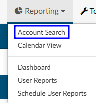

When the report you need doesn't already exist as a default user report, Account Search lets you build it yourself. It lets you search across most data points in the system and export the raw results to a CSV file.

Sample Use Cases:
- How many inpatient accounts were discharged last month with a principal diagnosis of sepsis?
- What accounts were discharged with pending reasons?
- Of the inpatient accounts coded and then discharged last month, what is the total of each CC and MCC?

To answer any of these questions, you'll need to filter the data, since Account Search can pull from all account and chart data available in the system.

## Setting Criteria

Account Search is highly flexible in the types of data you can pull. Like Workflow Management, it uses two criteria options to build your filters:

- AND criteria 
- OR Criteria

### AND Criteria

With AND criteria, every condition must be met for an account to appear in your results. For example, the criteria below returns charts where both the Coder and the CDI user identified a PSI.

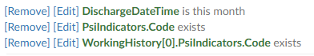

### OR Criteria

With OR criteria, an account only needs to meet one of the conditions to appear in your results. OR criteria appears in blue so it stands out from AND criteria. For example, the criteria below returns charts where either the Coder or the CDI user identified a PSI.

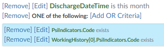

To start filtering, click the appropriate criteria button and select the fields you want to constrain the data by.

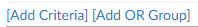

Keep adding criteria until the results match what you're looking for. There are over 250 fields available to filter on, and your organization may also have its own custom fields depending on how your system is configured.

## Selecting Columns

Once your data is filtered, choose which columns to display by clicking {}Columns{}. 

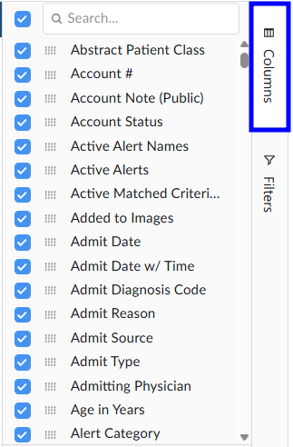

Your initial results will usually include more columns than you need. You can pare these down by adding or removing columns as needed. Clicking the drop-down arrow on Columns lets you select or unselect all columns at once. Check a box to display that column, or uncheck it to remove it from the Account Search or Scheduled Account Search report. As you type in the filter box above the column list, it narrows down the available fields.

### Organize Columns

To change the order of the columns, click {}Organize Columns{} in the upper-right corner of the Account Search page. In the Organize Columns dialog, you can:

- Drag and drop fields to reorder them.
- Enter a specific position for a field.
- Use the arrows to move a field up, down, or to the top or bottom of the list.
- Search to quickly locate a field.
- Add or remove individual fields, or all fields at once.

The dialog can be expanded or minimized to fit the screen.

### Days from Discharge

The **Days from Discharge** column shows the number of days between today and the account's discharge date. If an account has no discharge date, the value shows as zero. This column is for display only. It must first be added to the grid through [Grid Column Configuration](https://dolbeysystems.github.io/fusion-cac-web-docs/administrative-user-guide/tools/grid-column-configuration/), and it is also available in [scheduled](https://dolbeysystems.github.io/fusion-cac-web-docs/administrative-user-guide/reporting/scheduled-reports/) Account Search reports.

## Drill-Down Level

Account Search allows for the ability to search for account level data or drill down to an array of different data collections. 

- Account (Default)
- Audits
- CDI/Clinical Alerts
- Denials
- E/M Charges
- Final Assigned Codes
- Final CPT Codes
- Final Diagnoses
- Final Procedures
- Final Visit Reasons
- Pending Reasons
- Physician Coding Assigned Codes
- Physicians
- Queries
- Working Assigned Codes
- Working CPT Codes
- Working Diagnoses
- Working Procedures
- Working Visit Reasons
- Worksheet History

When you choose anything other than Account (the default view), that drill-down's columns get added to the front of your grid. The drill-down level is saved along with the search itself. For example, if you have a saved search called Unsubmitted and you add the Final Procedure drill-down to it, pulling up Unsubmitted later will include those drill-down columns automatically, and the drill-down level field will show Final Procedure instead of the default Account.

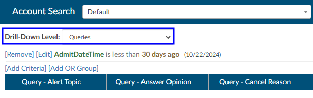

The **Queries** drill-down includes fields for comparing DRG information before and after a query: Pre-DRG, Pre-DRG Description, Pre-DRG Weight, Pre-DRG Reimbursement, Post-DRG, Post-DRG Description, Post-DRG Weight, and Post-DRG Reimbursement. These fields are also available in scheduled Account Searches.

## Searching for Data

The data filter lets you constrain your data before Account Search returns results in the grid.

Here's an example: a search for patient charts that CDI reviewed last month might look like this:

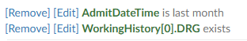

To learn more about individual fields and how they're defined, check out the [Fields](https://dolbeysystems.github.io/fusion-cac-web-docs/fields-and-definitions/fields/) section of this user guide.

## Sort and Filter Results

Each column includes menu options that let you filter the view down to only the data you want to see.

To manually filter:

- Click the 3 lines on the column to be filtered
- Click on the Filter icon
- Check or uncheck the boxes depending on the data you want to filter
- Click on the filter to close the box

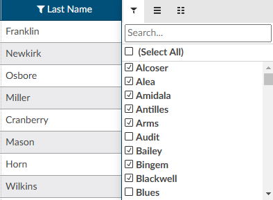

>[!Note] Filtering Pending Reasons
>For details on how the Pending Reasons column filter works, see [Pending Reasons](https://dolbeysystems.github.io/fusion-cac-web-docs/account-navigation/navigation-tree/code-summary/pending-reasons/#filtering-by-pending-reason).

Additionally, users can choose to group the data creating a pivot table.

You can also group the data to create a pivot table. Creating a pivot table lets you reorganize the columns and rows in your Account Search grid to build exactly the report you need. You can find the full list of fields available to filter on or display in the [Fields](https://dolbeysystems.github.io/fusion-cac-web-docs/fields-and-definitions/fields/) section of this user guide.

## Saving a Search

You can save an Account Search to reuse it later.

When you save a search, you'll see a new field called Filter Summary. If you fill it out, that summary appears in the search's banner next to the Drill-Down Level, a handy reminder of what the search actually filters for.

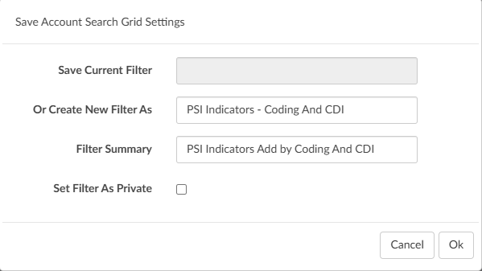

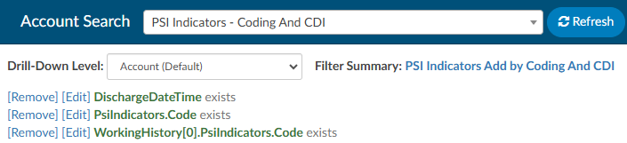

## Scheduling a Report

Once a search is saved, an {}+Add Scheduler{} button appears in Account Search, letting you open a dialog to create, edit, or delete a schedule. Each saved search can have one schedule.

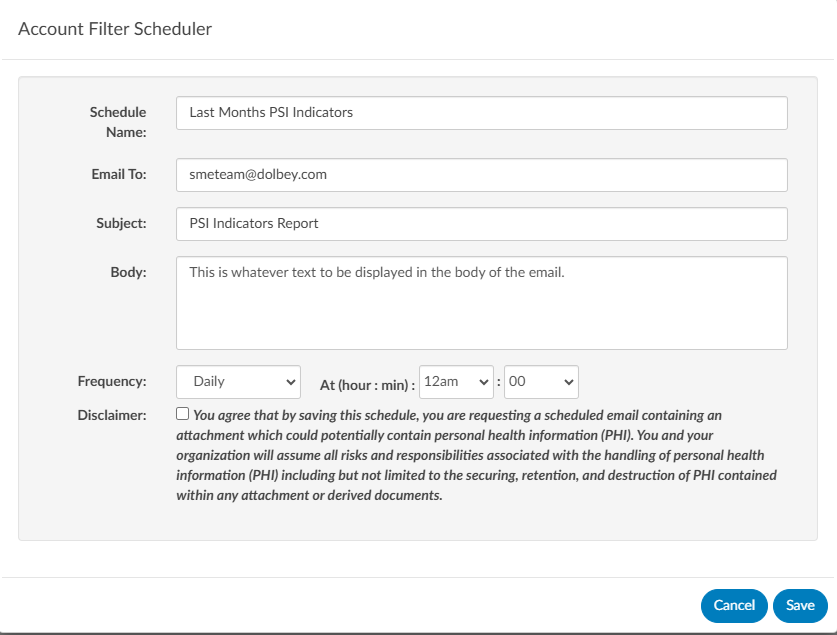

Once you fill this out and save it, the button changes so you can edit the scheduled report directly from Account Search.

You can also see the account searches that were scheduled under the Reporting tabs and Scheduled User Reports.

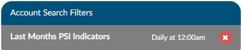

## Export to CSV

Search results can be exported from the right-click menu. Exporting in CSV format lets you view them in Excel, and exported results keep their columns and grouping.

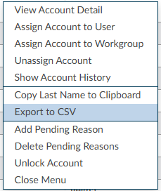

## Operators

Account Search uses the same set of operators as Workflow Management, since both features compare the value you enter against the value stored in a field. The right operator depends on whether you're checking for an exact match, a range, a list of options, or a date.

{}
