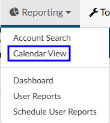
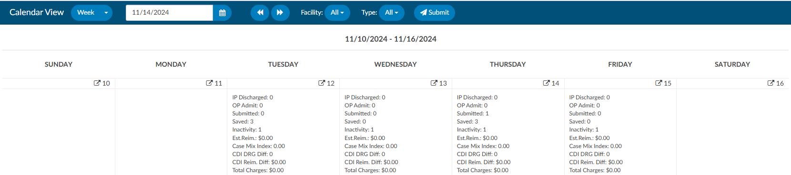
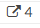
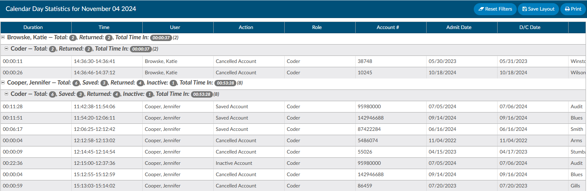
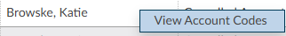

+++
title = 'Calendar Views'
weight = 21
+++

The calendar view will show which users touched charts on a specific day and the actions they took. Upon first
logging on, users will be presented with a calendar view. By default, the view shows the current calendar week.

To view the entire calendar month or choose a date range use the control keys at the top of the calendar.

The left and right buttons located at the right of the date field will allow you to change the month
forward or backward one month per click. Each of the calendar days have information provided which
are defined below. The facility drop down menu, will allow the user to select a facility (if applicable). The type drop down menu, will allow the user to select a patient type (category) (if applicable). Once the parameters havee been defined, click {}Submit{} to display the data within the calendar.

### Statistics

Each Calendar date has its own overview statistics. The numbers and totals shown on the calendar are 
distinct numbers, meaning each chart is only considered once per each category below even if a 
user clicked save or submit multiple times it will be **ONLY** counted once.

| Statistic            | Description |
| -------------------- | ----------- |
| IP Discharged        | This is a total inpatient chart that received a discharge date of the date you are viewing on the calendar. |
| OP Admit             | This is a total outpatient chart that received an admit date of the date you are viewing on the calendar. |
| Submitted            | This is the total number of charts that the user clicked the **submit button**. This is a distinct number of submits which means that each chart even if a user clicked submit multiple times it will be **ONLY** counted once. |
| Saved                | This is the total number of charts that the user clicked the **save button**. This is a distinct number of submits which means that each chart even if a user clicked save multiple times it will be **ONLY** counted once. |
| Inactivity           | This is an account that was saved automatically due to inactivity (session timeout). |
| Est. Reim.           | This is the total number of charts that the user has clicked the **submit button** that resulted in the encoder sending an estimated reimbursement, commonly this only occurs on inpatient charts when a DRG is calculated. |
| Case Mix Index       | This is the total number of charts that the user has clicked the **submit button**, commonly this only occurs on inpatient charts when a DRG is calculated. |
| CDI DRG Diff         | This is the total number of charts that resulted in a difference in DRG from CDI to Coding. |
| CDI Reim Diff        | This is the reimbursement difference of charts that resulted in a difference in DRG from CDI to Coding. This number will not populate if you do not have the reimbursement coming back from the encoder with the DRG. |
| Total Charges        | This is the total charges from the charts that the **submit button** was clicked on. |

To review the details surrounding a calendar date, click on the square with an arrow next to the calendar
date. This will display the calendar day statistics making up the overview data.

#### Calendar Day Statistics

All counts on the grouping row of the Calendar Stats by Day page are based on distinct accounts.
Categories will be hidden if they have a count of zero. The information grid below the total sum will be
an audit trail and **will not** add up to the grouping counts.

| Field              | Description |
| ------------------ | ----------- |
| Submitted          | Submitted is a term used to mean the chart was completed by coding. This also means that the code packet including patient demographics, code data, and abstraction fields have been passed to the abstraction system to be finalized. |
| Resubmitted        | Resubmitted is a term used to mean the chart was completed by coding and the chart had already had a submit action performed. This also means that the code packet including patient demographics, code data, and abstraction fields have been passed to the abstraction system to be finalized. |
| Saved Account      | Saved is a term used to mean the chart was not completed by coding. A user may save a chart if there was missing documents, query or the user could not complete the chart at the time of coding. |
| Inactivity         | Inactivity is a term used to mean the chart was saved automatically due to inactivity (session timeout). |
| Cancelled Account  | Cancelled is a term used to mean the chart was opened, nothing was changed on the account, and it was returned to the queue to be coded by another user. |

### View Account Codes

To view an account, right click on any of the grid rows. This will display codes assigned to this account.

This view provides a look at codes that were assigned by Coders and/or CDI. *Not all charts will have both user views.* Available views will depend on if the chart opened yields information from one or both user types. This view will indicate the state of chart for the audit item selected.

The columns listed below are default, however a user can change this display by hovering over a grid field and selecting the 3 horizontal lines.

| Column Name    | Description |
| -------------- | ----------- |
| Duration       | This field provides the total time that a user entered into the account displayed to the right of this field this will display in HH:MM:SS. |
| Time           | This field provides the time that a user entered into the account displayed to the right of this field. |
| User           | This is the person who performed the action. |
| Account #      | This is the account # of the patient chart the user reviewed. |
| Action         | This is the action the user did. An action being submit, resubmit, cancel or save. |
| MRN            | This is the MRN of the patient chart the user reviewed. |
| Patient Name   | This is the patient name of the patient chart the user reviewed. |
| Status         | Submitted – The chart has been sent outbound to a downsteam system (abstraction or billing) Unbilled – The chart has not yet been submitted yet. QA - The system had workflow that placed this chart into QA, there are many reasons please consult your workflow manual. |
| Admit Date     | This is the admit date of the patient chart. |
| Discharge Date | This is the discharge date of the patient chart. |
| LOS            | This is the LOS the CAC system calculated based on the admit and discharge date of the patient chart. |
| Category       | This is the patient type of the patient chart. |
| Facility       | This is the facility of the patient chart. |
