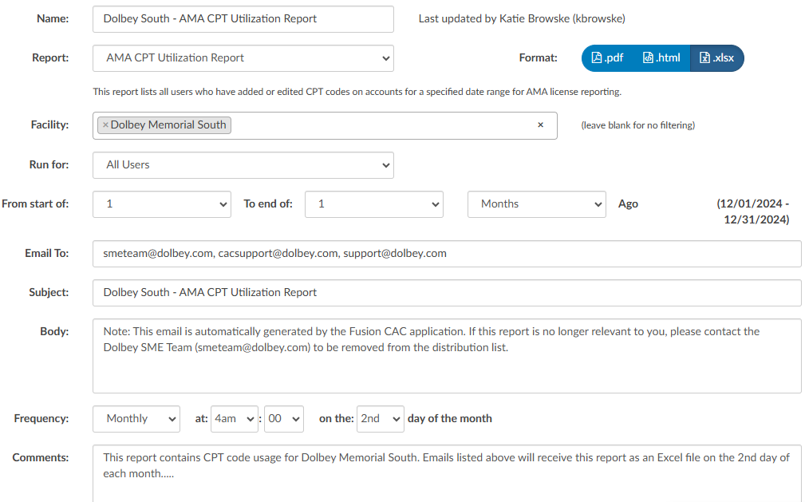

+++
title = 'Scheduled Reports'
weight = 50
+++

Reports in Fusion CAC can be scheduled to be delivered via email at specified times. 

Clicking {}+Create New Schedule{} will open the scheduling options. 

Click {}Save{} in the upper right hand corner to save the settings and start the schedule.

|Field|Purpose|
|-----|-------|
|Name |Name of the scheduled report that will display on the left hand side of the screen|
|Report|Dropdown list of User Reports available to be scheduled|
|Format|Format of the report when delivered to the recipient(s)|
|Disclaimer|Must be checked to acknowledge the report in question may contain PHI|
|Run For|Allows for filtering the report by role type (All Users, Auditors Only, CDI Only, Coders Only)|
|Date Range|Date range for the report. Can be set for X number of days or months in past|
|Email To|Email(s) for recipient(s). If sending to multiple people, email addresses should be comma separated. Receipients do not need to have an active Fusion CAC account to receive a scheduled report|
|Subject|Text to appear in the subject of the email|
|Body|Text to appear in the body of the email. It is recommended to include a note that the email is automatically generated and to include contact details for those who no longer want to recieve the report|
|Frequency|How often the report will be sent to the recipient(s). It is recommended to schedule reports outside of peak hours whenever possible for performance.|
|Comments|Note for management to keep track of report details. Text entered here will not be included in the email sent out|

Saved reports will display on the left hand side of the screen.

### Run History

Scheduled reports will have a run history. 

A run history will display above the schedule data for the last three times the report ran, whether it was successful or errored. No text in the message column indicate the report ran and was delivered without error. A message of “No Message Returned” indicates nothing was sent as the report yeilded no results. **The application will not send out a blank report.** 

