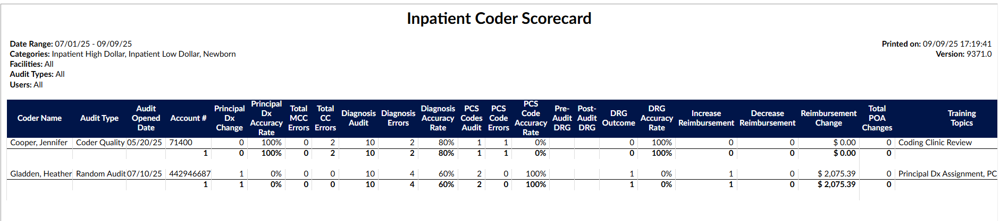
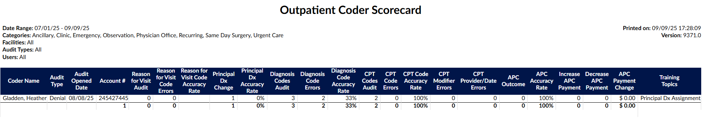
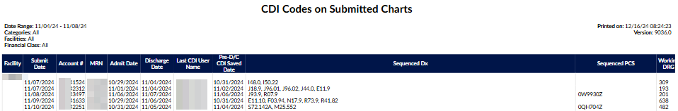
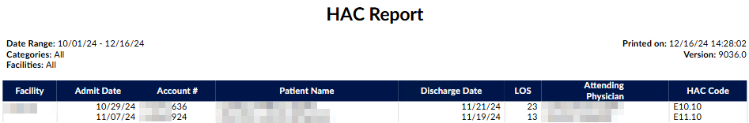
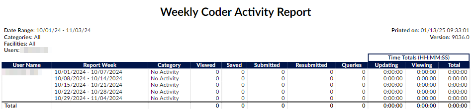
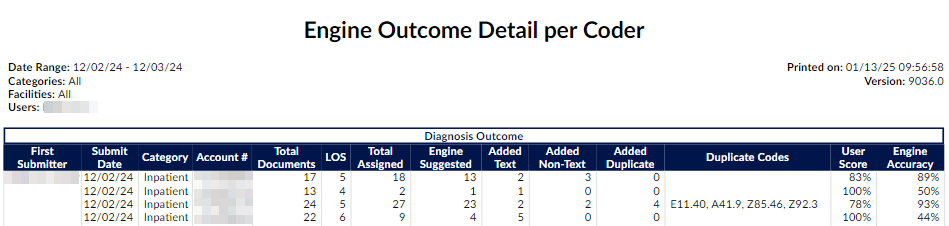

+++
title = 'User Reports'
weight = 40
+++

User reports are canned reports that are preformatted. User reports were created to be run on-demand, but many reports can also be scheduled to run at a specific date/time interval. Each report is outlined [below](https://dolbeysystems.github.io/fusion-cac-web-docs/administrative-user-guide/reporting/user-reports/#user-reports-and-descriptions) along with a brief description. 

Users looking for data that is not available in user reports can use [account search](https://dolbeysystems.github.io/fusion-cac-web-docs/administrative-user-guide/reporting/account-search/) to create custom searches and then export the raw data.

### Running a User Report

1. Select the report from the available list - the selected report will display a short description on the screen

2. Filter as needed - each report is unique in the style of data it will yield. Review filter options and use as needed.
   

  >[!Note] CDI Filters
  >Most CDI reports contain additional filters to give the user the option to filter as ‘
  include’ or ‘exclude’

3. Select the format of the report - .xlsx will result in a file in the users downloads folder.

4. Select Run Report
   

## User Reports and Descriptions

The following is a complete list of Fusion CAC's default reports and their descriptions. An organization may have custom reports
that do not appear in this list. Additionally, some reports may be part of an add-on module. For questions or if there are other reports your organization would benefit from and you cannot pull the data you need from [account search](https://dolbeysystems.github.io/fusion-cac-web-docs/administrative-user-guide/reporting/account-search/) please contact our SME Team (smeteam@dolbey.com) to discuss options.

#### 25 Most Common CPT Codes Report

This report is to provide a listing of the top 25 CPT® codes by patient type (category) for the discharge
date range provided. The Date Range for this report is the Chart Discharged Date.

#### 25 Most Common Diagnosis Codes Report

This report is to provide a listing of the top 25 diagnosis codes by patient type (category) per the
discharge date range provided. The Date Range for this report is the Chart Discharged Date.

#### 25 Most Common PCS Codes Report

This report is to provide a listing of the top 25 PCS codes by patient type (category) per the discharge
date range provided. The Date Range for this report is the Chart Discharged Date.

#### Assigned Workgroup Report

This report provides details about each of the users and what workgroup they are assigned to in
sequence. The date range input is irrelevant for this report and will always display the user’s current
workgroups.

> [!note] Date Criteria Ignored
Date criteria are not used for this report. The user's current workgroup assignments are reported.

#### Audit Abstract Report

This report will provide an overview of the abstraction scores for each user based upon a date range.

Notes:

- Abstract Pre-Audit value is the total number of abstraction items (discharge disposition change, date changes and provider changes) added pre-audit.
- Abstract D/C Disp Errors value is the total number of discharge disposition errors.
- Procedure Provider Changes value is the total number of procedure provider changes (PCS and/or CPT).
- Procedure Date Changes value is the total number of procedure date changes (PCS and/or CPT).
- Procedure Modifier Changes value is the total number of procedure modifier changes (CPT).
- Total Abstract Errors value is the Sum of all abstract (discharge disposition change, date changes and provider changes) errors during audit.

#### Audit Executive Summary

This report is an executive level view that shows an overview of inpatient and outpatient audit activity
by Auditor. It includes the audit rate and average error rates for diagnoses and procedure coding. The
date of this report is based on the date the account was first submitted.

#### Inpatient Audit Scorecard

This monthly report provides a summary of the Auditor's work completed for any type of inpatient audit
and the financial impact based on the audit findings. This report will show number of coders and coded
encounters audited that resulted in a DRG change and either over payments or under payments. This
report will also show the details of physician queries that resulted because of the audit and financial
impact of changes made.

#### Inpatient Auditor Productivity

This report shows auditor productivity by audit type and sub-type and a sum of the total outcomes for
each.

#### Inpatient Coder Scorecard

This report shows, on an individual coder basis, the principal diagnoses, secondary diagnoses, and
procedure code assignment errors that may or may not have resulted in a DRG change and financial
impact. The report has an audit present. The date range for this report is for the date the audit was
performed.

#### Outpatient Audit Scorecard

This monthly report provides a summary of the Auditor's work completed for any type of outpatient
audit.

#### Outpatient Auditor Productivity

This report shows auditor productivity by outpatient audit type and sub-type and a sum of the total
outcomes for each.

#### Outpatient Coder Scorecard

This report shows, on an individual coder basis, the errors and accuracy rates for diagnosis codes
including Reason for Visit and secondary diagnoses; errors in CPT code assignments, modifiers, charges,
and procedure details (provider name and date of procedure). The date range for this report is for the
date the audit was performed.

#### Cancelled Query Report

This report is to track Physician Queries that were cancelled within the date range specified. Only
queries cancelled from within the Physician Query viewer will be tracked on this report, i.e. any third-
party cancellations will not appear. Created date and cancelled date will be displayed, along with the
amount of time the query was open. The date range for this report is the date that the physician query
was cancelled.

#### Case Mix Index Comparison Trend Report

This report shows the Baseline, Working, and Final CMI per discharge month. (Filtering: Only run as a
monthly report). The date range on this report is the Chart Discharge Date please note the range is
expanded to the full month.

#### Case Mix Index Report by Attending Physician Report

This report will show the difference between the most Current Working CMI and Final CMI, additionally
providing the CMI Difference (Final CMI – Current Working CMI.) This report will show how the
physician's documentation impacted the chart over the course of the patient's stay. If the physician
documented appropriately, the Current Working and Final DRG should be very close. If the DRGs are far
apart, the likely cause is that either the CDI did not have the documentation, or the physician did not
document the chart comprehensively. This report should be used in conjunction with additional auditing
on the attending physician if you are questioning the results. (Filtering: Only run as a monthly report).
The date range for this report is on the Chart Admit Date

#### Case Mix Index per Month

Date Range: Chart Discharge Date (only Submitted Inpatient charts with a DRG Weight valued will
appear in this report)
This report will provide a monthly case mix overall for all financial classes then for each financial class.
This report is based upon final coded outcomes. A "case mix index" is the average DRG Weight of
accounts that have a DRG Weight - This report only includes submitted inpatient accounts with a DRG
Weight.

> [!info] Total Groups
> Totals are displayed differently based on the facility filter and the number of facilities 
> returned by the report.
>
> - If there is **no filter on facility and more than one facility is in the report**, an additional "All Facilities"
> group is appended that calculates the case mix for each financial class across all facilities.
> - If there is **any filter on facility and more than one facility is included in the report**, an additional "Combined
> Facilities" group is appended that calculates the case mix index for each financial class across
> the filtered facilities.
> - If **only one facility appears in the report**, there is no "All Facilities" or "Combined Facilities" group.

> [!note] Blank Field Values
> Blank facilities or financial classes are displayed as an empty string to be consistent with other reports.

#### CC/MCC Capture Rate

This report provides the final outcome of CC/MCC capture rate. This can be used to compare the
CC/MCC capture rate to those DRG's that don’t have a DRG but, have the opportunity to be maximized
which is defined as DRG's with a DRG description of without CC/MCC, w/o CC, w/o MCC. This report will
tell you what opportunities may have been missed

#### CDI Executive Summary Report

This report is an executive level view broken down per month that shows total discharges vs. total
reviews in addition to the # of total queries, response rates and improved DRG's. The improved DRG is
calculated by determining if there was a positive reimbursement gain from the baseline to the working
DRG. (Filtering: Max of 12 months selected; only run as a monthly report). The date range on this report
is the Chart Admit Date, please note that this report date range is expanded to the full month

#### CDI Financial Benefit Report

This report is broken down per month coded and the total financial impact CDI had on the chart. The
report will only display charts with unmatched DRG's and show a financial impact based on the baseline
DRG to final coded DRG. The date range on this report is the Chart Submitted Date (LastSubmitter).

#### CDI Metric Score Card

This report shows CDI productivity based upon the CDI user reviews and queries. The report will show
CDI activity specifically on the number of initial reviews (first time a CDI reviews a chart), number of
follow up reviews (reviews beyond the first time a CDI reviews a chart), queries issued, agreed upon
query amounts, and the number of days we show activity occurring.

#### CDI Productivity - Admission Month Report

This report shows CDI productivity based upon the admission month of the patient. The report will show
CDI activity specifically on the # of initial reviews (first time a CDI reviews a chart). A review is calculated
by the following:

- **Inpatient**: First time a user with a role of CDI computed a Working DRG and saved the chart.
- **Outpatient**: First time a user with a role of CDI saved the chart.

This report will also tell you out of the charts the CDI staff member completed what the query rate is
and on average how many days did it take before the chart was initially reviewed. Reporting is done on
the admission month, so this report displays any patient discharged or not discharged during this
admission month if there was a CDI review. (Filtering: Only run as a monthly report). The date range on
this report is the Chart Admit Date, please note that this report date range is expanded to the full
month.

#### CDI Query Detail Report

This report provides details of physician queries created by CDI Specialists on accounts that have since
been discharged. This report details how the account evolved from a Baseline DRG to a Final DRG.

> [!info] No PDF Support
> Due to the number of columns, this report is not intended to be launched as a PDF.

Any non-cancelled physician query created by a CDI Specialist on an inpatient, now-discharged account
should appear as a line item on this report.

#### CDI Query Score Card Report

This report is displayed in several sections:

1. **Discharge/Reviews** – This section reports on the review rate of the CDI team. It displays
the number of patients discharged in the current month along with how many of them
were reviewed by CDI.
2. **CDI Query Outcome** – Of the charts that made up the review rate under discharges, this
section displays the total that resulted in queries that are broken down more granularly
by the physician's response rate.
3. **Reconciliation** – This section displays charts that created the review rate section and
have a final DRG without having a submitted status. This section shows how often CDI
and coders agree on the DRG.
4. **CMI Comparison** – This section reviews where the chart started (Baseline DRG CMI) and
where the chart ended up (Final DRG CMI – which is the reported CMI). (Filtering: Max
of 12 months selected; only run as a monthly report).
5. **CDI Team Metrics** - The calculations within these sections are like the existing fields in the
CDI Metric Score Card report, but the review counts are determined by the discharge date or
admit date of accounts, respectively

The date range on this report is the Chart Discharged Date, please note that this report date range is
expanded to the full month

#### CDI Rounding Report

This report shows all charts reviewed and not reviewed by CDI. If the account has not been reviewed by
CDI, working information will be blank to allow CDI to take notes while rounding. If the account has been
reviewed by CDI, this report will show an account level view by admit date of the difference between
the ALOS and the GMLOS based on the most current Working DRG. The variance is the difference
between ALOS and the GMLOS. The higher that number, the chart is identified as needing a re-review
for potential DRG change and SOI/ROM. The date range on this report is the Chart Admit Date. To
qualify for this report the chart must be an Inpatient Chart. 

#### CDI Activity Report

This report shows the number of ‘Initial Reviews’ vs ‘Followup Reviews’ per category (patient type) with
the total number of queries sent. (Filtering: Max of 31 days selected). The date range on this report is
the Chart Working DRG Save Date/Time (Query Create Date for the Queries.)

#### CDI Codes on Submitted Charts Report

This report shows the list of diagnosis codes and procedures that CDI assigned in sequenced order.

> [!info] No PDF Support
> Due to the number of columns, this report is not intended to be launched as a PDF.

#### Coder DRG Summary

This report is to show the breakdown per coder MS-DRG to show the total visits per DRG.

#### Engine Outcome Summary by Coder Report

This report can be used to determine how the engine performed for the coder. It shows whether they
leveraged the code suggestions or if they manually entered codes, bypassing suggestions. Data is
gathered based on the date the chart was coded, and is based on final codes, not working. This report
should be used in conjunction with a coding audit if needed.

- **Accepted**: A code suggestion was assigned directly to the account.
- **Added**: A code was added to a text document manually and assigned to the account.
  - **Added Text**: counts the number of codes added to phrases in text documents that were not suggested by FAE.
  - **Added Non-Text**: counts the number of codes added to the top of text documents and worksheets that were not suggested by FAE.
- **Edited**: A code suggestion was edited and then assigned to the account.
- **Direct**: A code was assigned directly to the account manually or from the 3M CRS encoder, but also suggested by FAE
- **Image**: A code was assigned from an image document.
  - **Image (Non-Duplicate)**: counts the number of codes added to image documents not suggested by FAE.
  - **Image (Duplicate)**: counts the number of codes added to image documents that were also suggested by FAE.

The date range on this report is the Chart Submitted Date (FirstSubmitter.)

#### Coded Procedure Account Details Report

This report provides details about charts with assigned procedures. The date range on this report is the
Chart Last Submitted Date. To qualify for this report the chart must have at least one Procedure code
assigned on the chart.

#### Coder Activity Report

This report shows the distinct number of accounts that were 'Viewed', 'Saved', 'Submitted', and
'Resubmitted', then the total number of Queries created, the total time updating, time viewing
accounts, and total time spent per day - grouped by coder then by category (patient type) over the date
range. Date Range is the date of the activity, beginning of start date to the ending of end date. (Filtering:
max of 31 days selected). The date range on this report is the Change History Audit Date (Viewed, Saved,
Submitted, Resubmitted actions.

#### Coder Detailed Activity Report

This report is very similar to the "Coder Activity Report" but with two notable changes:
1. The new column "Chart Touches" counts the number of times the user touched" an
account on a specific date. A touch is defined as a unique save or submit action.
2. The times submitting and times saving are split. If the user loads an accounts, saves it,
keeps the account loaded, and then submits it, the time between loading the account
and saving it counts as time submitted instead of time saving.

#### Physician Coding Activity

This report shows the distinct unique charts a physician coder viewed and how many changes were
submitted and pended, then the total number of Queries created, the total time updating, time viewing
accounts, and total time spent per day - grouped by coder then by category over the date range. Date
Range is the date of the activity, beginning of start date to the ending of end date.

#### Coding Chart Status Report

This report displays coding productivity in regard to submitted, pending, and unbilled charts. This report
shows how long the chart took to code from the time the patient was discharged and how long the chart
took from the time the coder had accessibility to the patient chart. Once a patient is discharged, it may
be examined for completeness and non-coding staff may place pending reasons on the chart to indicate
deficiencies. When the deficiencies are resolved, the chart is then assigned to a coding worklist to
indicate the chart is ready for coding. The date range on this report is the Chart Discharged Date

#### Discharged Not Final Coded Report

This report will show management all of the discharged charts within the system that do not have final
coding. The date range for this report is the Chart Discharged Date. To qualify for this report the chart
must have a status of Unbilled. If there are multiple pending reasons on a qualifying chart, they will be
separated by a comma.

#### DRG Comparison Report

This report shows the difference between Baseline DRG and Final DRG per account. Only accounts that
have both a CDS calculated Baseline DRG and a Coder Submitted Final DRG with an Admit Date within
the selected range will be included. The user(s) selected below will constrain the data to either (or both)
by the CDS on the most current calculated Baseline DRG or the Coder that last submitted with a Final
DRG. (Filtering: Minimum of 1 category selected). The date range on this report is the Chart Admit Date.

#### Engine Outcome Detail per Coder

This report should be used to show if the user is using code suggestions or manually adding codes. It will
show total assigned codes broken down by code set along with how many codes were suggested by the
engine versus added by text documents and non-text documents in addition to those that were added in
duplicate. This report card should be used as an educational opportunity to show possible
improvements for the end-user and/or code suggestions. This report is recommended to be used in
conjunction with an audit.

> [!note] Documents without codes not included in total
> The field "Total Documents" had to be constrained to count the total documents on the account with at
> least one attached code to make the formulas correct. Documents with no codes (suggested nor added) are
> not counted in this report (and shouldn't be since this report is about engine outcome).

#### Engine Outcome Detail per CDI

This report shows the total codes that the engine is suggesting, and what CDI is using vs. what CDI is
manually adding compared to the coder's Final Codes. This report should tell the level of manual effort
per CDI of those codes that are being used for final code assignment by coders. It will show total
assigned codes by CDI broken down by code set along with how many codes were suggested by the
engine versus added by text documents and non-text documents in addition to those that were added in
duplicate. There is also a column to indicate of the codes manually added how many did the coder
assign for final code assignment. This report card should be used as an educational opportunity to show
possible improvements for the end-user and/or the code suggestions. This report is recommended to be
used in conjunction with an audit.

#### Engine Results by Documents Report

This report shows the default engine accuracy per document at the time of submission. Also, shows the
first and last times the document was received on the submitted accounts. The report is sorted from
most to least added/edited codes by the coder. The date range on this report is the Chart Submitted
Date (FirstSubmitter).

#### Financial Class Outcome by Discharge Report

This report shows the breakdown per financial class per month. It will breakdown the total patient
charts, average length of stay total charts and case mix index.

#### Final Code Count per Account Report

This report shows the submitted chart high level outcomes for diagnosis and procedure codes per
account. The Total Dx column displays the total of unique diagnosis codes on the account (visit, admit,
principal and secondary); the # of DX Unspecified column shows how many of those codes are showing
an 'unspecified' designation in their description. This report will allow managers to target coder audits to
determine if the chart is being coded correctly or if additional data should have been requested through
a query. This report would be used in conjunction with an audit. The date range on this report is the
Chart Last Submitted Date (Must have a status of Submitted.)

#### Global Productivity Report

This report shows coder productivity by patient type per day, the number of 'Viewed', 'Saved', and
'Submitted' actions, and the total time logged working on that patient type. (Filtering: Max of 31 days
selected). The date range on this report is the Change History Audit Date (Submitted, Resubmitted,
Saved, Viewed actions.)

#### HAC Report

This report is to provide a listing of all patients admitted within the date range of this report that
contains hospital acquired conditions. This report only looks at final coded data and does not reflect
working data. The date range on this report is the Chart Admit Date.

#### Incentive Productiviy Report

This report applies an incentive multiplier to the distinct number of accounts that were first submitted
each week, per user, to calculate incentive points.

- Multiplies the number of first submitted accounts per week by an incentive multiplier per category that is configured in Mappings Configuration.
- The administrator can optionally record an incentive multiplier that is used in this report.
- Categories without a value in the incentive multiplier will be calculated with an incentive multiplier of 1.0.
- This report is like the "Weekly Coder Productivity Report" in that it reports on whole weeks, but only produces an entry if the coder first submitted an account that week.

#### Length of Stay Variance Report

This report shows an account level view by admit date of the difference between the ALOS and the
GMLOS based on the most current Working DRG. The variance is the difference between ALOS and the
GMLOS. The higher that number, the chart is identified as needing a re-review for potential DRG change
and SOI/ROM. The date range on this report is the Chart Admit Date (Must be an Inpatient Chart).

#### Outstanding Queries Report

This report displays a list of the physicians that have open queries. At the top of the report there is a
summary that shows the Top Physicians with outstanding queries and the length of time their oldest
query has been open. Date Range: Query Create Date (The date that the query was initially created and
sent).

#### Pending Reasons Report

This report shows which charts are pending, who placed the pending reason, what the pending reason
is, and which physician was assigned to the pending reason. Not all pending reasons will have a
physician assigned as some pending reasons are not a result of chart deficiency. The date range on this
report is the Chart Admit Date.

#### Query Impact Report

This report includes all charts that received queries and resulted in at least one of the following:

- A change in DRG
- Change in CC/MCC/HAC Totals
- Other reasons your facility has defined as a query shift reason

This report will show you the impact that the query made. The report is grouped by query template
name, then by Author, then by account #. The query will also show if there was a shift in DRG and what
the user listed as the reason for the shift. The date range on this report is the Query Create Date (The
date that the query was initially created and sent)

> [!note] Queries with same DRG & No Shift Reasons Not Included
> By design, the Query Impact Report only reports queries that had an impact by either having
> different before-and-after DRGs or by having shift reasons. The queries not displayed in the Query
> Impact Report had identical DRGs and no shift reasons, so they were excluded. Hence, the name of the
> report – Query Impact Report.

#### Query Impact by Discharge Date Report

This report includes all charts that received queries and resulted in at least one of the following:

- A change in DRG
- Change in CC/MCC/HAC Totals
- Other reasons your facility has defined as a query shift reason

This report will show you the impact that the query made. The report is based on the patient's discharge
date and is grouped by query template name, then by Author, then by account #. The query will also
show if there was a shift in DRG and what the user listed as the reason for the shift. The date range on
this report is the Chart Discharged Date.

> [!note] Queries With the Same DRG & No Shift Reasons Not Included
> By design, the Query Impact Report only reports queries that had an impact by either having
> different before-and-after DRGs or by having shift reasons. The queries not displayed in the Query
> Impact Report had identical DRGs and no shift reasons, so they were excluded. Hence, the name of the
> report – Query Impact Report.

#### Query Overview Report

This report shows pre-discharge physicians query response or non-response and the template used. The
date range on this report is the Query Create Date (The date that the query was initially created and
sent).

#### Query Stats Report

This report shows the physicians within the date range that were queried. The report will show how
many charts the physician was queried for and how many queries these charts resulted in. The date
range on this report is the Query Create Date (The date that the query was initially created and sent.)

#### Present on Admission Tracking Report

This report is based on the date the patient chart was discharged and its final diagnosis codes. POA
Values will be listed, along with HAC determinations if they are present. The totals for the columns Visit
Count, Total LOS Days and Average LOS, (if available; Deaths, Autopsy Required) are figured per account,
the Totals for the Present on Admit and HAC columns are figured per code. The date range on this
report is the Chart Discharged Date.

#### Query TAT by Author Report

This report shows all of the queries that have been responded, with who sent the queries and the turn
around time, which is based on the date/time it was sent to the physician until the date/time that the
query was responded. The date range on this report is the Query Create Date (The date that the query
was initially created and sent).

#### Query Template Volume Overview Report

This report shows the volume of queries per template sorted by whom the query was sent with the date
sent and then responded to then when it was closed as agreed, disagreed or no opinion per account
along with the discharge date. The date range on this report is the Query Create Date (The date that the
query was initially created and sent).

#### Query Template Volume by Discharge Date Report

This report shows the volume of queries per template for discharged accounts, sorted by whom the query was sent with the date sent and then responded to then when it was closed as agreed, disagreed or no opinion.

> [!info] 
> This report is a clone of the ["Query Template Volume Overview"](https://dolbeysystems.github.io/fusion-cac-web-docs/administrative-user-guide/reporting/user-reports/#query-template-volume-overview-report) report but the date range of the report is by Discharge Date instead of Query Creation Date. This means that only queries of discharged accounts will appear in this report.  

#### Recent Suggested/Working DRG Report

This report shows all unsubmitted inpatient accounts without a discharge date that have a calculated
Suggested or Working DRG, grouped by calculation date. Only the most recent Suggested or Working
DRG is displayed for each account. The ""Updated By"" column will say ""Suggested"" to indicate that
the DRG was calculated automatically from the Suggested DRG module. Sites that do not use the
Suggested DRG module can still use this report to get the most recent Working DRGs for all Inhouse
accounts. In addition to displaying the GMLOS, it also displays the LOS and Variance.

The date range is irrelevant and will report on all inpatient accounts with no discharge date that have either a suggested DRG (calculated by the Suggested DRG module) or a working DRG (calculated by a CDI Specialist).

#### Recurring Account Productivity Report

This report tracks daily productivity for recurring accounts. It uses the effective date to track which
occurrence of the account was coded. An account can repeat on the report if the chart has been coded
multiple times on the same day with different effective dates. Total time in account is shown as
HH:MM:SS. The date range on this report is the Change History Audit Date (Submitted, Resubmitted,
Saved, Viewed actions

#### Submitted by Coder Report

This report shows the number of accounts submitted - grouped by facility, category, and submitter -
over the account discharged date range. The number of accounts submitted per coder is compared to
the total number of accounts per facility and category to calculate a submitted rate. Total discharges are
only displayed per facility and category. The date range on this report is the Chart Discharged Date

#### Submitted by Discharge Date Report

This report shows the number of accounts discharged, submitted, and percent of submitted - grouped
by facility, discharge date, and patient type over the date range. The date range on this report is the
Chart Discharged Date.

#### Submitted Secondary Diagnosis Total

This report is based on the first submit of an account. It shows the total number of secondary diagnoses
codes per account and whether the end user manually added the code(s), the system suggested them,
or the user added AND the engine suggested the code(s). In addition, the total codes still unassigned
upon submit will be shown.

#### Top 10 Coded Medical vs. Surgical DRG Report

This report displays the Top 10 Medical vs. Surgical DRGs for submitted accounts within the defined
discharge date. Medical DRGs and Surgical DRGs are defined by the DRG type that is returned from the
TruCode or 3M CRS encoder. The date range on this report is the Chart Discharged Date (Must be
Submitted and have a Final DRG).

#### User Audit Trail Report

This report shows user activities within the selected date range. Not selecting a User will result in only
system events being displayed. (Filtering: Max of 1 user selected; max of 1 day selected). The date range
on this report is the Date & Time of the action of the activity.

#### User Detail Report

This report shows the detail of the accounts that are coded including re-submits, the codes
Added/Deleted by the coder, number of documents, and Total Charges amounts — grouped by coder
over the date range. (distinct accounts) Date Range is the date the account was submitted, beginning of
start date to the ending of end date. (Filtering: Minimum of 1 user selected; max of 7 days selected). The
date range on this report is the ChangeHistory Audit Date (Submitted actions).

#### User Session Log Report

This report shows the users log showing the Checkout time (when user went into the account), Checkin
time ('Saved', 'Submitted', or cancelled activity in the account), and total time in the account per each
account session. (Filtering: Minimum of 1 user selected; max of 7 days selected). The date range on this
report is the ChangeHistory Audit Date (Check Out & Check In of the Account Dates).

#### Weekly Coder Activity Report

This report shows the distinct number of accounts that were 'Viewed', 'Saved', 'Submitted', and
'Resubmitted', then the total number of Queries created, the total time updating, time viewing
accounts, and total time spent per week - grouped by coder then by category (patient type) over the
week range. The week range contains the date of the activity, beginning of start date to end date.
(Filtering: Minimum of 1 user selected). The date range on this report is the Change History Audit Date
(Viewed, Saved, Submitted, Resubmitted actions).

#### CDI Query Detail Report

This report provides details of physician queries created by CDI Specialists on accounts that have since
been discharged. This report details how the account evolved from a Baseline DRG to a Final DRG.
Any non-cancelled physician query created by a CDI Specialist on an inpatient, now-discharged account
should appear as a line item on this report. The date range on this report is the Chart Discharged Date.
To qualify for this report the chart must be an inpatient patient type.

> [!info] No PDF Support
> Due to the number of columns, this report is not intended to be launched as a PDF.

#### Consulting Provider Report

This report provides a list of all consulting provider(s) that were added to each account. The date range
on this report is the Chart Discharged Date. To qualify for this report the chart must be Submitted and
have at least one Consulting Provider.

#### Engine Outcome per Coder Report

This report should be used to show if the user is using code suggestions or manually adding codes. It will
show total assigned codes broken down by code set along with how many codes were suggested by the
engine versus added by text documents and non-text documents in addition to those that were added in
duplicate. Duplicate is defined by codes that both the engine and the end-user added the code. This
report card should be used as an educational opportunity to show possible improvements for the end-
user and/or code suggestions. This report is recommended to be used in conjunction with an audit.

The field Total Documents had to be constrained to count the total documents on the account with at
least one attached code to make the formulas correct. Documents with no codes suggested nor added
are not counted in this report and should not be since this report is about engine outcome. The date
range on this report is the Chart Submitted Date. To qualify for this, report the chart must be Submitted
with assigned codes.

### Payor Volumes Report

This report shows the submitted patient account number, full name, MRN#, discharge date, patient
type, and facility - grouped by payor with number of accounts submitted subtotals and grand total over
the date range. Date Range is the date the account was discharged, beginning of start date to the ending
of end date. The date range on this report is the Chart Discharged Date. To qualify for this report the
chart must be Submitted.

### Current Workgroup Report

This report shows the list of all of the workgroups with the total charts, oldest admit and discharge date
along with total charges. 

> [!note] Date Range not Used
> The date fields below are not used for this report. The current workgroup assignments are reported.

> [!info] User Filter Behavior
> - If **no user is filtered** on this report, this report will output the current workgroup statistics for all enabled workgroups that do not have a workgroup type of "Purge" (more info below)
> - If **one or more users are selected as a filter**, this report will output the current workgroup statistics for the workgroups that are assigned to only those users (mimicking the workgroup list that appears in the user's personal dashboard).
> - CDI workgroups can have a blank "oldest discharge date" since no accounts in CDI workgroups typically have a discharge date.

### AMA CPT Utilization Report

This report lists all users who have added or edited CPT codes on accounts for a specified date range for
AMA license reporting. **This is a report Dolbey uses to report CPT code usage to the AMA.**

## Topics

User reports can be categorized by topic, per organization. 

For example, the following reports might be added to a topic of Impact Reports:
you are running reports.

- Physician Query Impact
- Physician Query Impact by Discharge Date
- CDI Financial Benefit

Reports can be filtered by topic to narrow down the list of available reports. 

To assign a topic to report
- Select the report
- Click {}Edit Topic{}
- Edit the selected report 
  - Choose an exisiting topic from the dropdown menu
  - Enter a name for a custom topic, and click {}+Add{}
  - Click {}Save{}

>[!info] 
>A report can have multiple topic tags.

Topics can be managed in the Topics [mapping table](https://dolbeysystems.github.io/fusion-cac-web-docs/administrative-user-guide/tools/mapping-configuration/#updating-mapping-tables). 