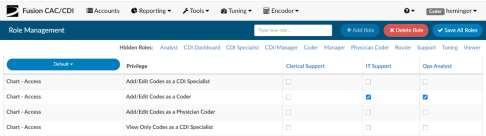
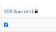
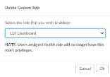

+++
title = 'Role Management'
weight = 90
+++

Under "Tools" in the application, there is a tab for "Role Management". This allows you to create custom user roles that can access certain privileges of Fusion CAC by checking or unchecking the box next to each of the privileges. When first viewed, Role Management will already have default privileges for each role checked for backwards compatibility. This allows management to
create new roles. Even though the user can have more privileges, they will still maintain a current role of
either coder or CDI which controls what assigned code tree and fields need completed upon their
actions within the software.

The chart-access section will tell which roles the user will have added to the assigned code tree however, you
can add additional privileges as needed.

To create a new role, in the top right-hand corner where it says type new role add in whatever you want
the role to be named(example: CDI Enhanced). Once you have a name click on the add role button. With
this role you may want to provide the CDI access to everything that they had previously as well as allow
them to be able to help design queries. In this example you would copy over any of the settings for the
CDI specialist default role in addition to giving them privileges to the form designer to create and edit
CDI forms and create and edit physician query forms. Once you are done selecting the privileges for the
custom role you have created, click on save all roles in the top right-hand corner.

## Hidden Roles

When designing the custom roles, you may want to get rid of some of the rolls that are not applicable to
what you were doing. To hide a column, click on the header. For example, if you click on CDI specialist
you will notice the CDI specialist column will go away and be shown above where it says hidden roles. If
you want to unhide the role you can click on CDI specialist under hidden roles, and it will add that
column back in.

## Locked Roles

You will notice a lock icon next to a few of the roles. The lock icon indicates it is a
default role in our application and cannot be deleted. However, any of the custom roles
that have been added do not have a lock icon, are not tied to areas of the software, and
can be deleted.

## Deleting Roles

Click on the delete role button in the top right-hand corner, upon clicking on that button shows all of the
user roles in the software.

On the pop-up box to delete the custom rolls it indicates any users that are assigned
to this role will no longer have user privileges. Best practice is to ensure
users with this role are reassigned to a different one prior to deleting this
role so you don’t lock them out of the software.

