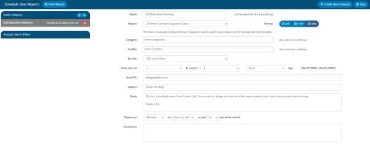
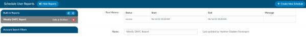
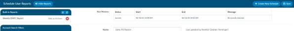

+++
title = 'Scheduled Reports'
weight = 50
+++

Scheduled reporting enables you to: schedule a report to be delivered during a time window, repeat the
report on a one-time, daily, weekly, or monthly basis, and email the report to the user who needs to see
the report. Note that not all reports can be scheduled. Review the table of default reports to see if the
one you wish to schedule is available for this feature. There are two sections in scheduled reports ones
for Built-in reports from the user reports section and those that are scheduled account search filters.

## Creating a Scheduled Report

Click on Create New Schedule then fill out all the fields

## Run History

Any report (user report or account search filters) will have a run history. If the user clicks on a report on
the left side of the screen, the right side will now show a run history above the schedule data for the last
three times the report ran, whether it was successful or errored.

You will also see the message, if no message it ran the report and delivered it. You may also see a
message that says “No Message Returned” which indicates the report didn’t yeild results therefore the
email didn’t go out since the search didn’t yeild results.

