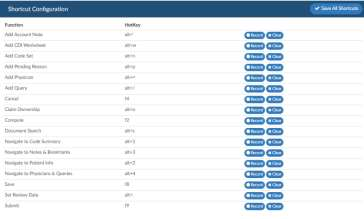

+++
title = 'Shortcut Configuration'
weight = 160
+++

Shortcut keys help provide an easier and usually quicker method of navigating and executing commands
within the software.

Because some hotkeys may be mapped to a different software solution you are using, we allow you to 
configure ours. We provide defaults but feel free to change them as needed.

To record a new, simply press the record button on the line of the function you wish to configure.
Enter in a button combination usually between 1-2 keys on the keyboard. For Example, ALT and F9
might submit the chart. We are a browser based application therefore you should not use the standard
browser hot keys.
